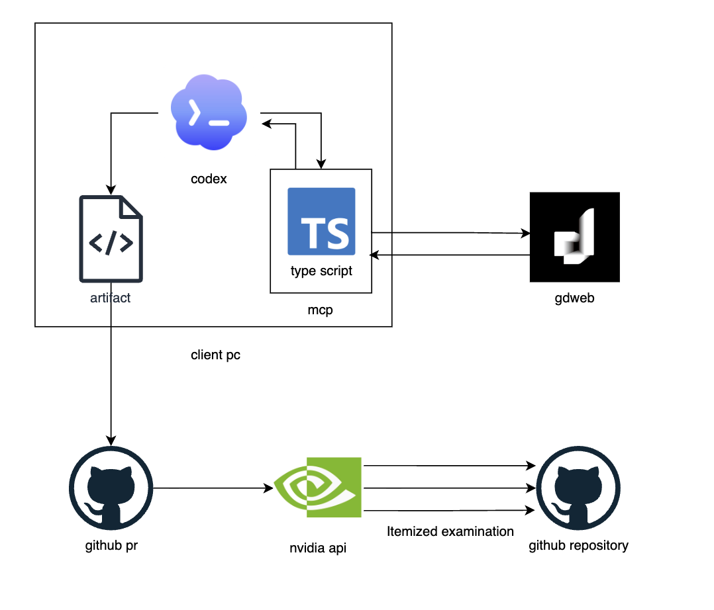
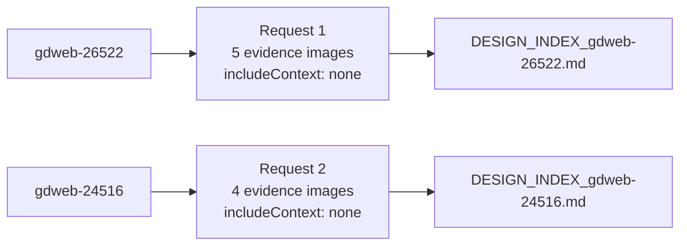
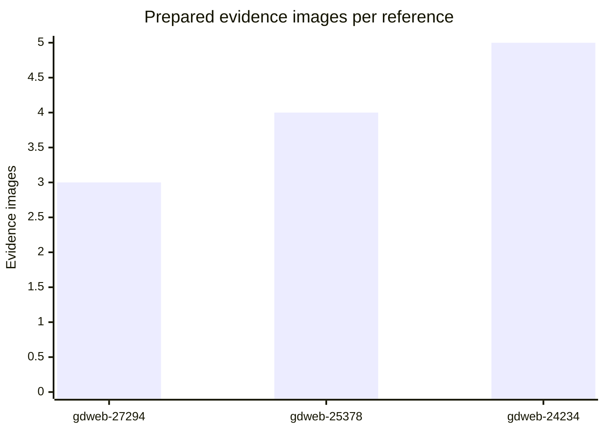
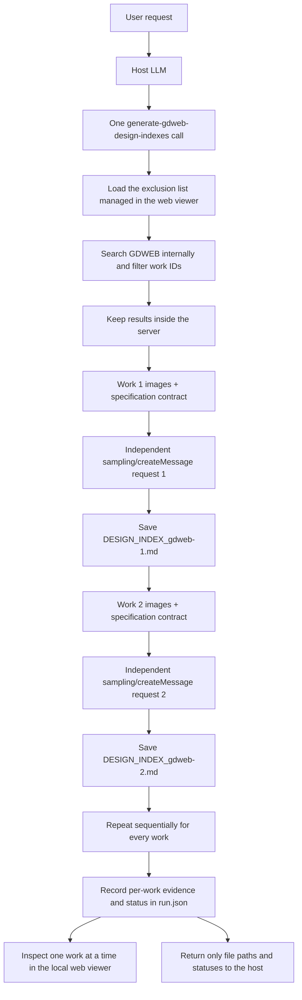
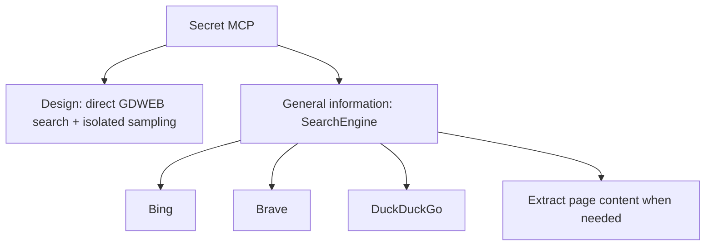

**English** | [한국어](README.ko.md)

## Target Architecture



---

# Secret MCP

**An evidence-grounded MCP server for web design analysis, screenshot-to-specification workflows, and frontend reconstruction planning.**

```bash
npx -y secret-design-mcp
```

Secret MCP is a local Model Context Protocol (MCP) server that searches GDWEB for recent design references and **creates a separate LLM request and a separate `DESIGN_INDEX` file for every search result**. Each file contains page- and route-specific layouts, navigation, pixel coordinates, colors, components, and responsive specifications traceable to the supplied visual evidence.

The name `Secret MCP` does not mean that the project provides secret features or private data. It was the project name used while experimenting in a private repository with the idea of building an MCP server around design websites. The project's current purpose is to extract reproducible structural evidence from public design references and turn it into one specification per work that an LLM can apply to a new project.

Images and descriptions from multiple works are never combined in a single LLM context or document. The server processes search results sequentially inside the server, creates an independent MCP `sampling/createMessage` request for each work, saves that work's file, and only then advances to the next work. A separate local web application lets you select one work at a time, inspect its source evidence, measured colors and coordinates, LLM contract, generation log, and final document, and manage the exclusion list for subsequent searches.

## Research Note

> **Evidence-Isolated Multimodal Design Analysis through MCP Sampling**
>
> Working paper and implementation report · Secret MCP v0.6.0 · not peer reviewed

### Abstract

Secret MCP implements an auditable pipeline for converting public webpage screenshots into implementation-oriented design specifications. The system prepares desktop and mobile visual evidence, records crop coordinates and representative pixel colors, and invokes client-side MCP sampling once per reference. Unlike workflows that concatenate several design references into one prompt, Secret MCP treats reference identity as both a request boundary and an artifact boundary: one reference produces one sampling request, one request contract, and one `DESIGN_INDEX` document. Each request asks for `includeContext: none` and applies the same 19-section specification contract covering routes, geometry, components, design tokens, responsive behavior, accessibility, implementation tasks, acceptance criteria, and uncertainty. This report evaluates protocol-level isolation and artifact production; it does not claim that one language model, prompt, or reconstruction method outperforms another. A live smoke test verifies the request boundary, while a preserved three-reference run provides descriptive measurements and a qualitative implementation case.

### Research Questions

| Question | Current evidence | Status |
| --- | --- | --- |
| **RQ1.** Can an MCP design-analysis tool maintain one-reference-per-request isolation? | Live sampling smoke test with cross-reference ID inspection and output-file checks | Verified within the test scope |
| **RQ2.** Can screenshot evidence be transformed into auditable spatial, color, and document artifacts? | Preserved three-reference run with evidence manifests, contracts, and generated documents | Descriptively verified |
| **RQ3.** Can the resulting specification guide a distinct frontend implementation? | AEROFLOW qualitative case study | Preliminary; no controlled comparison |

### Formal System Model

For reference `r_i`, the prepared evidence set contains image tiles `I`, crop bounds `B`, representative-color measurements `P`, and source metadata `M`. The fixed specification contract is `C`; the independent request and resulting document are `q_i` and `D_i`.

```text
E_i = { I_i,k, B_i,k, P_i,k, M_i }
q_i = sampling/createMessage(C, E_i; includeContext = none)
D_i = G_theta(q_i)

References(q_i) = { r_i }
For every i != j: referenceId(r_j) is absent from q_i
```

Coordinates measured inside a prepared tile map back to the original screenshot as follows.

```text
x_source = (cropLeft + x_tile) / scaleX
y_source = (cropTop  + y_tile) / scaleY
```

This is an operational isolation invariant, not a claim of statistical independence. The server and smoke test can inspect request contents and artifacts; they cannot prove what an arbitrary external model provider may retain outside the MCP message.

## Empirical Results

### Protocol Isolation



| Sampling request | `gdweb-26522` present | `gdweb-24516` present | Output documents |
| --- | ---: | ---: | ---: |
| Request 1 | 1 | 0 | 1 |
| Request 2 | 0 | 1 | 1 |

*Figure 1.* Live smoke test recorded on 2026-08-22 using the query `금융` (`n = 2` sampled references after excluding `gdweb-26905`). Each request contained its own reference ID and visual evidence, no other sampled reference ID, and `includeContext: none`; the run produced two distinct Markdown files. The test verifies observable request composition and file separation, not model-memory behavior outside the protocol.

### Recorded Run Measurements



| Reference | Desktop source height | Prepared images | Image payload | Color measurements | Document tokens | Document size | Required headings |
| --- | ---: | ---: | ---: | ---: | ---: | ---: | ---: |
| `gdweb-27294` | 2,675px | 3 | 126.6KB | 24 | 7,921 | 54.0KB | 19/19 |
| `gdweb-25378` | 7,043px | 4 | 302.5KB | 32 | 9,953 | 69.8KB | 19/19 |
| `gdweb-24234` | 7,832px | 5 | 387.8KB | 40 | 9,517 | 63.2KB | 19/19 |

*Figure 2.* Descriptive measurements from preserved run `2026-07-29T15-54-10-483Z-5c70317e` (`n = 3` references). The run prepared 12 evidence images totaling 816.9 decimal KB and recorded 96 representative-color measurements. It produced three `DESIGN_INDEX` documents totaling 27,391 whitespace-delimited tokens and 187.0 decimal KB. All three contain headings 1–19; heading presence does not establish semantic correctness.

### Qualitative Case Study

| (a) Evidence and measurements | (b) Per-reference `DESIGN_INDEX` | (c) Specification-driven implementation |
| --- | --- | --- |
|  |  |  |

*Figure 3.* A preserved qualitative trace from the GDWEB evidence viewer to the generated Korean Air `DESIGN_INDEX` and then to AEROFLOW. AEROFLOW intentionally introduces new branding, content, imagery, and functionality; this example illustrates specification use and is not a controlled visual-fidelity comparison.

### Interpretation and Limitations

- The live isolation result has `n = 2`; the recorded artifact analysis has `n = 3`. Neither supports broad claims about design quality or model performance.
- The current evaluation has no control group, human rating, repeated trials, confidence intervals, or comparison against screenshot-to-code baselines.
- Representative colors are measured after resizing, JPEG normalization, and channel quantization. They are screenshot evidence, not proof of the source website's CSS tokens.
- The 19/19 result measures required heading presence. A future benchmark must separately evaluate factual grounding, coordinate error, color difference, responsive behavior, and implementation fidelity.
- The qualitative implementation is an existence example, not evidence that Secret MCP improves reconstruction quality.

## Usage

### 1. Install and Build

Node.js 20.19 or later is required.

The published MCP server can be launched with:

```bash
npx -y secret-design-mcp
```

Clone the repository when you also need the local viewer or want to work on the source:

```bash
git clone https://github.com/yyeongjin/secret_mcp.git
cd secret_mcp
npm install
npm run build
```

### 2. Start the Web Application

Set `DESIGN_INDEX_OUTPUT_DIR` to the same value for the MCP server and the web application so that both processes read the same output directory.

```bash
DESIGN_INDEX_OUTPUT_DIR=/absolute/path/to/design-index npm run web
```

Open the following address in a browser.

```text
http://127.0.0.1:4317
```

The web application displays the generation-run list, per-work progress, GDWEB evidence images, measured coordinates and palettes, the specification contract sent to the LLM, the final Markdown, and generation timestamps. Documents and evidence are read-only; only `Exclude from search` and `Remove exclusion` change the filter used by subsequent searches.

### 3. Register the MCP Server

```json
{
  "mcpServers": {
    "secret-mcp": {
      "command": "npx",
      "args": [
        "-y",
        "secret-design-mcp"
      ],
      "env": {
        "DESIGN_INDEX_OUTPUT_DIR": "/absolute/path/to/design-index",
        "SECRET_MCP_WEB_ORIGIN": "http://127.0.0.1:4317"
      }
    }
  }
}
```

For a source checkout, replace `command` and `args` with `"command": "node"` and `"args": ["/absolute/path/to/secret_mcp/dist/index.js"]`.

The MCP client must support `sampling/createMessage`. When a client does not support sampling, the server returns an explicit error instead of running a fallback that places multiple works in the same context.

The MCP stdio server itself does not open an HTTP port. The client launches `node dist/index.js` as a child process and exchanges JSON-RPC messages over stdio. Only the separate web viewer process uses port `4317` by default.

#### Direct Sampling Client for Hosts Without Sampling

The server does not need to be modified when the outer MCP host cannot answer `sampling/createMessage`. A separate MCP protocol client can connect directly to `dist/index.js`, advertise `sampling: {}`, and handle every sampling request by launching a fresh Codex LLM process in a fresh temporary workspace.

```ts
const client = new Client(
  { name: 'secret-mcp-sampling-client', version: '1.0.0' },
  { capabilities: { sampling: {} } }
);

client.setRequestHandler(CreateMessageRequestSchema, async request => {
  const workspace = await mkdtemp('secret-mcp-sampling-');
  const response = await launchFreshCodex({
    workspace,
    messages: request.params.messages,
    systemPrompt: request.params.systemPrompt,
  });

  return {
    model: response.model,
    role: 'assistant',
    content: { type: 'text', text: response.markdown },
  };
});
```

The sampling handler must copy only the current request's text blocks and evidence images into that workspace. It must not reuse a Codex conversation, process, working directory, response file, or message history from another work. The workspace launches one new Codex process, waits for its complete Markdown response, returns that response to the pending MCP sampling call, and can then be removed after the server has saved the work's contract, evidence, and document.

The server still controls the sequential queue: work 2 is not prepared until work 1 has returned and been saved. This makes the fresh process and workspace an execution-level equivalent of the protocol-level `includeContext: none` boundary without adding a combined fallback to the server. The direct client becomes the sampling-capable MCP host; it should use a tool-call timeout long enough for the per-work output budget and must never answer multiple sampling requests through one persistent LLM conversation.

### 4. Ask the LLM

A separate `/web-design` slash command is not required.

```text
Find three recent design references on GDWEB that are suitable for a Godot project website.
Analyze every search result through a completely independent LLM request,
and create one reproducible DESIGN_INDEX document for each result.
Inside each document, separate every visible page into its own page specification,
and specify everything from navigation and section coordinates to exact color formats and responsive values.
```

The host LLM calls the `generate-gdweb-design-indexes` tool once. The MCP server performs the search and separates the per-work LLM requests internally.

The manual tool-call format is shown below.

```json
{
  "name": "generate-gdweb-design-indexes",
  "arguments": {
    "query": "game portfolio",
    "limit": 3,
    "awardOnly": true,
    "includePreviousYear": true,
    "language": "English",
    "outputDirectory": "/absolute/path/to/design-index",
    "maxTokens": 131072
  }
}
```

If `outputDirectory` is omitted, the tool uses the `DESIGN_INDEX_OUTPUT_DIR` environment variable. If that variable is also absent, it uses the `design-index` directory under the server's working directory.

`maxTokens` is a per-work output budget, not a budget shared by the run and not a budget divided equally between pages. A single work may contain multiple visible pages or routes, and every page must repeat the complete page-specific parts of the 19-section contract. The default and minimum are therefore `131072` tokens. Clients may request up to `262144` tokens for exceptionally large multi-page evidence sets.

With `limit: 3`, the default run can request up to three independent `131072`-token outputs; the works do not share one `131072`-token pool. The connected sampling client and selected model must support the requested output size. If the model returns `stopReason: maxTokens`, the server treats that work as failed instead of saving a truncated `DESIGN_INDEX` as complete.

When the tool completes, it returns the run ID, run-manifest path, per-work document paths, and web-viewer URL.

## End-to-End Example: From GDWEB Specifications to a Godot Aviation Website

For the actual example, Secret MCP found three aviation award winners registered on GDWEB in 2026 and 2025, created a `DESIGN_INDEX` for each work through an independent LLM request, and then applied the structure of the Korean Air reference to a Godot aviation project website.

The finished `AEROFLOW` website is not a clone of the Korean Air website. It uses the information hierarchy, navigation, action panel, section arrangement, and responsive principles from the specification while introducing a new brand, copy, aviation imagery, and content. This example demonstrates that **even when the resulting design differs from the reference, measurable structural evidence can still produce a polished website with a distinctive identity**.

### Run the Example

```bash
# 1. Build
npm install
npm run build

# 2. Per-work document web viewer
DESIGN_INDEX_OUTPUT_DIR="$PWD/tmp/design-index/aviation-godot-20260730" npm run web

# 3. Specification-driven result website
python3 -m http.server 4320 \
  --bind 127.0.0.1 \
  --directory tmp/showcase/aviation-godot/generated-site
```

After starting the processes, open the following screens.

- Per-work specification web viewer: <http://127.0.0.1:4317/?run=2026-07-29T15-54-10-483Z-5c70317e>
- AEROFLOW result website: <http://127.0.0.1:4320>

### 1. Per-Work Specification Results

Select works one at a time from the run list on the left. The right side displays only the final `DESIGN_INDEX` for the selected work, without mixing in content from other works.


### 2. Evidence Images and Measurements

The `Evidence` tab shows the desktop and mobile images sent to the independent LLM request, tile coordinates, reduction ratios, and representative colors.


### 3. Independent LLM Request Contract

The `Request Contract` records page separation, navigation, section bounds, HEX/RGB/HSL colors, components, the responsive matrix, and acceptance criteria. This contract prevents the result from ending as a superficial mood summary and makes it an implementation specification another LLM can use.


### 4. Generation Process

The `Generation Log` shows the sequence from search and evidence preparation through the independent per-work LLM request, document save, and full-run completion. This run processed all three works with separate `includeContext: none` requests.


### 5. Specification-Driven AEROFLOW First View

The bright aviation portal and action-panel structure observed in the Korean Air reference were adapted to a Godot project. The brand, aircraft imagery, copy, and functionality were created specifically for this result.


### 6. Project Highlights

The reservation and promotion card structure was repurposed for core project content: flight regions, a glass cockpit, and real-time weather.


### 7. Development Log and Shortcuts

The source reference's notices and service shortcuts were restructured into build history, development progress, flight models, avionics, media, controls, and roadmap navigation.


### 8. Media and Footer

The final area contains project media, development, support, and license links, followed by an independent-project footer.


### What This Result Demonstrates

- A new project can use a validated information hierarchy and layout relationships without copying the reference's logo, trademarks, copy, or images.
- Converting static screenshots into navigation, pixel bounds, color tokens, components, and a responsive matrix gives another LLM enough detail to create a concrete implementation plan.
- Even with the same structural evidence, newly designed content, branding, and visual assets can create a distinctive identity that differs from the source.
- Secret MCP is intended to extract structural evidence from good design and use it to build a polished website suited to a new project, not to reproduce the source pixel for pixel.

### Specification and Request Contract

- [Korean Air DESIGN_INDEX specification](tmp/design-index/aviation-godot-20260730/.secret-mcp-runs/2026-07-29T15-54-10-483Z-5c70317e/documents/DESIGN_INDEX_gdweb-27294.md)
- [Independent LLM request contract](tmp/design-index/aviation-godot-20260730/.secret-mcp-runs/2026-07-29T15-54-10-483Z-5c70317e/contracts/gdweb-27294.md)
- [Run manifest](tmp/design-index/aviation-godot-20260730/.secret-mcp-runs/2026-07-29T15-54-10-483Z-5c70317e/run.json)
- [Generated website source](tmp/reconstructions/gdweb-27294-godot/index.html)

These links point directly to the actual files included in the repository. The same artifacts are also grouped under `tmp/showcase/aviation-godot` through relative symbolic links for local execution and browsing.

## Core Execution Architecture



The following boundaries are essential.

- Images or specification bodies from multiple works are never returned to the outer host LLM as one batch.
- With `limit: 3`, the server performs exactly up to three mutually independent LLM sampling requests.
- Every sampling request uses `includeContext: none`.
- A sampling request contains only one work's metadata and image tiles.
- The previous work's ID, images, and analysis document are never passed into the next work's request.
- Works excluded in the web viewer are removed from search results before any sampling request is created.
- The server starts the next work only after saving the current sampling response to a file.
- At the end, only generated file paths, the model used, and success or failure status are returned to the host.

In other words, this is not the earlier architecture in which the host LLM reads every result at once and produces a combined summary.

## Web Viewer

The web viewer reads `DESIGN_INDEX_OUTPUT_DIR/.secret-mcp-runs` every 2.5 seconds. There is no separate database or debugging connection between the MCP generation process and the web server.

The interface contains the following areas.

- Generation runs: query, requested count, allowed years, and overall status
- Work list: progress and evidence-image count for each `gdweb-<work-number>`
- Work details: specification, evidence images and measurements, request contract, and generation log for one selected work
- Search exclusions: exclude the selected work from future searches, include it again, and manage the full exclusion list

When a run contains three works, it also produces three documents as shown below.

```text
.secret-mcp-runs/<run-id>/
├── run.json
├── contracts/
│   ├── gdweb-26905.md
│   ├── gdweb-26522.md
│   └── gdweb-xxxxx.md
├── evidence/
│   ├── gdweb-26905_desktop_01-of-05.jpg
│   ├── gdweb-26522_desktop_01-of-04.jpg
│   └── ...
└── documents/
    ├── DESIGN_INDEX_gdweb-26905.md
    ├── DESIGN_INDEX_gdweb-26522.md
    └── DESIGN_INDEX_gdweb-xxxxx.md
```

`run.json` is not a file that combines document bodies from multiple works. It is a viewer manifest containing only per-work file paths, status, timestamps, model, and evidence lists.

### Search Exclusion List

Selecting `Exclude from search` in the web viewer saves the work number to the following file.

```text
DESIGN_INDEX_OUTPUT_DIR/.secret-mcp/exclusions.json
```

- Historical runs and generated documents are never deleted.
- New `generate-gdweb-design-indexes` and `search-gdweb-designs` runs filter work numbers before selection.
- To avoid returning too few results because of exclusions, the search reads additional GDWEB candidates and selects the requested `limit` from the non-excluded works.
- Selecting `Remove exclusion` makes the work eligible again starting with the next search.
- The MCP server and web viewer must use the same `DESIGN_INDEX_OUTPUT_DIR` to share the same exclusion list.

## Image Processing

GDWEB's full desktop captures can be extremely tall and several megabytes in size. Sending the original base64 data directly in a sampling request can exceed MCP transport limits or cause a vision model to miss fine structural details.

Before creating the request for each work, `gdweb-sampling-images.ts` performs the following operations.

- Load the GDWEB desktop registration image with `sgbn=1`
- Load the GDWEB mobile registration image with `sgbn=3`
- Resize the desktop image to a maximum width of 1200px
- Split a long page into overlapping vertical tiles 1600px high
- Preserve the mobile image as separate evidence
- Compress the evidence as JPEG to reduce the MCP sampling-request size
- Record the original and prepared canvas dimensions, scale factor, prepared `x/y/width/height` coordinates, source-space coordinates, and source URL for every tile
- Measure eight representative colors from every tile and record HEX, RGB, HSL, and pixel coverage

Multiple tiles from one work are included in the same work-specific sampling request. Tiles from different works are never included in the same request.

Representative colors are measurements sampled from normalized screenshot pixels. They are precise evidence for visual comparison, but they must not be presented as the source site's CSS variables because JPEG error and image content affect the values. The generation contract distinguishes `MEASURED` colors from `INFERRED` implementation tokens.

The server does not open the work's live production website or crawl its DOM. Visual evidence is limited to the images and metadata registered on GDWEB.

## GDWEB Search

Design search does not use browser automation, Bing, Brave, or DuckDuckGo.

```text
Query
  -> POST https://www.gdweb.co.kr/sub/search.asp
  -> form field: Txt_word=<query>
  -> parse the GDWEB result HTML
  -> collect work number, category, and registration year
  -> retain only the current and previous year
  -> load GDWEB detail metadata and registered images
```

### Freshness Policy

- If `year` is omitted, the current runtime year is used.
- `includePreviousYear` defaults to `true`.
- When run in 2026, only works registered in 2026 and 2025 are allowed by default.
- With `includePreviousYear: false`, only the target year is allowed.
- `awardOnly` defaults to `true`, so works without an award name are excluded.
- `limit` can be set from 1 through 10.

### Work Metadata

| Field | Description |
| --- | --- |
| `strNo` | GDWEB work number, also used in the document filename |
| `txtFgbn` | GDWEB work-category value |
| `title` | Work title |
| `gdwebUrl` | GDWEB work detail page |
| `registeredDate` / `registeredYear` | Registration date and the year used for filtering |
| `award` | Award name |
| `concept` | Design concept |
| `primaryColor` | Primary color |
| `productionCompany` | Production company |
| `desktopImageUrl` | GDWEB desktop capture (`sgbn=1`) |
| `mobileImageUrl` | GDWEB mobile capture (`sgbn=3`) |

## DESIGN_INDEX Specification

Every independent sampling request includes the `secret-mcp/design-index/v2` contract. The resulting filename is `DESIGN_INDEX_gdweb-<strNo>.md`.

There is one file per work, but each file begins with a page and route inventory and repeats a complete subsection for every verified page. The contract does not mistake sections in a long scrolling capture for separate pages; it splits pages only when the evidence collage visibly contains separate screens.

Every document must contain all 19 numbered sections below.

| Area | Required Specification |
| --- | --- |
| Reconstruction goal | Reference ID, target fidelity, routes, target viewports, and non-goals |
| Evidence and coordinate system | Image IDs, original/prepared dimensions, scale, tile coordinates, source-space coordinates, and overlap-removal method |
| Site map | Verified pages and routes, purpose, evidence images, shared shell, active menu, and confidence |
| Shared app shell | Global background, container, gutters, overlays, page chrome, and stacking context |
| Navigation | Desktop and mobile heights, logo/menu coordinates, gaps, touch areas, and active/hover/focus/open states |
| Per-page specification and coordinate table | Canvas model, section order, x/y/width/height, layout, states, data, and evidence level for every page |
| Layout deep dive | DOM, grid/flex, tracks, min/max, ratios, gaps, overflow, sticky, absolute, and z-index |
| Component abstraction | Page-linked component tree, props, variants, slots, state, events, and data contracts |
| Tokens and exact colors | HEX/RGB/HSL/alpha, usage, measurement coordinates, confidence, tolerance, and CSS variables |
| Typography | Font family by role, px/rem, weight, line height, letter spacing, alignment, truncation, and responsive values |
| Assets and icons | Page and section, display size, aspect ratio, crop, focal point, object-fit, loading, and fallback strategy |
| Responsive matrix | Containers, columns, order, visibility, navigation, and spacing at 1440/1280/1024/768/390/360px |
| Interaction and motion | Color, opacity, transform, duration, easing, keyboard, and reduced-motion behavior for every state |
| Accessibility | Per-page landmarks, headings, focus, menu semantics, labels, alt text, contrast, and touch targets |
| Data and content | Page entities, fields, counts, ordering, formats, localization, and loading/empty/error fixtures |
| Frontend architecture | Routes, directories, page/shared modules, tokens, assets, state, and server/client boundaries |
| Implementation task graph | Measurement, shell, navigation, per-page task IDs, dependencies, deliverables, and completion criteria |
| Per-page acceptance criteria | Coordinate, color, and typography tolerances; viewport comparison; overflow; assets; keyboard; and performance |
| Uncertainties and decisions | Per-page and per-section UNKNOWNs, adopted values, alternatives, confidence, and additional evidence required |

Every major judgment is marked with one of the following evidence levels.

- `OBSERVED`: directly visible in a GDWEB image or metadata
- `MEASURED`: numerically verified from supplied pixel coordinates or the measured palette
- `INFERRED`: reasonably inferred to reproduce the same result
- `UNKNOWN`: cannot be verified from static evidence and must not be asserted as fact

Another LLM must be able to derive the component tree, tokens, responsive rules, assets, implementation order, and validation items from the completed document alone.

## Exposed Tools

The server currently exposes five MCP tools.

| Tool | Purpose |
| --- | --- |
| `generate-gdweb-design-indexes` | Search GDWEB, make an isolated LLM request per result, and save documents |
| `search-gdweb-designs` | Return a GDWEB reference list without generating specifications |
| `full-web-search` | Search the general web and extract full page content |
| `get-web-search-summaries` | Return titles, URLs, and descriptions from a general search |
| `get-single-web-page-content` | Extract the full content of a known general webpage |

Use `generate-gdweb-design-indexes` for design planning, layout analysis, implementation specifications, and `DESIGN_INDEX` requests. Use `search-gdweb-designs` only for lightweight list requests.

## Boundary Between Design and General Search



Bing, Brave, DuckDuckGo, and Playwright are used only by the general-search path. They do not participate in GDWEB search or image collection.

## Source Structure

```text
secret_mcp/
├── src/
│   ├── index.ts                         MCP tool registration and sampling requests
│   ├── dashboard-server.ts              Local web server and document/exclusion APIs
│   ├── design-index-run-store.ts         Run manifest and per-work artifact records
│   ├── design-exclusion-store.ts         Add/remove persistent search exclusions
│   ├── design-index-paths.ts             Shared MCP/viewer output-path resolution
│   ├── gdweb-design-search.ts           GDWEB search, year filtering, and registered-image loading
│   ├── gdweb-design-index-generator.ts  Sequential per-work generation and Markdown saving
│   ├── gdweb-sampling-images.ts         Long-capture resizing, tiling, and compression
│   ├── design-spec-contract.ts          Required DESIGN_INDEX specification contract
│   ├── search-engine.ts                 General Bing, Brave, and DuckDuckGo search
│   ├── enhanced-content-extractor.ts    General webpage content extraction
│   ├── browser-pool.ts                  Browser pool for general content extraction
│   ├── rate-limiter.ts                  General-search request limits
│   ├── types.ts                         Search and tool types
│   └── utils.ts                         URL, text, and timestamp utilities
├── web/
│   ├── index.html                       Web viewer interface
│   ├── styles.css                       Desktop and mobile layout
│   └── app.js                           Run refresh and per-work document switching
├── .github/workflows/
│   ├── ci.yml                           Build, lint, and package validation
│   ├── gdweb-smoke.yml                  Live GDWEB search and image validation
│   └── release.yml                      Release-package generation
├── tmp/DESIGN_CONTEST_SITES.md          Design competition and award website list
├── tmp/reconstructions/
│   └── gdweb-27294-godot/               Specification-driven AEROFLOW static website
├── tmp/showcase/aviation-godot/
│   ├── DESIGN_INDEX.md                   Relative symbolic link to the per-work specification
│   ├── REQUEST_CONTRACT.md               Relative symbolic link to the independent request contract
│   ├── RUN_MANIFEST.json                 Relative symbolic link to the run manifest
│   ├── generated-site/                   Relative symbolic link to the result website
│   └── screenshots/                      Run and result screens used by this README
├── mcp.json                             MCP registration example
└── package.json
```

## Development and Validation

```bash
npm run build
npm run lint
npm run smoke:gdweb-isolation
npm run web
```

The isolation smoke test connects a mock MCP client that supports sampling and verifies the following behavior.

- The number of search results equals the number of sampling requests.
- Each sampling request contains exactly one reference ID.
- No other work's ID is mixed into a request.
- Every request uses `includeContext: none`.
- Every request includes GDWEB images.
- Every result creates a separate Markdown file.
- An excluded work does not enter subsequent search results or sampling requests.
- The specification contract contains per-page, navigation, coordinate, and color requirements.
- The run-manifest evidence records tile coordinates and measured palettes.

## Runtime Environment Variables

| Name | Default | Description |
| --- | --- | --- |
| `DESIGN_INDEX_OUTPUT_DIR` | `./design-index` | Directory where generated documents are stored |
| `SECRET_MCP_WEB_ORIGIN` | `http://127.0.0.1:4317` | Web-viewer address included in MCP results |
| `SECRET_MCP_WEB_HOST` | `127.0.0.1` | Web-server bind address |
| `SECRET_MCP_WEB_PORT` | `4317` | Web-server port |
| `MCP_SAMPLING_TIMEOUT_MS` | `1800000` | Timeout for each independent per-work LLM request in milliseconds |
| `MAX_CONTENT_LENGTH` | `500000` | Maximum page-body length extracted from a general webpage |
| `DEFAULT_TIMEOUT` | `6000` | Timeout for general HTTP and browser requests |
| `MAX_BROWSERS` | `3` | Maximum number of browsers used for general extraction |
| `BROWSER_TYPES` | `chromium,firefox` | Browsers used for general search and extraction |
| `BROWSER_HEADLESS` | `true` | Whether Playwright runs headlessly |
| `FORCE_MULTI_ENGINE_SEARCH` | `false` | Whether to compare every engine during general search |
| `DEBUG_BROWSER_LIFECYCLE` | `false` | Whether to print browser lifecycle logs |

## Documentation

- [MCP API documentation](docs/API.md)
- [Design competition and award website list](tmp/DESIGN_CONTEST_SITES.md)
- [Fresh-clone reverification record](docs/VERIFICATION_TEST.md)
- [Yeong Coffee DESIGN_INDEX, Korean historical output](docs/generated/food-godot-20260803/DESIGN_INDEX_gdweb-26387.md)
- [Yorien DESIGN_INDEX, Korean historical output](docs/generated/food-godot-20260803/DESIGN_INDEX_gdweb-26788.md)
- [Ggublack Chicken DESIGN_INDEX, Korean historical output](docs/generated/food-godot-20260803/DESIGN_INDEX_gdweb-26853.md)
- [Korean Air DESIGN_INDEX specification, Korean historical output](tmp/design-index/aviation-godot-20260730/.secret-mcp-runs/2026-07-29T15-54-10-483Z-5c70317e/documents/DESIGN_INDEX_gdweb-27294.md)
- [Korean Air independent request contract](tmp/design-index/aviation-godot-20260730/.secret-mcp-runs/2026-07-29T15-54-10-483Z-5c70317e/contracts/gdweb-27294.md)

## Related Work and References

Secret MCP is positioned as an implementation artifact adjacent to multimodal UI understanding and screenshot-to-code research. It has not yet been evaluated on the datasets or metrics used by the papers below, so their results must not be interpreted as Secret MCP results.

1. Chenglei Si, Yanzhe Zhang, Ryan Li, Zhengyuan Yang, Ruibo Liu, and Diyi Yang. **Design2Code: Benchmarking Multimodal Code Generation for Automated Front-End Engineering.** NAACL 2025. Introduces real-world screenshot-to-code evaluation with visual and element-level metrics. [Paper](https://aclanthology.org/2025.naacl-long.199/)
2. Bryan Wang, Gang Li, Xin Zhou, Zhourong Chen, Tovi Grossman, and Yang Li. **Screen2Words: Automatic Mobile UI Summarization with Multimodal Learning.** UIST 2021. Studies representations that combine screenshot, text, structure, and UI semantics. [Paper](https://arxiv.org/abs/2108.03353)
3. Jing Yu Koh, Robert Lo, Lawrence Jang, Vikram Duvvur, Ming Chong Lim, Po-Yu Huang, Graham Neubig, Shuyan Zhou, Ruslan Salakhutdinov, and Daniel Fried. **VisualWebArena: Evaluating Multimodal Agents on Realistic Visually Grounded Web Tasks.** ACL 2024. Establishes the importance and difficulty of visually grounded web-agent evaluation. [Paper](https://aclanthology.org/2024.acl-long.50/)
4. Model Context Protocol. **Sampling specification.** Defines client-mediated `sampling/createMessage`, including request messages, model preferences, token budgets, and context controls. [Specification](https://modelcontextprotocol.io/specification/2025-11-25/client/sampling)

## Citation

Secret MCP is currently software with a working research note, not a peer-reviewed publication.

```bibtex
@software{jo2026secretmcp,
  author  = {{조영진}},
  title   = {Secret MCP: Evidence-Isolated Multimodal Design Analysis through MCP Sampling},
  year    = {2026},
  version = {0.6.0},
  url     = {https://github.com/yyeongjin/secret_mcp},
  note    = {Software artifact and working implementation report}
}
```
