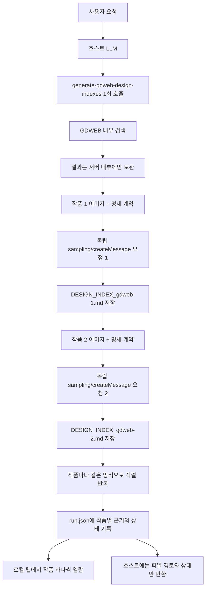

# Secret MCP

GDWEB에서 최근 디자인 레퍼런스를 검색하고, **검색 결과 하나마다 별도의 LLM 요청과 별도의 `DESIGN_INDEX` 파일을 생성하는** 로컬 MCP(Model Context Protocol) 서버입니다.

여러 작품의 이미지와 설명을 한 LLM 문맥이나 한 문서에 합치지 않습니다. 서버가 검색 결과를 내부에서 순서대로 처리하며, 작품마다 독립된 MCP `sampling/createMessage` 요청을 만들고 작품별 파일을 저장한 뒤 다음 작품으로 넘어갑니다. 별도 로컬 웹 프로그램에서는 작품을 하나씩 선택해 사용 근거, LLM 계약, 생성 기록과 최종 문서를 확인할 수 있습니다.

## 사용 방법

### 1. 설치와 빌드

```bash
git clone https://github.com/yyeongjin/secret_mcp.git
cd secret_mcp
npm install
npm run build
```

### 2. 웹 프로그램 실행

MCP와 웹 프로그램이 같은 출력 폴더를 보도록 `DESIGN_INDEX_OUTPUT_DIR` 값을 동일하게 지정합니다.

```bash
DESIGN_INDEX_OUTPUT_DIR=/absolute/path/to/design-index npm run web
```

브라우저에서 다음 주소를 엽니다.

```text
http://127.0.0.1:4317
```

웹 프로그램은 디버거가 아닙니다. 생성 실행 목록, 작품별 진행 상태, GDWEB 근거 이미지, LLM에 전달한 명세 계약, 최종 Markdown과 생성 시간만 읽기 전용으로 보여줍니다.

### 3. MCP 등록

```json
{
  "mcpServers": {
    "secret-mcp": {
      "command": "node",
      "args": [
        "/absolute/path/to/secret_mcp/dist/index.js"
      ],
      "env": {
        "DESIGN_INDEX_OUTPUT_DIR": "/absolute/path/to/design-index",
        "SECRET_MCP_WEB_ORIGIN": "http://127.0.0.1:4317"
      }
    }
  }
}
```

MCP 클라이언트는 `sampling/createMessage`를 지원해야 합니다. 지원하지 않는 클라이언트에서는 여러 작품을 같은 문맥에 넣는 fallback을 실행하지 않고 명확한 오류를 반환합니다.

서버는 HTTP 포트를 열지 않습니다. 클라이언트가 `node dist/index.js`를 자식 프로세스로 실행하고 stdio로 JSON-RPC 메시지를 주고받습니다.

### 4. LLM에 요청

별도의 `/web-design` 슬래시 명령은 필요하지 않습니다.

```text
Godot 프로젝트 사이트에 맞는 최근 디자인 레퍼런스 3개를 GDWEB에서 찾아줘.
각 검색 결과를 반드시 서로 독립된 LLM 요청으로 분석하고,
결과마다 재구현 가능한 DESIGN_INDEX 문서를 하나씩 생성해줘.
```

호스트 LLM은 `generate-gdweb-design-indexes` 도구를 한 번 호출합니다. 검색과 작품별 LLM 요청 분리는 MCP 서버 내부에서 수행됩니다.

수동 도구 호출 형식은 다음과 같습니다.

```json
{
  "name": "generate-gdweb-design-indexes",
  "arguments": {
    "query": "게임 포트폴리오",
    "limit": 3,
    "awardOnly": true,
    "includePreviousYear": true,
    "language": "Korean",
    "outputDirectory": "/absolute/path/to/design-index",
    "maxTokens": 20000
  }
}
```

`outputDirectory`를 생략하면 `DESIGN_INDEX_OUTPUT_DIR` 환경변수를 사용하고, 환경변수도 없으면 서버 실행 디렉터리의 `design-index` 폴더를 사용합니다.

도구가 완료되면 run ID, run manifest 경로, 작품별 문서 경로와 웹 뷰어 URL을 반환합니다.

## 핵심 실행 구조



중요한 경계는 다음과 같습니다.

- 바깥 호스트 LLM에는 여러 작품의 이미지나 명세 본문을 몰아서 반환하지 않습니다.
- `limit: 3`이면 서버가 서로 독립된 LLM sampling 요청을 정확히 최대 3회 수행합니다.
- 각 sampling 요청의 `includeContext`는 `none`입니다.
- 한 sampling 요청에는 작품 하나의 메타데이터와 이미지 조각만 포함됩니다.
- 이전 작품의 ID, 이미지, 분석 문서는 다음 작품 요청에 전달되지 않습니다.
- sampling 응답을 파일로 저장한 뒤에만 다음 작품 요청을 시작합니다.
- 마지막에는 생성 파일 경로, 사용 모델, 성공·실패 상태만 호스트에 반환합니다.

즉, 호스트 LLM이 모든 결과를 한꺼번에 읽고 통합 요약하는 이전 구조가 아닙니다.

## 웹 뷰어

웹 뷰어는 `DESIGN_INDEX_OUTPUT_DIR/.secret-mcp-runs`를 2.5초 간격으로 읽습니다. MCP 생성 작업과 웹 서버 사이에 별도 데이터베이스나 디버깅 연결은 없습니다.

화면은 세 영역으로 구성됩니다.

- 생성 실행: 검색어, 요청 개수, 허용 연도, 전체 상태
- 작품 목록: `gdweb-<작품번호>`별 진행 상태와 근거 이미지 수
- 작품 상세: 선택한 작품 하나의 명세서, 근거 이미지, 요청 계약, 생성 기록

작품이 세 개면 다음처럼 문서도 세 개가 생성됩니다.

```text
.secret-mcp-runs/<run-id>/
├── run.json
├── contracts/
│   ├── gdweb-26905.md
│   ├── gdweb-26522.md
│   └── gdweb-xxxxx.md
├── evidence/
│   ├── gdweb-26905_desktop_01-of-05.jpg
│   ├── gdweb-26522_desktop_01-of-04.jpg
│   └── ...
└── documents/
    ├── DESIGN_INDEX_gdweb-26905.md
    ├── DESIGN_INDEX_gdweb-26522.md
    └── DESIGN_INDEX_gdweb-xxxxx.md
```

`run.json`은 여러 작품의 문서 본문을 합친 파일이 아닙니다. 작품별 파일 경로, 상태, 시간, 모델과 근거 목록만 담는 웹 표시용 manifest입니다.

## 이미지 처리

GDWEB의 전체 데스크톱 캡처는 세로 길이가 매우 길고 수 MB에 이를 수 있습니다. 원본 base64를 그대로 sampling 요청에 넣으면 MCP 전송 한계를 넘거나 시각 모델이 세부 구조를 놓칠 수 있습니다.

`gdweb-sampling-images.ts`는 작품별 요청을 만들기 전에 다음 작업을 수행합니다.

- GDWEB 데스크톱 등록 이미지 `sgbn=1` 로드
- GDWEB 모바일 등록 이미지 `sgbn=3` 로드
- 데스크톱 이미지를 최대 1200px 폭으로 축소
- 긴 페이지를 1600px 높이의 겹치는 세로 타일로 분리
- 모바일 이미지는 별도 증거 이미지로 유지
- JPEG로 압축해 MCP sampling 요청 크기 제한 완화
- 각 조각에 원본 종류, 순서, 전체 조각 수, 크기와 출처 표시

한 작품의 여러 조각은 동일한 작품 전용 sampling 요청 안에 들어갑니다. 다른 작품의 조각은 절대 같은 요청에 포함하지 않습니다.

작품의 실제 운영 사이트를 열거나 DOM을 크롤링하지 않습니다. 시각적 근거는 GDWEB에 등록된 이미지와 메타데이터로 제한됩니다.

## GDWEB 검색

디자인 검색은 브라우저 자동화나 Bing, Brave, DuckDuckGo를 사용하지 않습니다.

```text
검색어
  -> POST https://www.gdweb.co.kr/sub/search.asp
  -> form field: Txt_word=<검색어>
  -> GDWEB 결과 HTML 파싱
  -> 작품 번호, 부문, 등록 연도 수집
  -> 현재 연도와 전년도만 유지
  -> GDWEB 상세 메타데이터와 등록 이미지 로드
```

### 최신성 정책

- `year`를 생략하면 실행 시점의 현재 연도를 사용합니다.
- `includePreviousYear` 기본값은 `true`입니다.
- 2026년에 실행하면 기본적으로 2026년과 2025년 등록작만 허용합니다.
- `includePreviousYear: false`이면 대상 연도 하나만 허용합니다.
- `awardOnly` 기본값은 `true`이며 수상명이 없는 작품은 제외합니다.
- `limit`은 1부터 10까지 지정할 수 있습니다.

### 작품 메타데이터

| 필드 | 설명 |
| --- | --- |
| `strNo` | GDWEB 작품 번호와 문서 파일명에 사용 |
| `txtFgbn` | GDWEB 작품 부문 값 |
| `title` | 작품명 |
| `gdwebUrl` | GDWEB 작품 상세 페이지 |
| `registeredDate` / `registeredYear` | 등록일과 필터 기준 연도 |
| `award` | 수상명 |
| `concept` | 디자인 컨셉 |
| `primaryColor` | 주색상 |
| `productionCompany` | 제작사 |
| `desktopImageUrl` | GDWEB 데스크톱 캡처 (`sgbn=1`) |
| `mobileImageUrl` | GDWEB 모바일 캡처 (`sgbn=3`) |

## DESIGN_INDEX 명세

각 독립 sampling 요청은 `secret-mcp/design-index/v1` 계약을 전달합니다. 결과 파일명은 `DESIGN_INDEX_gdweb-<strNo>.md`입니다.

문서에는 다음 15개 영역이 모두 있어야 합니다.

| 영역 | 반드시 명세할 내용 |
| --- | --- |
| 재구성 목표 | 참조 ID, 목표 충실도, 라우트, 대상 뷰포트, 비목표 |
| 근거 목록 | 이미지 종류·크기·출처·가시 범위·한계 |
| 정보 구조 | 헤더부터 푸터까지 순서, 섹션 역할과 컴포넌트 순서 |
| 섹션 레이아웃 | DOM 계층, grid/flex, 폭, 여백, 비율, 정렬, 고정·겹침 관계 |
| 컴포넌트 추상화 | 컴포넌트 트리, props, variants, slots, 상태, 이벤트, 데이터 계약 |
| 디자인 토큰 | 색상, 타이포그래피, 간격, radius, border, shadow, z-index, breakpoint, motion |
| 타이포그래피 | 글꼴, 크기, 굵기, 행간, 정렬, 말줄임, 반응형 변화 |
| 에셋 명세 | 역할, 비율, crop, focal point, object-fit, 우선순위, 대체 전략 |
| 반응형 규칙 | 열 축소, 순서 변경, 숨김·대체, 내비게이션, 간격, 이미지 crop, 터치 영역 |
| 상호작용·모션 | 링크, 버튼, 탭, 폼, hover/focus/pressed/disabled, 스크롤, 전환 |
| 접근성 | landmark, heading, 키보드, focus, label, alt, contrast, reduced motion |
| 프론트엔드 구조 | 라우트, 디렉터리, 모듈, 스타일링, 데이터 모델, 상태 소유권, 서버·클라이언트 경계 |
| 구현 작업 그래프 | 작업 ID, 의존성, 입력·출력, 대상 컴포넌트, 완료 조건, 병렬화 가능 범위 |
| 인수 조건 | 데스크톱·모바일 비교, overflow, 텍스트, 에셋, 키보드, 성능 검사 |
| 불확실성과 결정 | 이미지에서 확인 불가능한 항목과 대신 채택한 구현 결정 |

모든 주요 판단은 다음 근거 수준 중 하나로 표시합니다.

- `OBSERVED`: GDWEB 이미지나 메타데이터에서 직접 확인됨
- `INFERRED`: 동일한 결과를 구현하기 위해 합리적으로 추론함
- `UNKNOWN`: 정적 이미지로 확인할 수 없으며 사실처럼 단정하지 않음

다른 LLM이 완성된 문서만으로 컴포넌트 트리, 토큰, 반응형 규칙, 에셋, 구현 순서와 검증 항목을 도출할 수 있어야 합니다.

## 공개 도구

현재 서버는 다섯 개의 MCP 도구를 공개합니다.

| 도구 | 용도 |
| --- | --- |
| `generate-gdweb-design-indexes` | GDWEB 검색과 결과별 독립 LLM 요청, 문서 저장 |
| `search-gdweb-designs` | 명세 생성 없이 GDWEB 레퍼런스 목록만 확인 |
| `full-web-search` | 일반 웹 검색과 페이지 본문 추출 |
| `get-web-search-summaries` | 일반 검색 제목, URL, 설명 반환 |
| `get-single-web-page-content` | 이미 알고 있는 일반 페이지 본문 추출 |

디자인 계획, 레이아웃 분석, 구현 명세, `DESIGN_INDEX` 요청에는 `generate-gdweb-design-indexes`를 사용합니다. `search-gdweb-designs`는 단순 목록 요청에만 사용합니다.

## 일반 검색과의 경계


Bing, Brave, DuckDuckGo와 Playwright는 일반 검색 경로에서만 사용됩니다. GDWEB 검색과 이미지 수집에는 관여하지 않습니다.

## 소스 구조

```text
secret_mcp/
├── src/
│   ├── index.ts                         MCP 도구 등록과 sampling 요청
│   ├── dashboard-server.ts              로컬 웹 서버와 읽기 전용 API
│   ├── design-index-run-store.ts         run manifest와 작품별 산출물 기록
│   ├── gdweb-design-search.ts           GDWEB 검색, 연도 필터, 등록 이미지 로드
│   ├── gdweb-design-index-generator.ts  작품별 직렬 생성과 Markdown 저장
│   ├── gdweb-sampling-images.ts         긴 캡처 축소, 분할, 압축
│   ├── design-spec-contract.ts          DESIGN_INDEX 필수 명세 계약
│   ├── search-engine.ts                 일반 Bing, Brave, DuckDuckGo 검색
│   ├── enhanced-content-extractor.ts    일반 페이지 본문 추출
│   ├── browser-pool.ts                  일반 본문 추출용 브라우저 풀
│   ├── rate-limiter.ts                  일반 검색 요청 제한
│   ├── types.ts                         검색 및 도구 타입
│   └── utils.ts                         URL, 텍스트, 타임스탬프 유틸리티
├── web/
│   ├── index.html                       웹 뷰어 화면
│   ├── styles.css                       데스크톱·모바일 레이아웃
│   └── app.js                           run 갱신과 작품별 문서 전환
├── .github/workflows/
│   ├── ci.yml                           빌드, lint, 패키지 검증
│   ├── gdweb-smoke.yml                  GDWEB 실검색과 이미지 검증
│   └── release.yml                      릴리스 패키지 생성
├── tmp/DESIGN_CONTEST_SITES.md          디자인 공모 및 어워드 사이트 목록
├── mcp.json                             MCP 등록 예시
└── package.json
```

## 개발 및 검증

```bash
npm run build
npm run lint
npm run smoke:gdweb-isolation
npm run web
```

격리 smoke test는 sampling을 지원하는 가짜 MCP 클라이언트를 연결해 다음을 검증합니다.

- 검색 결과 수와 sampling 요청 수가 같은지
- sampling 요청 하나에 참조 ID가 하나만 있는지
- 다른 작품의 ID가 요청에 섞이지 않는지
- `includeContext: none`인지
- 요청마다 GDWEB 이미지가 포함되는지
- 결과마다 별도 Markdown 파일이 생성되는지

## 런타임 환경변수

| 이름 | 기본값 | 설명 |
| --- | --- | --- |
| `DESIGN_INDEX_OUTPUT_DIR` | `./design-index` | 생성된 문서 저장 디렉터리 |
| `SECRET_MCP_WEB_ORIGIN` | `http://127.0.0.1:4317` | MCP 결과에 표시할 웹 뷰어 주소 |
| `SECRET_MCP_WEB_HOST` | `127.0.0.1` | 웹 서버 bind 주소 |
| `SECRET_MCP_WEB_PORT` | `4317` | 웹 서버 포트 |
| `MAX_CONTENT_LENGTH` | `500000` | 일반 페이지에서 추출할 본문 최대 길이 |
| `DEFAULT_TIMEOUT` | `6000` | 일반 HTTP 및 브라우저 요청 timeout |
| `MAX_BROWSERS` | `3` | 일반 추출용 최대 브라우저 수 |
| `BROWSER_TYPES` | `chromium,firefox` | 일반 검색 및 추출에 사용할 브라우저 |
| `BROWSER_HEADLESS` | `true` | Playwright headless 실행 여부 |
| `FORCE_MULTI_ENGINE_SEARCH` | `false` | 일반 검색에서 모든 엔진을 비교할지 여부 |
| `DEBUG_BROWSER_LIFECYCLE` | `false` | 브라우저 생명주기 로그 출력 여부 |

## 문서

- [디자인 공모 및 어워드 사이트 목록](tmp/DESIGN_CONTEST_SITES.md)
