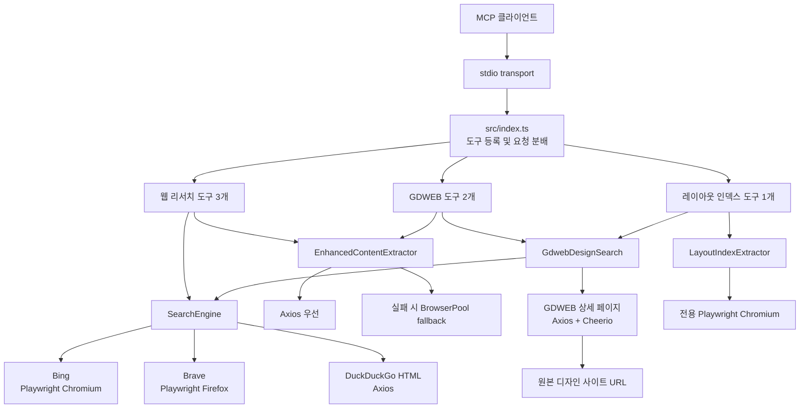
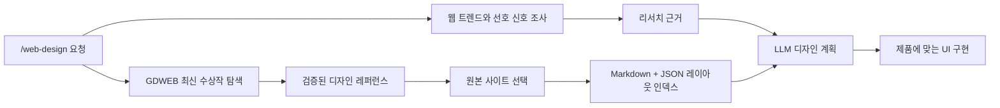

# Web Design MCP

웹 트렌드와 사용자 선호 신호를 검색하고, GDWEB의 검증된 디자인 레퍼런스를 찾고, 실제 사이트의 레이아웃 구조를 LLM용 인덱스로 변환하는 TypeScript 기반 MCP(Model Context Protocol) 서버입니다.

카카오 MCP로 제공할 목적입니다.

범용 웹 검색과 GDWEB 디자인 검색을 결합해 "사람들이 어떤 디자인을 좋아하는가"를 조사하고, 선택한 레퍼런스를 구현 가능한 레이아웃 계획으로 연결하는 것이 목적입니다.

## 사용자 명령어

카카오에서 사용자에게 노출할 슬래시 명령어는 `/web-design`을 권장합니다.

- 무엇을 찾는 명령인지 바로 이해할 수 있습니다.
- `gdweb`이라는 현재 데이터 공급처 이름에 사용자 경험이 종속되지 않습니다.
- 이후 다른 디자인 어워드나 레퍼런스 사이트를 추가해도 명령어를 유지할 수 있습니다.
- MCP 서버 식별자는 `web-design`, 실행 바이너리 이름은 `web-design-mcp`입니다.

MCP 프로토콜 자체가 `/web-design` 슬래시 명령을 등록하는 것은 아닙니다. 카카오 측 명령 라우팅에서 `/web-design`을 이 MCP 서버에 연결하고, 서버 내부에서는 아래 도구들을 순서에 맞게 호출하는 구조입니다.

## 주요 기능

- `full-web-search`: 웹 트렌드, 사용자 선호, 시장 맥락을 조사하고 결과 본문까지 추출
- `get-web-search-summaries`: 검색 결과 제목, URL, 설명만 빠르게 반환
- `get-single-web-page-content`: 특정 URL의 텍스트 본문 추출
- `search-gdweb-designs`: GDWEB 디자인 수상작 검색
- `get-gdweb-design-site`: GDWEB 상세 페이지에서 실제 디자인 사이트 URL 추출
- `generate-web-design-index`: 실제 사이트의 DOM과 스타일을 분석해 LLM용 레이아웃 인덱스 생성

## 문서

- [디자인 공모/어워드 사이트 목록](tmp/DESIGN_CONTEST_SITES.md)

## 현재 구조 한눈에 보기

현재 버전은 세 단계의 기능을 한 MCP 서버에서 제공합니다.

1. Bing, Brave, DuckDuckGo를 이용해 디자인 트렌드와 사용자 선호 맥락 조사
2. GDWEB에서 최근 수상작과 실제 디자인 사이트 발견
3. 선택한 사이트의 DOM, 레이아웃, 시각 토큰을 LLM용 인덱스 문서로 변환

GDWEB 검색도 내부적으로 범용 `SearchEngine`을 사용합니다. 외부 검색은 트렌드 조사와 GDWEB 상세 URL 발견이라는 두 역할을 함께 담당합니다.



### 런타임 구성

| 구분 | 현재 구현 |
| --- | --- |
| 언어 | TypeScript |
| 실행 환경 | Node.js 18 이상 |
| 모듈 형식 | ESM (`type: module`) |
| MCP SDK | `@modelcontextprotocol/sdk` |
| 전송 방식 | `StdioServerTransport` |
| 입력 검증 | Zod 및 일부 수동 검증 |
| HTTP 요청 | Axios |
| HTML 파싱 | Cheerio |
| 브라우저 자동화 | Playwright Chromium, Firefox |
| 빌드 | TypeScript compiler가 `src/`를 `dist/`로 컴파일 |
| 진입점 | 개발 시 `src/index.ts`, 실행 시 `dist/index.js` |

이 서버는 HTTP 포트를 열지 않습니다. MCP 클라이언트가 `node dist/index.js`를 자식 프로세스로 실행하고 표준입출력으로 JSON-RPC 메시지를 주고받습니다.

### TypeScript를 선택한 이유

TypeScript와 Python 모두 공식 MCP SDK에서 우선 지원되는 언어이므로, MCP 프로토콜 기능 자체는 어느 쪽을 선택해도 구현할 수 있습니다. 이 저장소에서는 다음 이유로 TypeScript를 유지합니다.

| 비교 항목 | TypeScript | Python | 현재 저장소의 판단 |
| --- | --- | --- | --- |
| 기존 코드와 통합 | MCP 서버, 검색엔진, 추출기가 모두 TypeScript | 동일 기능을 다시 감싸거나 프로세스 간 호출 필요 | TypeScript가 단순함 |
| 브라우저 자동화 | 설치된 Node Playwright와 Chromium, Firefox 재사용 | Python 패키지와 전용 브라우저 바이너리 추가 설치 필요 | TypeScript가 운영 부담이 적음 |
| DOM과 CSS 분석 | 브라우저의 JavaScript 실행 환경 및 웹 타입과 직접 연결 | Playwright API로 가능하지만 자료를 Python 객체로 다시 전달 | TypeScript가 자연스러움 |
| 데이터 및 AI 생태계 | 웹 서버와 프런트엔드 연계에 강함 | ML, 통계, 데이터 처리 라이브러리에 강함 | 현재 작업은 웹 구조 분석이 중심 |
| 배포 | `npm install`, `npm run build`, Node 실행으로 통일 | Node 서버와 Python 가상환경을 함께 관리해야 함 | 단일 런타임이 유리함 |

Python은 향후 이미지 분류, 임베딩 생성, 대규모 통계 분석처럼 Python 생태계가 필요한 독립 파이프라인을 추가할 때 좋은 선택입니다. 현재 핵심 기능은 검색 결과 수집과 브라우저 DOM/CSS 측정이므로, Python 하위 프로세스를 추가하지 않고 `src/layout-index-extractor.ts`에서 직접 처리합니다.

참고 자료:

- [MCP 공식 SDK 목록](https://modelcontextprotocol.io/docs/sdk)
- [공식 TypeScript SDK](https://github.com/modelcontextprotocol/typescript-sdk)
- [공식 Python SDK](https://github.com/modelcontextprotocol/python-sdk)
- [Playwright Python 설치 안내](https://playwright.dev/python/docs/library)

## MCP 도구와 의존 관계

현재 서버는 총 6개 도구를 공개합니다.

| 도구 | 역할 | 검색엔진 필요 | 본문 추출기 필요 |
| --- | --- | --- | --- |
| `full-web-search` | 범용 웹 검색 후 결과 페이지 본문 추출 | 필요 | `includeContent: true`일 때 필요 |
| `get-web-search-summaries` | 제목, URL, 검색 결과 설명만 반환 | 필요 | 불필요 |
| `get-single-web-page-content` | 알고 있는 URL 한 개의 본문 추출 | 불필요 | 필요 |
| `search-gdweb-designs` | 키워드로 GDWEB 상세 페이지를 찾고 디자인 메타데이터 반환 | 현재 구현에서는 필요 | 불필요 |
| `get-gdweb-design-site` | GDWEB 상세 URL 또는 `str_no`로 원본 사이트 확인 | 불필요 | `includeContent: true`일 때 필요 |
| `generate-web-design-index` | 실제 렌더링된 사이트를 레이아웃 인덱스로 변환 | GDWEB 입력일 때 상세 해석에만 필요 | 별도 DOM 분석기 사용 |

### `full-web-search`

1. `SearchEngine`이 Bing, Brave, DuckDuckGo에서 검색 결과를 수집합니다.
2. 본문 추출을 요청하면 PDF와 실패를 고려해 요청량보다 많은 후보를 확보합니다.
3. `EnhancedContentExtractor`가 검색 결과의 실제 페이지를 따라가 본문을 추출합니다.
4. 성공한 본문을 우선 반환하고, 사용 엔진과 추출 성공 및 실패 수를 상태로 표시합니다.

디자인 작업에서는 업종별 선호, 타깃 사용자의 기대, 최근 UX 패턴, 경쟁 서비스 반응을 조사하는 용도로 사용합니다.

### `get-web-search-summaries`

본문을 따라가지 않고 제목, URL, 검색 결과 설명만 반환합니다. 초기 탐색 범위를 빠르게 넓히거나 조사할 후보를 고를 때 사용합니다.

### `get-single-web-page-content`

검색 없이 URL 한 개의 텍스트 본문을 추출합니다. 레이아웃 측정이 아니라 콘텐츠와 메시지 구조를 이해하는 도구이며, 실제 배치와 시각 스타일은 `generate-web-design-index`가 담당합니다.

### `search-gdweb-designs`

현재 GDWEB 검색의 핵심 흐름은 다음과 같습니다.

```text
사용자 검색어
  -> site:gdweb.co.kr/sub/view.asp 연도 검색어
  -> Bing / Brave / DuckDuckGo 검색
  -> GDWEB 상세 URL만 선별 및 중복 제거
  -> 각 상세 페이지를 Axios로 요청
  -> Cheerio로 메타데이터 파싱
  -> 연도 및 수상 여부를 엄격하게 필터링
  -> 최신 연도 우선 정렬 후 limit만큼 반환
```

예를 들어 2026년에 `query: "브랜드 웹사이트"`, `includePreviousYear: true`로 호출하면 내부 검색어는 다음 형태가 됩니다.

```text
site:gdweb.co.kr/sub/view.asp 2026 OR 2025 브랜드 웹사이트
```

요청한 `limit`보다 충분한 후보를 확보하기 위해 검색엔진에는 `min(limit * 3, 10)`개를 요청합니다. 발견된 URL 중 다음 조건을 모두 만족하는 주소만 사용합니다.

- 호스트 이름이 `gdweb.co.kr`로 끝나야 합니다.
- 경로가 `/sub/view.asp`로 끝나야 합니다.
- 쿼리 문자열에 `str_no`가 있어야 합니다.
- `Txt_fgbn`이 없으면 기본값 `5`를 사용합니다.
- 정규화한 상세 URL을 기준으로 중복을 제거합니다.

각 상세 페이지에서는 다음 값을 추출합니다.

| 반환 필드 | GDWEB에서 읽는 위치 또는 의미 |
| --- | --- |
| `title` | `.content-info h2` |
| `gdwebUrl` | 정규화된 GDWEB 상세 URL |
| `siteUrl` | `.title-box .url a`의 원본 사이트 링크 |
| `registeredDate` | `등록일` 표 항목 |
| `registeredYear` | `등록일`에서 추출한 네 자리 연도 |
| `award` | `수상명` 표 항목 |
| `concept` | `디자인 컨셉` 표 항목 |
| `primaryColor` | `주색상` 표 항목 |
| `productionCompany` | `제작사` 표 항목 |
| `imageUrl` | `.view-area .img-box .img-inner > img`의 마지막 이미지 |
| `timestamp` | MCP 서버가 파싱한 시각 |

상세 페이지 요청은 6초 timeout을 사용합니다. 제목 또는 등록 연도를 읽지 못한 페이지는 결과에서 제외되며, 페이지 하나의 파싱 실패가 전체 검색을 중단시키지는 않습니다.

### `get-gdweb-design-site`

GDWEB 상세 URL이나 `strNo`를 이미 알고 있을 때 검색엔진을 거치지 않고 상세 페이지를 직접 읽습니다.

- `gdwebUrl`을 주면 호스트, 경로, `str_no`를 검증하고 URL을 정규화합니다.
- `strNo`를 주면 `Txt_fgbn=5`를 기본값으로 상세 URL을 조립합니다.
- `includeContent: false`이면 GDWEB 메타데이터와 원본 사이트 URL까지만 반환합니다.
- `includeContent: true`이면 원본 디자인 사이트를 `EnhancedContentExtractor`로 추가 요청합니다.
- 원본 사이트 본문 추출 실패는 GDWEB 메타데이터 조회 자체를 실패시키지 않고 `fetchStatus`와 오류 메시지로 표시합니다.

### `generate-web-design-index`

선택한 레퍼런스 사이트를 Playwright로 실제 렌더링한 뒤 LLM이 구현 계획에 사용할 레이아웃 인덱스를 만듭니다. 입력은 다음 세 방식 중 하나를 사용할 수 있습니다.

- `url`: 분석할 원본 사이트 URL을 직접 전달
- `gdwebUrl`: GDWEB 상세 페이지에서 원본 사이트를 해석한 뒤 분석
- `strNo`: GDWEB 작품 번호로 원본 사이트를 해석한 뒤 분석

기본 viewport는 `1440 x 1100`이며, 화면에 보이는 semantic element와 주요 body child를 최대 24개까지 수집합니다. `maxSections`로 1개부터 50개까지 조절할 수 있습니다.

각 섹션에서 수집하는 정보:

- DOM 순서와 부모 섹션 번호
- `header`, `nav`, `main`, `section`, `article`, `aside`, `footer` 등의 태그와 ARIA role
- ID, 주요 class, 대표 heading, 텍스트 샘플
- 렌더링된 x/y 좌표, 너비, 높이
- `display`, `position`, flex 방향과 정렬, grid column, gap
- 배경색, 글자색, 폰트, 글자 크기, border radius
- heading, paragraph, link, image, video 개수
- button과 CTA로 보이는 링크의 레이블
- 페이지 전체에서 자주 관찰되는 색상, 폰트 패밀리, 글자 크기

`outputFormat`은 `markdown`, `json`, `both`를 지원합니다. 기본 Markdown은 사람이 검토하기 쉽고, JSON은 LLM이나 후속 자동화가 안정적으로 필드를 읽기 좋습니다. `both`는 Markdown 끝에 원본 JSON을 함께 넣습니다.

이 도구는 레이아웃을 측정해 근거 문서를 만드는 역할만 합니다. 어떤 요소를 채택하고 어떻게 새 제품에 맞출지는 해당 인덱스, 웹 리서치 결과, 타깃 사용자 정보를 함께 받은 LLM이 결정합니다.

## 검색엔진 통합 방식

`SearchEngine.search()`는 기본적으로 아래 순서로 검색합니다.

| 순서 | 엔진 | 접근 방식 | 브라우저 | 재시도 |
| --- | --- | --- | --- | --- |
| 1 | Bing | 홈페이지 검색 폼 제출 후 실패하면 직접 검색 URL 사용 | 매 검색마다 전용 Chromium 실행 | 최대 2회 |
| 2 | Brave | 검색 URL로 직접 이동한 뒤 HTML 파싱 | 매 검색마다 전용 Firefox 실행 | 최대 2회 |
| 3 | DuckDuckGo | `html.duckduckgo.com/html/` GET 요청 후 HTML 파싱 | 사용하지 않음 | 별도 재시도 없음 |

각 엔진은 공식 검색 API가 아니라 공개 검색 결과 HTML을 읽습니다. 따라서 검색 사이트의 DOM 변경, CAPTCHA, 지역별 페이지 차이, 자동화 차단 정책에 영향을 받습니다. API 키가 필요 없다는 장점이 있지만 장기 안정성은 공식 API보다 낮습니다.

### 검색 결과 선택 로직

검색엔진은 단순히 첫 성공 결과만 사용하는 것이 아니라 제목, 설명, URL에 검색어가 얼마나 포함되는지 계산해 0부터 1 사이의 관련도 점수를 만듭니다.

- 점수가 `0.8` 이상이면 즉시 해당 엔진 결과를 반환합니다.
- Bing 결과가 기본 임계값 `0.3` 이상이어도 더 좋은 결과를 찾기 위해 다음 엔진을 계속 시도할 수 있습니다.
- Brave 또는 DuckDuckGo 결과가 임계값 이상이면 해당 결과를 반환합니다.
- 모든 엔진을 확인한 경우 가장 높은 점수의 결과를 사용합니다.
- 모든 결과가 임계값보다 낮아도 결과가 하나라도 있으면 가장 나은 결과를 반환합니다.
- `FORCE_MULTI_ENGINE_SEARCH=true`이면 조기 반환하지 않고 모든 엔진을 시도합니다.

관련도 계산은 검색어의 개별 단어와 연속 구문 일치를 가산하고, 음식, 날씨, 쇼핑, 스포츠 등 명백히 무관하다고 간주하는 영문 패턴이 있으면 감점합니다. 이 규칙은 범용 웹 검색을 전제로 작성되어 있으므로 한국어 디자인 검색에 완전히 최적화된 랭킹 모델은 아닙니다.

### 호출 제한

`SearchEngine` 앞에는 `RateLimiter`가 있습니다.

- MCP 프로세스 하나당 분당 검색 요청 10개
- 동시에 실행되는 제한 작업 최대 5개
- 한도를 넘으면 남은 대기 시간을 포함한 오류 반환
- 여기서 한 번의 요청은 내부 Bing, Brave, DuckDuckGo 시도 횟수가 아니라 `SearchEngine.search()` 호출 한 번을 의미

## 본문 추출 방식

실제 런타임은 `ContentExtractor`가 아니라 `EnhancedContentExtractor`를 사용합니다.

### 1단계: Axios

먼저 임의의 브라우저 헤더를 사용해 일반 HTTP 요청을 보냅니다. 응답 HTML에서 스크립트, 스타일, 폼, 이미지, 내비게이션, 광고, 사이드바 등의 요소를 제거하고 아래 우선순위로 본문 영역을 찾습니다.

```text
article -> main -> [role="main"] -> .content -> .post-content
-> .entry-content -> .article-content -> 기타 본문 후보 -> body
```

본문이 100자 미만이거나 JavaScript 활성화 문구, 접근 거부, CAPTCHA, 비정상 트래픽 문구 등이 발견되면 낮은 품질로 판단합니다.

### 2단계: Playwright browser fallback

Axios 실패가 다음 조건에 해당하면 `BrowserPool`에서 브라우저를 가져와 다시 시도합니다.

- HTTP 403, 429, 503
- timeout, Access denied, Forbidden, 낮은 품질 본문
- JavaScript, CAPTCHA, unusual traffic, robot 관련 응답
- Twitter, Facebook, Instagram, LinkedIn, Reddit, Medium처럼 브라우저 렌더링이 필요한 것으로 지정된 사이트

브라우저 추출은 이미지, 폰트, 미디어 요청을 차단하고 DOM이 준비되면 동일한 Cheerio 기반 정제 과정을 거칩니다. 기본 풀은 Chromium과 Firefox를 번갈아 사용하며, 브라우저 인스턴스는 재사용하고 종료 신호에서 모두 닫습니다.

여러 검색 결과의 본문을 가져올 때는 PDF를 먼저 제외하고 최대 `min(targetCount * 2, 10)`개의 후보를 동시에 처리합니다. 각 페이지에는 6초 추출 timeout과 8초 외부 안전 timeout이 적용됩니다.

## 소스 코드 구성

```text
secret_mcp/
├── src/
│   ├── index.ts                       MCP 진입점과 6개 도구 등록
│   ├── search-engine.ts               Bing, Brave, DuckDuckGo 통합 및 결과 선택
│   ├── gdweb-design-search.ts         GDWEB URL 발견, 상세 파싱, 연도 필터
│   ├── layout-index-extractor.ts      렌더링된 DOM을 LLM용 레이아웃 인덱스로 변환
│   ├── enhanced-content-extractor.ts  Axios 우선, Playwright fallback 본문 추출
│   ├── browser-pool.ts                본문 추출용 브라우저 생성, 재사용, 종료
│   ├── content-extractor.ts           이전 Axios 전용 추출기, 현재 진입점에서 미사용
│   ├── rate-limiter.ts                분당 요청 및 동시 실행 제한
│   ├── types.ts                       검색, 본문, 도구 입출력 타입
│   └── utils.ts                       텍스트 정제, URL, PDF, 타임스탬프 유틸리티
├── tests/                              검색엔진별 수동 실행 스크립트
├── scripts/bundle.js                   esbuild 번들 스크립트
├── docs/API.md                         기존 API 문서
├── tmp/DESIGN_CONTEST_SITES.md         디자인 공모/어워드 사이트 목록
├── eslint.config.js                    ESLint 9 flat config
├── .github/workflows/ci.yml            빌드, 린트, 패키지 검증
├── .github/workflows/gdweb-smoke.yml   수동 GDWEB 네트워크 smoke test
├── .github/workflows/release.yml       태그 기반 GitHub Release 생성
├── mcp.json                            MCP 설정 예시
├── package.json                        패키지, 실행 명령, 의존성
└── tsconfig.json                       TypeScript 빌드 설정
```

### 파일별 실제 책임과 참고사항

| 파일 | 실제 책임 | 현재 참고사항 |
| --- | --- | --- |
| `src/index.ts` | 서버 생성, Zod 입력 검증, 도구 응답 문자열 조립, 종료 처리 | 모든 기능이 한 클래스에 모여 있음 |
| `src/search-engine.ts` | 세 검색엔진 실행, HTML 파싱, URL 정리, 관련도 평가 | 검색엔진별 DOM 파서와 디버그 로그가 큼 |
| `src/gdweb-design-search.ts` | GDWEB 후보 발견 및 상세 메타데이터 파싱 | 키워드 검색은 `SearchEngine`에 의존 |
| `src/layout-index-extractor.ts` | 실제 DOM, computed style, 콘텐츠 구조 측정 | Markdown과 JSON 인덱스 생성 |
| `src/enhanced-content-extractor.ts` | 범용 페이지 본문 추출 | 현재 사용되는 추출기 |
| `src/browser-pool.ts` | Chromium, Firefox, WebKit 브라우저 풀 | 주로 본문 fallback에 사용 |
| `src/content-extractor.ts` | Axios 기반 구형 본문 추출 | 현재 어디에서도 import하지 않음 |
| `src/rate-limiter.ts` | 검색 호출 제한 | `getStatus()`는 현재 미사용 |
| `src/types.ts` | 내부 데이터 구조 정의 | 일부 과거 타입도 함께 남아 있음 |

## 제품 목표와 권장 워크플로

이 MCP의 제품 경계는 GDWEB 자체가 아니라 디자인 의사결정 과정입니다. 일반 웹 검색은 사람들이 무엇을 선호하는지에 대한 시장 신호를 모으고, GDWEB은 전문가 평가를 통과한 레퍼런스를 제공하며, 레이아웃 인덱스는 그 레퍼런스를 LLM이 구현 계획으로 바꿀 수 있는 형태로 만듭니다.



### 권장 도구 호출 순서

| 단계 | 목적 | 권장 도구 | 결과 |
| --- | --- | --- | --- |
| 1 | 업종과 타깃 사용자의 최근 선호 조사 | `full-web-search` 또는 `get-web-search-summaries` | 트렌드, 사례, 근거 URL |
| 2 | 전문가 평가를 받은 최신 레퍼런스 탐색 | `search-gdweb-designs` | 수상작, 컨셉, 색상, 제작사 |
| 3 | 분석할 실제 사이트 확정 | `get-gdweb-design-site` | 원본 사이트 URL과 메타데이터 |
| 4 | 실제 레이아웃 구조 측정 | `generate-web-design-index` | 섹션, 배치, 스타일, CTA, 디자인 토큰 |
| 5 | 새 제품에 맞는 계획 생성 | MCP를 사용하는 호스트 LLM | 페이지 구조와 구현 계획 |

MCP 서버가 디자인 취향을 임의로 단정하거나 완성된 화면을 자동 복제하지는 않습니다. 측정 가능한 근거와 구조를 제공하고, 호스트 LLM이 타깃 사용자, 제품 목적, 브랜드 제약을 함께 고려해 계획하도록 합니다.

웹 검색 결과는 대중 선호의 간접 신호이고 GDWEB 수상작은 전문가 평가의 신호입니다. 실제 사용자 행동을 확정하려면 향후 클릭률, 체류시간, 전환율, 사용자 인터뷰 같은 데이터도 함께 연결해야 합니다.

### 레이아웃 인덱스의 역할

레이아웃 인덱스는 `index.html` 완성본이 아니라 구현 전 설계 근거 문서입니다. Markdown은 사람과 LLM이 흐름을 검토하는 용도이고, JSON은 섹션과 스타일 값을 안정적으로 재사용하는 용도입니다. LLM은 이 문서를 참고하되 원본 브랜드, 카피, 이미지를 그대로 복제하지 않고 새 제품의 정보 구조에 맞게 재구성해야 합니다.

## 현재 구현에서 정리할 부분

아래 항목은 현재 동작을 막지는 않지만 이후 정리할 가치가 있습니다.

- `mcp.json`의 `/absolute/path/to/secret_mcp/dist/index.js`는 사용하는 컴퓨터의 실제 절대 경로로 바꿔야 합니다.
- `src/content-extractor.ts`는 현재 사용되지 않는 이전 구현입니다.
- `BROWSER_FALLBACK_THRESHOLD`는 읽고 로그에는 출력하지만 실제 fallback 분기 조건에는 사용되지 않습니다.
- Bing과 Brave는 `BrowserPool` 설정을 따르지 않고 검색마다 전용 Chromium과 Firefox를 직접 실행합니다.
- `MAX_BROWSERS`와 `BROWSER_TYPES`는 주로 본문 추출용 브라우저 풀에만 적용됩니다.
- `tests/`는 `npm test`에 연결된 자동 테스트가 아니라 직접 실행하는 JavaScript 스크립트입니다.
- `console.log`가 많은데 stdio MCP에서는 stdout을 프로토콜 전용으로 유지하고 일반 로그를 stderr로 보내는 편이 안전합니다.
- `tmp/DESIGN_CONTEST_SITES.md`는 저장소에는 포함되지만 `package.json`의 패키지 배포 파일 목록에는 `tmp`가 없어 npm tarball에는 포함되지 않습니다.

## GDWEB 검색 정책

디자인은 시간이 지나면 트렌드성이 떨어지기 때문에 GDWEB 검색은 최신성 필터를 강하게 적용합니다.

- `year`를 생략하면 실행 시점의 현재 연도를 사용합니다.
- 기본적으로 `현재 연도 + 전년도`만 허용합니다.
- 예: 2026년에 실행하면 2026년, 2025년 결과만 통과합니다.
- `includePreviousYear: false`를 주면 해당 연도만 허용합니다.
- 허용 연도 밖 결과는 점수 감점이 아니라 완전히 제외합니다.
- `awardOnly` 기본값은 `true`이며, 수상명이 없는 결과는 제외합니다.

## 설치

요구 사항:

- Node.js 18 이상
- npm

```bash
git clone https://github.com/yyeongjin/secret_mcp.git
cd secret_mcp
npm install
npx playwright install chromium firefox
npm run build
```

Playwright 브라우저 설치는 Bing/Brave 기반 검색에 필요합니다. 설치하지 않아도 DuckDuckGo fallback은 동작할 수 있지만 검색 품질이 크게 떨어질 수 있습니다.

## MCP 설정

MCP 클라이언트 설정에 빌드된 `dist/index.js`를 등록합니다.

Windows 예시:

```json
{
  "mcpServers": {
    "web-design": {
      "command": "node",
      "args": [
        "C:\\path\\to\\secret_mcp\\dist\\index.js"
      ]
    }
  }
}
```

macOS/Linux 예시:

```json
{
  "mcpServers": {
    "web-design": {
      "command": "node",
      "args": [
        "/path/to/secret_mcp/dist/index.js"
      ]
    }
  }
}
```

환경변수까지 같이 넣는 예시:

```json
{
  "mcpServers": {
    "web-design": {
      "command": "node",
      "args": [
        "C:\\path\\to\\secret_mcp\\dist\\index.js"
      ],
      "env": {
        "MAX_CONTENT_LENGTH": "10000",
        "BROWSER_HEADLESS": "true",
        "MAX_BROWSERS": "3",
        "BROWSER_FALLBACK_THRESHOLD": "3"
      }
    }
  }
}
```

## 도구 사용 예시

### GDWEB 디자인 검색

```json
{
  "name": "search-gdweb-designs",
  "arguments": {
    "query": "디자인 트렌드 웹사이트",
    "limit": 5,
    "awardOnly": true,
    "includePreviousYear": true
  }
}
```

2026년 기준이면 2026년과 2025년 수상작만 반환합니다.

특정 연도만 강제하려면:

```json
{
  "name": "search-gdweb-designs",
  "arguments": {
    "query": "브랜드 웹사이트",
    "year": 2026,
    "includePreviousYear": false
  }
}
```

### GDWEB 상세에서 원본 사이트 URL 추출

```json
{
  "name": "get-gdweb-design-site",
  "arguments": {
    "strNo": "26889",
    "includeContent": false
  }
}
```

GDWEB 상세 URL을 직접 넘길 수도 있습니다.

```json
{
  "name": "get-gdweb-design-site",
  "arguments": {
    "gdwebUrl": "https://www.gdweb.co.kr/sub/view.asp?Txt_fgbn=5&str_no=26889",
    "includeContent": true,
    "maxContentLength": 10000
  }
}
```

### 레이아웃 인덱스 생성

원본 사이트 URL을 직접 분석하려면:

```json
{
  "name": "generate-web-design-index",
  "arguments": {
    "url": "https://example.com",
    "maxSections": 24,
    "outputFormat": "both"
  }
}
```

GDWEB 작품 번호에서 원본 사이트를 해석해 바로 분석하려면:

```json
{
  "name": "generate-web-design-index",
  "arguments": {
    "strNo": "26889",
    "outputFormat": "markdown"
  }
}
```

## 런타임 환경변수

MCP 클라이언트의 `env`에 넣어서 동작을 조정할 수 있습니다.

| 이름 | 기본값 | 설명 |
| --- | --- | --- |
| `MAX_CONTENT_LENGTH` | `500000` | 추출할 본문 최대 길이 |
| `DEFAULT_TIMEOUT` | `6000` | HTTP/브라우저 요청 기본 타임아웃(ms) |
| `MAX_BROWSERS` | `3` | 유지할 최대 브라우저 수 |
| `BROWSER_TYPES` | `chromium,firefox` | 사용할 Playwright 브라우저 종류 |
| `BROWSER_HEADLESS` | `true` | 브라우저를 headless로 실행할지 여부 |
| `BROWSER_FALLBACK_THRESHOLD` | `3` | 현재 값만 읽고 로그에 표시하며 실제 fallback 분기에는 미사용 |
| `ENABLE_RELEVANCE_CHECKING` | `true` | 검색 결과 품질 점수 계산 사용 여부 |
| `RELEVANCE_THRESHOLD` | `0.3` | 검색 결과 최소 품질 점수 |
| `FORCE_MULTI_ENGINE_SEARCH` | `false` | 모든 검색엔진을 시도한 뒤 최고 결과 선택 |
| `DEBUG_BROWSER_LIFECYCLE` | `false` | 브라우저 생명주기 로그 출력 |
| `DEBUG_BING_SEARCH` | `false` | Bing 검색 디버그 로그 출력 |

## 개발 명령어

```bash
npm install
npx playwright install chromium firefox
npm run build
npm run lint
npm run dev
```

Windows PowerShell 실행 정책 때문에 `npm`이 막히면 `npm.cmd`를 사용합니다.

```powershell
npm.cmd install
npx.cmd playwright install chromium firefox
npm.cmd run build
```

## GitHub Actions

이 레포에는 세 가지 워크플로가 있습니다.

### CI

파일: `.github/workflows/ci.yml`

실행 시점:

- `main` 브랜치 push
- `main` 대상 pull request
- 수동 실행

수행 작업:

- `npm ci`
- `npm run build`
- `npm run lint`
- `npm pack --dry-run`

필요한 GitHub secret 또는 환경변수:

- 없음

### GDWEB Smoke Test

파일: `.github/workflows/gdweb-smoke.yml`

실행 시점:

- 수동 실행만 지원

수동 입력값:

| 이름 | 기본값 | 설명 |
| --- | --- | --- |
| `query` | `디자인 트렌드 웹사이트` | GDWEB 검색 쿼리 |
| `year` | 빈 값 | 대상 연도. 비워두면 현재 연도 사용 |

수행 작업:

- `npm ci`
- `npx playwright install chromium firefox`
- `npm run build`
- GDWEB 검색 smoke test 실행

필요한 GitHub secret 또는 환경변수:

- 없음

주의:

- 실제 검색엔진과 GDWEB에 접근하므로 네트워크 상태나 검색엔진 차단에 따라 실패할 수 있습니다.
- 이 워크플로는 기본 CI에 넣지 않고 수동 실행으로 분리했습니다.

### Release

파일: `.github/workflows/release.yml`

실행 시점:

- `v*` 태그 push
- 수동 실행

수동 입력값:

| 이름 | 설명 |
| --- | --- |
| `tag` | 릴리스 태그. 예: `v0.3.1` |
| `prerelease` | GitHub Release를 prerelease로 표시할지 여부 |

수행 작업:

- `npm ci`
- `npm run build`
- `npm run lint`
- `npm pack`
- GitHub Release 생성 및 `.tgz` 업로드

필요한 GitHub secret 또는 환경변수:

- 별도 secret 없음
- GitHub Actions가 자동 제공하는 `GITHUB_TOKEN` 사용

필요한 레포 설정:

- GitHub 저장소의 `Settings > Actions > General > Workflow permissions`에서 `Read and write permissions`가 필요할 수 있습니다.
- `Allow GitHub Actions to create and approve pull requests`는 현재 워크플로에는 필수는 아닙니다.

릴리스 태그 예시:

```bash
git tag v0.3.1
git push origin v0.3.1
```

## Dependabot

파일: `.github/dependabot.yml`

대상:

- npm 의존성
- GitHub Actions 버전

주기:

- 매주

필요한 secret:

- 없음

## 다른 컴퓨터에서 사용하는 절차

```bash
git clone https://github.com/yyeongjin/secret_mcp.git
cd secret_mcp
npm install
npx playwright install chromium firefox
npm run build
```

그 다음 MCP 클라이언트 설정에서 `dist/index.js`를 지정하면 됩니다.

## 주의사항

- `workflow/` 폴더는 다른 레포에서 가져온 이식용 원본이라 `.gitignore` 처리되어 있습니다.
- `dist/`는 빌드 산출물이라 git에는 올라가지 않습니다.
- npm 패키지 tarball에는 `dist`, `docs`, `README.md`, `LICENSE`, `mcp.json`만 포함되도록 `package.json`의 `files` 필드로 제한했습니다.
- GDWEB은 `robots.txt` 정책상 대량 크롤링보다는 검색 결과로 발견된 상세 페이지를 최소 파싱하는 방식이 안전합니다.
