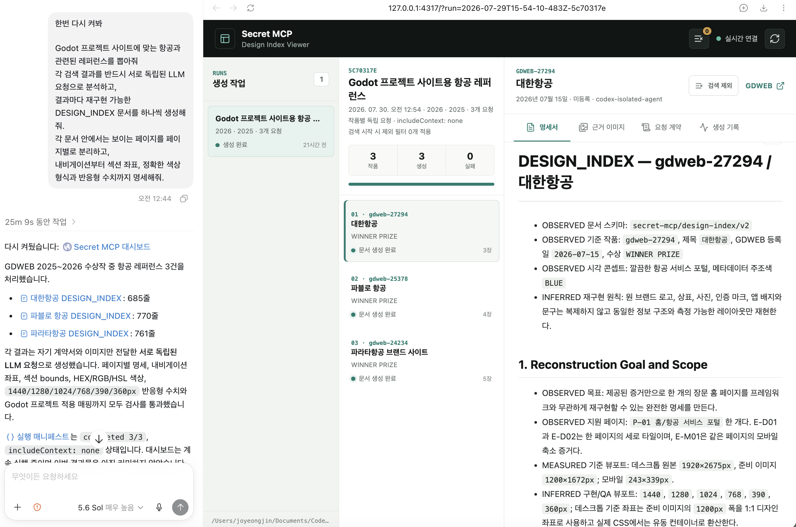
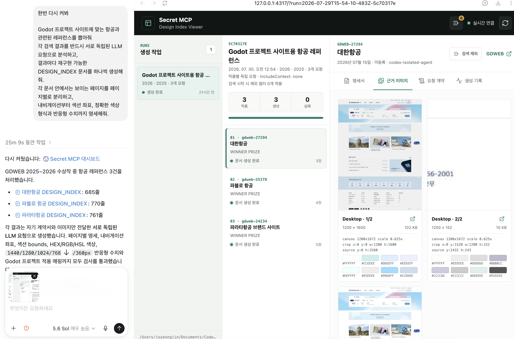
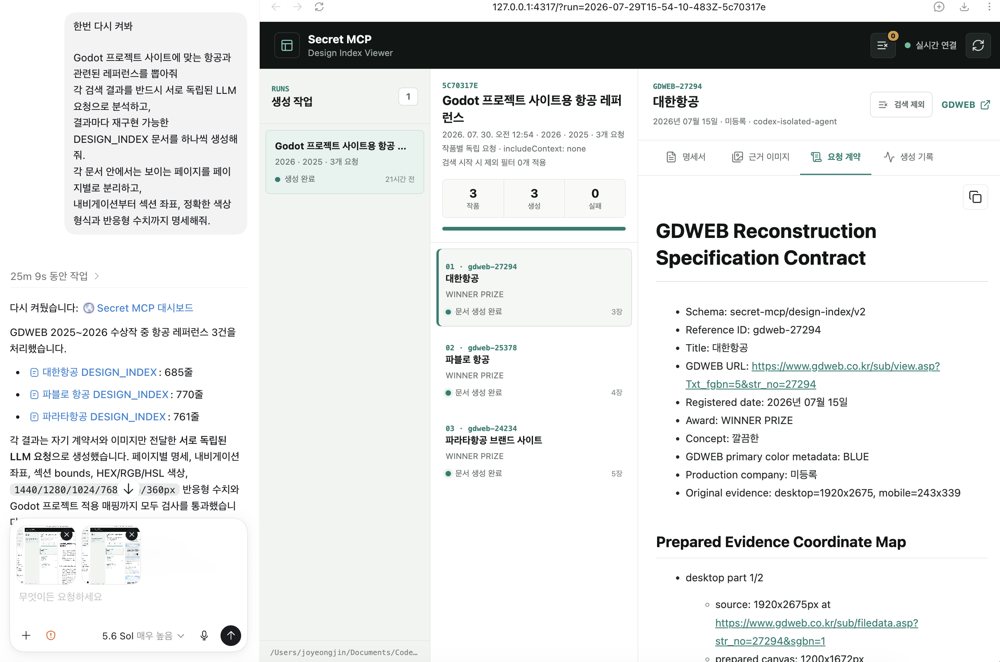
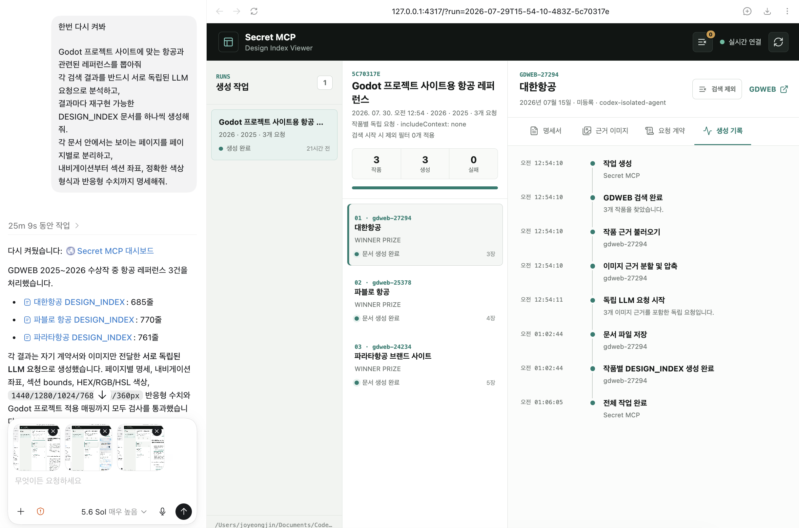
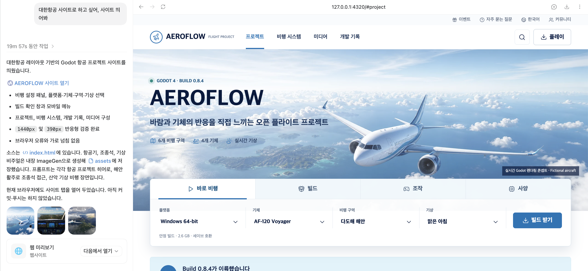
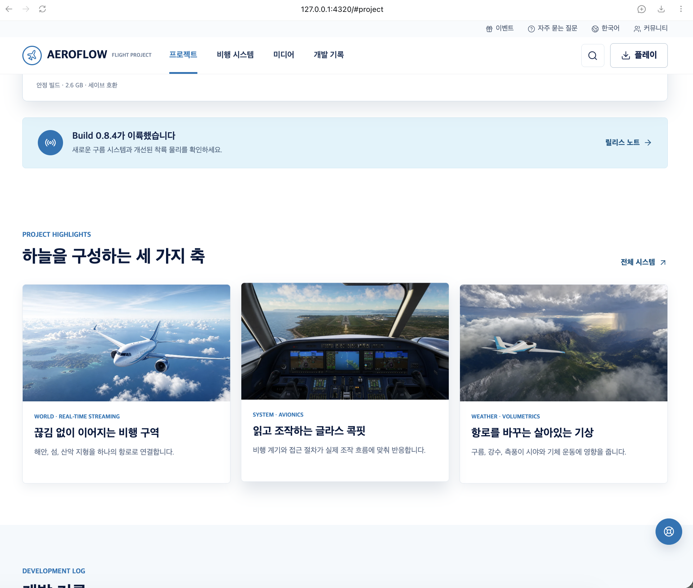
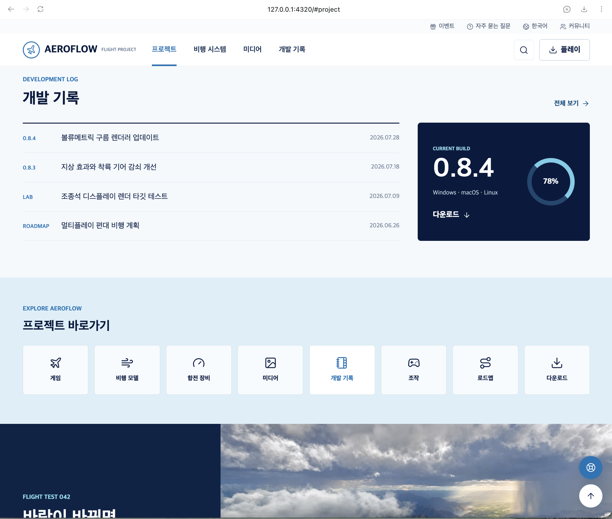
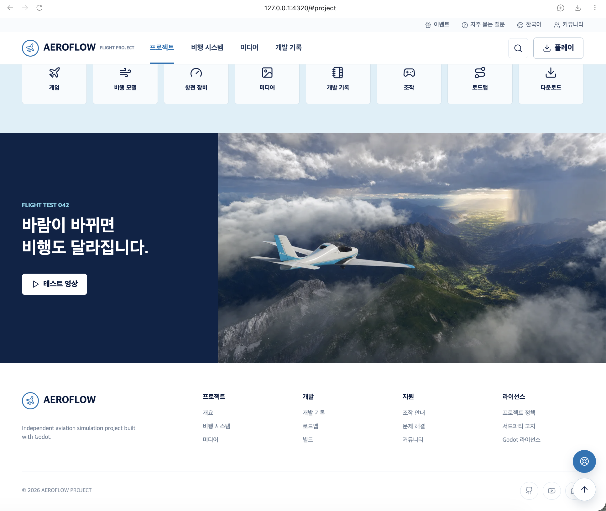
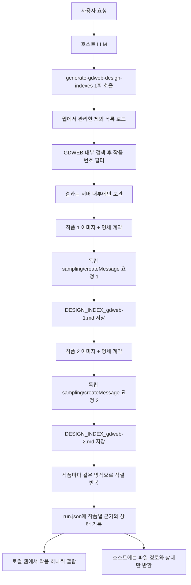

# Secret MCP

GDWEB에서 최근 디자인 레퍼런스를 검색하고, **검색 결과 하나마다 별도의 LLM 요청과 별도의 `DESIGN_INDEX` 파일을 생성하는** 로컬 MCP(Model Context Protocol) 서버입니다. 각 파일 내부에는 확인 가능한 페이지·라우트별 레이아웃, 내비게이션, 픽셀 좌표, 색상, 컴포넌트와 반응형 명세가 들어갑니다.

`Secret MCP`라는 이름은 비밀 기능이나 비공개 데이터를 제공한다는 뜻이 아닙니다. 비공개 저장소에서 디자인 사이트를 기반으로 MCP를 만들 수 있을지 실험하면서 붙인 프로젝트명입니다. 현재 프로젝트의 목적은 공개된 디자인 레퍼런스에서 재구현 가능한 구조적 근거를 추출하고, LLM이 새 프로젝트에 적용할 수 있는 작품별 명세로 만드는 것입니다.

여러 작품의 이미지와 설명을 한 LLM 문맥이나 한 문서에 합치지 않습니다. 서버가 검색 결과를 내부에서 순서대로 처리하며, 작품마다 독립된 MCP `sampling/createMessage` 요청을 만들고 작품별 파일을 저장한 뒤 다음 작품으로 넘어갑니다. 별도 로컬 웹 프로그램에서는 작품을 하나씩 선택해 사용 근거, 측정 색상·좌표, LLM 계약, 생성 기록과 최종 문서를 확인하고 다음 검색의 제외 목록을 관리할 수 있습니다.

## 사용 방법

### 1. 설치와 빌드

Node.js 20.19 이상이 필요합니다.

```bash
git clone https://github.com/yyeongjin/secret_mcp.git
cd secret_mcp
npm install
npm run build
```

### 2. 웹 프로그램 실행

MCP와 웹 프로그램이 같은 출력 폴더를 보도록 `DESIGN_INDEX_OUTPUT_DIR` 값을 동일하게 지정합니다.

```bash
DESIGN_INDEX_OUTPUT_DIR=/absolute/path/to/design-index npm run web
```

브라우저에서 다음 주소를 엽니다.

```text
http://127.0.0.1:4317
```

웹 프로그램은 생성 실행 목록, 작품별 진행 상태, GDWEB 근거 이미지, 측정 좌표·팔레트, LLM에 전달한 명세 계약, 최종 Markdown과 생성 시간을 보여줍니다. 문서와 근거는 읽기 전용이며, `검색 제외`와 `제외 해제`만 다음 검색 필터를 변경합니다.

### 3. MCP 등록

```json
{
  "mcpServers": {
    "secret-mcp": {
      "command": "node",
      "args": [
        "/absolute/path/to/secret_mcp/dist/index.js"
      ],
      "env": {
        "DESIGN_INDEX_OUTPUT_DIR": "/absolute/path/to/design-index",
        "SECRET_MCP_WEB_ORIGIN": "http://127.0.0.1:4317"
      }
    }
  }
}
```

MCP 클라이언트는 `sampling/createMessage`를 지원해야 합니다. 지원하지 않는 클라이언트에서는 여러 작품을 같은 문맥에 넣는 fallback을 실행하지 않고 명확한 오류를 반환합니다.

MCP stdio 서버 자체는 HTTP 포트를 열지 않습니다. 클라이언트가 `node dist/index.js`를 자식 프로세스로 실행하고 stdio로 JSON-RPC 메시지를 주고받습니다. 별도의 웹 뷰어 프로세스만 기본 `4317` 포트를 사용합니다.

### 4. LLM에 요청

별도의 `/web-design` 슬래시 명령은 필요하지 않습니다.

```text
Godot 프로젝트 사이트에 맞는 최근 디자인 레퍼런스 3개를 GDWEB에서 찾아줘.
각 검색 결과를 반드시 서로 독립된 LLM 요청으로 분석하고,
결과마다 재구현 가능한 DESIGN_INDEX 문서를 하나씩 생성해줘.
각 문서 안에서는 보이는 페이지를 페이지별로 분리하고,
내비게이션부터 섹션 좌표, 정확한 색상 형식과 반응형 수치까지 명세해줘.
```

호스트 LLM은 `generate-gdweb-design-indexes` 도구를 한 번 호출합니다. 검색과 작품별 LLM 요청 분리는 MCP 서버 내부에서 수행됩니다.

수동 도구 호출 형식은 다음과 같습니다.

```json
{
  "name": "generate-gdweb-design-indexes",
  "arguments": {
    "query": "게임 포트폴리오",
    "limit": 3,
    "awardOnly": true,
    "includePreviousYear": true,
    "language": "Korean",
    "outputDirectory": "/absolute/path/to/design-index",
    "maxTokens": 32000
  }
}
```

`outputDirectory`를 생략하면 `DESIGN_INDEX_OUTPUT_DIR` 환경변수를 사용하고, 환경변수도 없으면 서버 실행 디렉터리의 `design-index` 폴더를 사용합니다.

도구가 완료되면 run ID, run manifest 경로, 작품별 문서 경로와 웹 뷰어 URL을 반환합니다.

## 실행 사례: GDWEB 명세에서 Godot 항공 사이트까지

실제 실행 사례로 2026·2025 GDWEB 항공 수상작 세 건을 찾고, 작품마다 독립된 LLM 요청으로 `DESIGN_INDEX`를 생성한 뒤 대한항공 레퍼런스의 구조를 Godot 항공 프로젝트 사이트에 적용했습니다.

완성된 `AEROFLOW` 사이트는 대한항공 사이트를 복제한 화면이 아닙니다. 명세서에서 정보 계층, 내비게이션, 실행 패널, 섹션 배열과 반응형 원칙을 가져오고 브랜드, 문구, 항공 이미지와 콘텐츠를 새로 만들었습니다. 이 사례는 **결과 디자인이 레퍼런스와 달라도, 측정 가능한 구조를 기반으로 독특한 개성과 완성도를 가진 사이트를 만들 수 있음**을 보여줍니다.

### 사례 구동

```bash
# 1. 빌드
npm install
npm run build

# 2. 작품별 문서 웹 뷰어
DESIGN_INDEX_OUTPUT_DIR="$PWD/tmp/design-index/aviation-godot-20260730" npm run web

# 3. 명세 기반 결과 사이트
python3 -m http.server 4320 \
  --bind 127.0.0.1 \
  --directory tmp/showcase/aviation-godot/generated-site
```

실행 후 다음 화면을 엽니다.

- 작품별 명세 웹 뷰어: <http://127.0.0.1:4317/?run=2026-07-29T15-54-10-483Z-5c70317e>
- AEROFLOW 결과 사이트: <http://127.0.0.1:4320>

### 1. 작품별 명세 생성 결과

왼쪽 실행 목록에서 작품을 하나씩 선택합니다. 오른쪽에는 선택한 작품 하나의 최종 `DESIGN_INDEX`만 표시되며 다른 작품의 내용은 섞이지 않습니다.



### 2. 근거 이미지와 측정값

`근거 이미지` 탭에서는 독립 LLM 요청에 전달된 데스크톱·모바일 이미지, 타일 좌표, 축소 비율과 대표 색상을 확인합니다.



### 3. 독립 LLM 요청 계약

`요청 계약`에는 페이지 분리, 내비게이션, 섹션 bounds, HEX/RGB/HSL 색상, 컴포넌트, 반응형 행렬과 인수 조건이 기록됩니다. 이 계약 때문에 결과가 단순 분위기 요약으로 끝나지 않고 다른 LLM이 구현할 수 있는 명세가 됩니다.



### 4. 생성 과정 확인

`생성 기록`은 검색, 근거 이미지 준비, 작품별 독립 LLM 요청, 문서 저장과 전체 작업 완료 순서를 보여줍니다. 이번 실행은 세 작품을 `includeContext: none` 요청으로 각각 처리했습니다.



### 5. 명세 기반 AEROFLOW 첫 화면

대한항공 레퍼런스에서 확인한 밝은 항공 포털과 실행 패널 구조를 Godot 프로젝트에 맞게 바꿨습니다. 브랜드, 항공기 이미지, 문구와 기능은 새로 제작했습니다.



### 6. 프로젝트 하이라이트

예약·프로모션 카드 구조는 비행 구역, 글라스 콕핏, 실시간 기상이라는 프로젝트 핵심 콘텐츠로 치환했습니다.



### 7. 개발 기록과 바로가기

원본의 공지·서비스 바로가기 구조를 빌드 기록, 개발 진행률, 비행 모델, 항전 장비, 미디어, 조작과 로드맵 탐색으로 재구성했습니다.



### 8. 미디어와 푸터

마지막에는 프로젝트 미디어, 개발·지원·라이선스 링크와 독립 프로젝트 푸터를 배치했습니다.



### 이 결과가 보여주는 것

- 레퍼런스의 로고, 상표, 카피와 이미지를 복제하지 않아도 검증된 정보 계층과 레이아웃 관계를 새 프로젝트에 적용할 수 있습니다.
- 정적 스크린샷을 내비게이션, 픽셀 bounds, 색상 토큰, 컴포넌트와 반응형 행렬로 바꾸면 다른 LLM도 구체적인 구현 계획을 세울 수 있습니다.
- 같은 구조적 근거를 사용해도 콘텐츠, 브랜드와 시각 자산을 새로 설계하면 원본과 다른 독특한 개성을 만들 수 있습니다.
- Secret MCP의 목적은 원본을 픽셀 단위로 복제하는 것이 아니라, 좋은 디자인의 구조적 근거를 추출해 새 프로젝트에 맞는 완성도 높은 사이트를 만드는 데 있습니다.

### 명세서와 요청 계약

- [대한항공 DESIGN_INDEX 명세서](tmp/design-index/aviation-godot-20260730/.secret-mcp-runs/2026-07-29T15-54-10-483Z-5c70317e/documents/DESIGN_INDEX_gdweb-27294.md)
- [독립 LLM 요청 계약](tmp/design-index/aviation-godot-20260730/.secret-mcp-runs/2026-07-29T15-54-10-483Z-5c70317e/contracts/gdweb-27294.md)
- [실행 매니페스트](tmp/design-index/aviation-godot-20260730/.secret-mcp-runs/2026-07-29T15-54-10-483Z-5c70317e/run.json)
- [생성 사이트 소스](tmp/reconstructions/gdweb-27294-godot/index.html)

위 링크는 저장소에 포함된 실제 파일을 직접 가리킵니다. 같은 산출물은 `tmp/showcase/aviation-godot` 아래의 상대 심볼릭 링크로도 묶어 두어 로컬 실행과 탐색에 사용할 수 있습니다.

## 핵심 실행 구조



중요한 경계는 다음과 같습니다.

- 바깥 호스트 LLM에는 여러 작품의 이미지나 명세 본문을 몰아서 반환하지 않습니다.
- `limit: 3`이면 서버가 서로 독립된 LLM sampling 요청을 정확히 최대 3회 수행합니다.
- 각 sampling 요청의 `includeContext`는 `none`입니다.
- 한 sampling 요청에는 작품 하나의 메타데이터와 이미지 조각만 포함됩니다.
- 이전 작품의 ID, 이미지, 분석 문서는 다음 작품 요청에 전달되지 않습니다.
- 웹에서 제외한 작품은 sampling 요청을 만들기 전 검색 결과에서 제거됩니다.
- sampling 응답을 파일로 저장한 뒤에만 다음 작품 요청을 시작합니다.
- 마지막에는 생성 파일 경로, 사용 모델, 성공·실패 상태만 호스트에 반환합니다.

즉, 호스트 LLM이 모든 결과를 한꺼번에 읽고 통합 요약하는 이전 구조가 아닙니다.

## 웹 뷰어

웹 뷰어는 `DESIGN_INDEX_OUTPUT_DIR/.secret-mcp-runs`를 2.5초 간격으로 읽습니다. MCP 생성 작업과 웹 서버 사이에 별도 데이터베이스나 디버깅 연결은 없습니다.

화면은 세 영역으로 구성됩니다.

- 생성 실행: 검색어, 요청 개수, 허용 연도, 전체 상태
- 작품 목록: `gdweb-<작품번호>`별 진행 상태와 근거 이미지 수
- 작품 상세: 선택한 작품 하나의 명세서, 근거 이미지와 측정값, 요청 계약, 생성 기록
- 검색 제외: 선택 작품을 다음 검색에서 제외하거나 다시 포함하고 전체 제외 목록 관리

작품이 세 개면 다음처럼 문서도 세 개가 생성됩니다.

```text
.secret-mcp-runs/<run-id>/
├── run.json
├── contracts/
│   ├── gdweb-26905.md
│   ├── gdweb-26522.md
│   └── gdweb-xxxxx.md
├── evidence/
│   ├── gdweb-26905_desktop_01-of-05.jpg
│   ├── gdweb-26522_desktop_01-of-04.jpg
│   └── ...
└── documents/
    ├── DESIGN_INDEX_gdweb-26905.md
    ├── DESIGN_INDEX_gdweb-26522.md
    └── DESIGN_INDEX_gdweb-xxxxx.md
```

`run.json`은 여러 작품의 문서 본문을 합친 파일이 아닙니다. 작품별 파일 경로, 상태, 시간, 모델과 근거 목록만 담는 웹 표시용 manifest입니다.

### 검색 제외 목록

웹에서 `검색 제외`를 누르면 다음 파일에 작품 번호가 저장됩니다.

```text
DESIGN_INDEX_OUTPUT_DIR/.secret-mcp/exclusions.json
```

- 과거 실행과 생성 문서는 삭제하지 않습니다.
- 새 `generate-gdweb-design-indexes` 실행과 `search-gdweb-designs` 실행에서 작품 번호를 먼저 필터링합니다.
- 제외 때문에 결과가 부족하지 않도록 더 많은 GDWEB 후보를 읽은 뒤 요청한 `limit`만큼 비제외 작품을 선택합니다.
- `제외 해제`를 누르면 이후 검색부터 다시 후보에 포함됩니다.
- MCP와 웹이 동일한 `DESIGN_INDEX_OUTPUT_DIR`을 사용해야 같은 제외 목록을 봅니다.

## 이미지 처리

GDWEB의 전체 데스크톱 캡처는 세로 길이가 매우 길고 수 MB에 이를 수 있습니다. 원본 base64를 그대로 sampling 요청에 넣으면 MCP 전송 한계를 넘거나 시각 모델이 세부 구조를 놓칠 수 있습니다.

`gdweb-sampling-images.ts`는 작품별 요청을 만들기 전에 다음 작업을 수행합니다.

- GDWEB 데스크톱 등록 이미지 `sgbn=1` 로드
- GDWEB 모바일 등록 이미지 `sgbn=3` 로드
- 데스크톱 이미지를 최대 1200px 폭으로 축소
- 긴 페이지를 1600px 높이의 겹치는 세로 타일로 분리
- 모바일 이미지는 별도 증거 이미지로 유지
- JPEG로 압축해 MCP sampling 요청 크기 제한 완화
- 각 조각에 원본·준비 캔버스 크기, 축소 비율, 준비 좌표의 `x/y/width/height`, 원본 환산 좌표와 출처 표시
- 각 조각에서 대표 색상 8개를 측정해 HEX, RGB, HSL과 픽셀 점유율 기록

한 작품의 여러 조각은 동일한 작품 전용 sampling 요청 안에 들어갑니다. 다른 작품의 조각은 절대 같은 요청에 포함하지 않습니다.

대표 색상은 정규화된 스크린샷 픽셀을 샘플링한 측정값입니다. 따라서 화면 비교를 위한 정확한 근거이지만, JPEG 오차와 이미지 콘텐츠가 포함되므로 원본 사이트의 CSS 변수였다고 단정하지 않습니다. 생성 계약은 `MEASURED` 색상과 구현용 `INFERRED` 토큰을 구분하게 합니다.

작품의 실제 운영 사이트를 열거나 DOM을 크롤링하지 않습니다. 시각적 근거는 GDWEB에 등록된 이미지와 메타데이터로 제한됩니다.

## GDWEB 검색

디자인 검색은 브라우저 자동화나 Bing, Brave, DuckDuckGo를 사용하지 않습니다.

```text
검색어
  -> POST https://www.gdweb.co.kr/sub/search.asp
  -> form field: Txt_word=<검색어>
  -> GDWEB 결과 HTML 파싱
  -> 작품 번호, 부문, 등록 연도 수집
  -> 현재 연도와 전년도만 유지
  -> GDWEB 상세 메타데이터와 등록 이미지 로드
```

### 최신성 정책

- `year`를 생략하면 실행 시점의 현재 연도를 사용합니다.
- `includePreviousYear` 기본값은 `true`입니다.
- 2026년에 실행하면 기본적으로 2026년과 2025년 등록작만 허용합니다.
- `includePreviousYear: false`이면 대상 연도 하나만 허용합니다.
- `awardOnly` 기본값은 `true`이며 수상명이 없는 작품은 제외합니다.
- `limit`은 1부터 10까지 지정할 수 있습니다.

### 작품 메타데이터

| 필드 | 설명 |
| --- | --- |
| `strNo` | GDWEB 작품 번호와 문서 파일명에 사용 |
| `txtFgbn` | GDWEB 작품 부문 값 |
| `title` | 작품명 |
| `gdwebUrl` | GDWEB 작품 상세 페이지 |
| `registeredDate` / `registeredYear` | 등록일과 필터 기준 연도 |
| `award` | 수상명 |
| `concept` | 디자인 컨셉 |
| `primaryColor` | 주색상 |
| `productionCompany` | 제작사 |
| `desktopImageUrl` | GDWEB 데스크톱 캡처 (`sgbn=1`) |
| `mobileImageUrl` | GDWEB 모바일 캡처 (`sgbn=3`) |

## DESIGN_INDEX 명세

각 독립 sampling 요청은 `secret-mcp/design-index/v2` 계약을 전달합니다. 결과 파일명은 `DESIGN_INDEX_gdweb-<strNo>.md`입니다.

작품별 파일은 하나지만, 파일 내부에는 먼저 페이지·라우트 목록이 나오고 확인된 페이지마다 완전한 하위 명세가 반복됩니다. 긴 스크롤 캡처의 섹션을 서로 다른 페이지로 오인하지 않으며, 콜라주에서 별도 화면이 확인될 때만 페이지를 나눕니다.

문서에는 다음 19개 numbered section이 모두 있어야 합니다.

| 영역 | 반드시 명세할 내용 |
| --- | --- |
| 재구성 목표 | 참조 ID, 목표 충실도, 라우트, 대상 뷰포트, 비목표 |
| 근거·좌표계 | 이미지 ID, 원본/준비 크기, 배율, 타일 좌표, 원본 환산 좌표, 겹침 제거 방식 |
| 사이트 맵 | 확인된 페이지·라우트, 목적, 근거 이미지, 공통 셸, 활성 메뉴, 신뢰도 |
| 공통 앱 셸 | 전역 배경, 컨테이너, 거터, 오버레이, 페이지 크롬과 stacking context |
| 내비게이션 | 데스크톱·모바일 높이, 로고/메뉴 좌표, 간격, 터치 영역, active/hover/focus/open 상태 |
| 페이지별 명세·좌표표 | 페이지마다 캔버스 모델, 섹션 순서, x/y/width/height, 레이아웃, 상태, 데이터와 근거 수준 |
| 레이아웃 상세 | DOM, grid/flex, track, min/max, 비율, gap, overflow, sticky, absolute, z-index |
| 컴포넌트 추상화 | 페이지 연결 컴포넌트 트리, props, variants, slots, 상태, 이벤트, 데이터 계약 |
| 토큰·정확 색상 | HEX/RGB/HSL/alpha, 사용 위치, 측정 좌표, 신뢰도, 허용 오차, CSS 변수 |
| 타이포그래피 | 역할별 글꼴, px/rem, 굵기, 행간, 자간, 정렬, 말줄임과 반응형 값 |
| 에셋·아이콘 | 페이지·섹션, 표시 크기, 비율, crop, focal point, object-fit, 로딩, 대체 전략 |
| 반응형 행렬 | 1440/1280/1024/768/390/360px별 컨테이너, 열, 순서, 노출, 내비게이션과 간격 |
| 상호작용·모션 | 상태별 색상·opacity·transform·duration·easing·키보드·reduced motion |
| 접근성 | 페이지별 landmark, heading, focus, 메뉴 semantics, label, alt, contrast, touch target |
| 데이터·콘텐츠 | 페이지 엔티티, 필드, 개수, 정렬, 포맷, 다국어, loading/empty/error fixture |
| 프론트엔드 구조 | 라우트, 디렉터리, 페이지/공통 모듈, 토큰, 에셋, 상태, 서버·클라이언트 경계 |
| 구현 작업 그래프 | 측정, 셸, 내비게이션, 페이지별 작업 ID, 의존성, 산출물, 완료 조건 |
| 페이지별 인수 조건 | 좌표·색상·타이포 허용 오차, 뷰포트 비교, overflow, 에셋, 키보드, 성능 |
| 불확실성과 결정 | 페이지/섹션별 UNKNOWN, 채택값, 대안, 신뢰도와 추가 필요 근거 |

모든 주요 판단은 다음 근거 수준 중 하나로 표시합니다.

- `OBSERVED`: GDWEB 이미지나 메타데이터에서 직접 확인됨
- `MEASURED`: 전달된 픽셀 좌표나 측정 팔레트에서 수치로 확인됨
- `INFERRED`: 동일한 결과를 구현하기 위해 합리적으로 추론함
- `UNKNOWN`: 정적 이미지로 확인할 수 없으며 사실처럼 단정하지 않음

다른 LLM이 완성된 문서만으로 컴포넌트 트리, 토큰, 반응형 규칙, 에셋, 구현 순서와 검증 항목을 도출할 수 있어야 합니다.

## 공개 도구

현재 서버는 다섯 개의 MCP 도구를 공개합니다.

| 도구 | 용도 |
| --- | --- |
| `generate-gdweb-design-indexes` | GDWEB 검색과 결과별 독립 LLM 요청, 문서 저장 |
| `search-gdweb-designs` | 명세 생성 없이 GDWEB 레퍼런스 목록만 확인 |
| `full-web-search` | 일반 웹 검색과 페이지 본문 추출 |
| `get-web-search-summaries` | 일반 검색 제목, URL, 설명 반환 |
| `get-single-web-page-content` | 이미 알고 있는 일반 페이지 본문 추출 |

디자인 계획, 레이아웃 분석, 구현 명세, `DESIGN_INDEX` 요청에는 `generate-gdweb-design-indexes`를 사용합니다. `search-gdweb-designs`는 단순 목록 요청에만 사용합니다.

## 일반 검색과의 경계


Bing, Brave, DuckDuckGo와 Playwright는 일반 검색 경로에서만 사용됩니다. GDWEB 검색과 이미지 수집에는 관여하지 않습니다.

## 소스 구조

```text
secret_mcp/
├── src/
│   ├── index.ts                         MCP 도구 등록과 sampling 요청
│   ├── dashboard-server.ts              로컬 웹 서버와 문서·제외 목록 API
│   ├── design-index-run-store.ts         run manifest와 작품별 산출물 기록
│   ├── design-exclusion-store.ts         영구 검색 제외 목록의 추가·해제
│   ├── design-index-paths.ts             MCP·웹의 공통 출력 경로 해석
│   ├── gdweb-design-search.ts           GDWEB 검색, 연도 필터, 등록 이미지 로드
│   ├── gdweb-design-index-generator.ts  작품별 직렬 생성과 Markdown 저장
│   ├── gdweb-sampling-images.ts         긴 캡처 축소, 분할, 압축
│   ├── design-spec-contract.ts          DESIGN_INDEX 필수 명세 계약
│   ├── search-engine.ts                 일반 Bing, Brave, DuckDuckGo 검색
│   ├── enhanced-content-extractor.ts    일반 페이지 본문 추출
│   ├── browser-pool.ts                  일반 본문 추출용 브라우저 풀
│   ├── rate-limiter.ts                  일반 검색 요청 제한
│   ├── types.ts                         검색 및 도구 타입
│   └── utils.ts                         URL, 텍스트, 타임스탬프 유틸리티
├── web/
│   ├── index.html                       웹 뷰어 화면
│   ├── styles.css                       데스크톱·모바일 레이아웃
│   └── app.js                           run 갱신과 작품별 문서 전환
├── .github/workflows/
│   ├── ci.yml                           빌드, lint, 패키지 검증
│   ├── gdweb-smoke.yml                  GDWEB 실검색과 이미지 검증
│   └── release.yml                      릴리스 패키지 생성
├── tmp/DESIGN_CONTEST_SITES.md          디자인 공모 및 어워드 사이트 목록
├── tmp/reconstructions/
│   └── gdweb-27294-godot/               명세 기반 AEROFLOW 정적 사이트
├── tmp/showcase/aviation-godot/
│   ├── DESIGN_INDEX.md                   작품별 명세서 상대 심볼릭 링크
│   ├── REQUEST_CONTRACT.md               독립 요청 계약 상대 심볼릭 링크
│   ├── RUN_MANIFEST.json                 실행 매니페스트 상대 심볼릭 링크
│   ├── generated-site/                   결과 사이트 상대 심볼릭 링크
│   └── screenshots/                      README용 실행·결과 화면
├── mcp.json                             MCP 등록 예시
└── package.json
```

## 개발 및 검증

```bash
npm run build
npm run lint
npm run smoke:gdweb-isolation
npm run web
```

격리 smoke test는 sampling을 지원하는 가짜 MCP 클라이언트를 연결해 다음을 검증합니다.

- 검색 결과 수와 sampling 요청 수가 같은지
- sampling 요청 하나에 참조 ID가 하나만 있는지
- 다른 작품의 ID가 요청에 섞이지 않는지
- `includeContext: none`인지
- 요청마다 GDWEB 이미지가 포함되는지
- 결과마다 별도 Markdown 파일이 생성되는지
- 제외한 작품이 이후 검색과 sampling 요청에 들어오지 않는지
- 명세 계약에 페이지별·내비게이션·좌표·색상 요구가 포함되는지
- run manifest 근거에 타일 좌표와 측정 팔레트가 기록되는지

## 런타임 환경변수

| 이름 | 기본값 | 설명 |
| --- | --- | --- |
| `DESIGN_INDEX_OUTPUT_DIR` | `./design-index` | 생성된 문서 저장 디렉터리 |
| `SECRET_MCP_WEB_ORIGIN` | `http://127.0.0.1:4317` | MCP 결과에 표시할 웹 뷰어 주소 |
| `SECRET_MCP_WEB_HOST` | `127.0.0.1` | 웹 서버 bind 주소 |
| `SECRET_MCP_WEB_PORT` | `4317` | 웹 서버 포트 |
| `MCP_SAMPLING_TIMEOUT_MS` | `180000` | 작품별 독립 LLM 요청 제한 시간(ms) |
| `MAX_CONTENT_LENGTH` | `500000` | 일반 페이지에서 추출할 본문 최대 길이 |
| `DEFAULT_TIMEOUT` | `6000` | 일반 HTTP 및 브라우저 요청 timeout |
| `MAX_BROWSERS` | `3` | 일반 추출용 최대 브라우저 수 |
| `BROWSER_TYPES` | `chromium,firefox` | 일반 검색 및 추출에 사용할 브라우저 |
| `BROWSER_HEADLESS` | `true` | Playwright headless 실행 여부 |
| `FORCE_MULTI_ENGINE_SEARCH` | `false` | 일반 검색에서 모든 엔진을 비교할지 여부 |
| `DEBUG_BROWSER_LIFECYCLE` | `false` | 브라우저 생명주기 로그 출력 여부 |

## 문서

- [디자인 공모 및 어워드 사이트 목록](tmp/DESIGN_CONTEST_SITES.md)
- [새 clone 재검증 기록](docs/VERIFICATION_TEST.md)
- [영커피 DESIGN_INDEX](docs/generated/food-godot-20260803/DESIGN_INDEX_gdweb-26387.md)
- [요리엔 DESIGN_INDEX](docs/generated/food-godot-20260803/DESIGN_INDEX_gdweb-26788.md)
- [꾸블랙치킨 DESIGN_INDEX](docs/generated/food-godot-20260803/DESIGN_INDEX_gdweb-26853.md)
- [대한항공 DESIGN_INDEX 명세서](tmp/design-index/aviation-godot-20260730/.secret-mcp-runs/2026-07-29T15-54-10-483Z-5c70317e/documents/DESIGN_INDEX_gdweb-27294.md)
- [대한항공 독립 요청 계약](tmp/design-index/aviation-godot-20260730/.secret-mcp-runs/2026-07-29T15-54-10-483Z-5c70317e/contracts/gdweb-27294.md)
