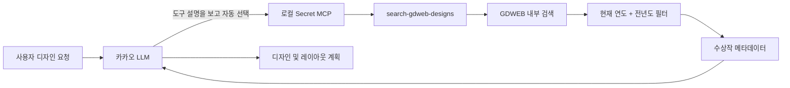
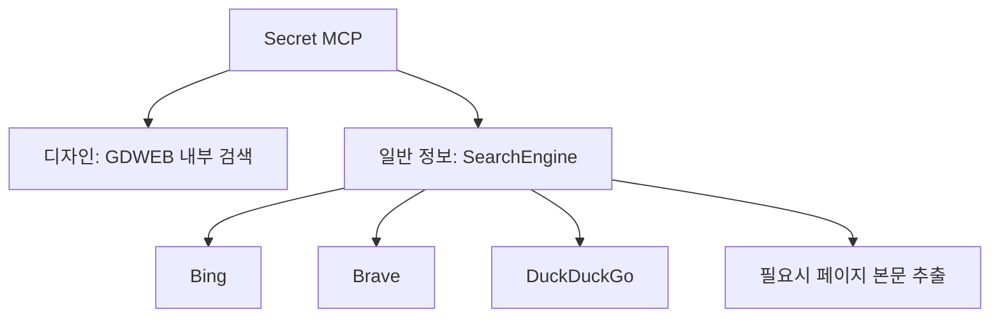

# Secret MCP

카카오의 LLM이 필요에 따라 자동 호출하는 로컬 검색 MCP(Model Context Protocol) 서버입니다.

일반 정보는 범용 웹 검색 도구로 찾고, 웹 디자인 레퍼런스는 GDWEB의 내부 검색을 직접 호출해 찾습니다. 사용자가 브라우저를 열거나 GDWEB URL, 작품 번호, 검색엔진을 직접 선택하는 구조가 아닙니다. MCP 클라이언트가 이 서버의 도구 설명을 LLM에 제공하면 LLM이 사용자 요청에 맞는 검색 도구를 선택합니다.

## 핵심 동작

예를 들어 사용자가 다음처럼 요청합니다.

```text
금융 서비스에 어울리는 최근 웹 디자인 레퍼런스를 찾아서 화면 구성을 계획해줘.
```

호스트 LLM은 디자인 레퍼런스가 필요하다고 판단하고 `search-gdweb-designs`를 자동 호출합니다. 이 도구는 GDWEB 내부 검색 결과 중 현재 연도와 전년도 작품만 반환합니다. 2026년에 실행하면 2026년과 2025년 작품만 통과합니다.



별도의 `/web-design` 슬래시 명령이나 사용자의 수동 도구 선택은 필수가 아닙니다. 핵심 진입점은 LLM의 자동 MCP 도구 선택입니다.

## 공개 도구

현재 서버는 네 개의 MCP 도구를 공개합니다.

| 도구 | LLM이 사용하는 상황 | 내부 동작 |
| --- | --- | --- |
| `search-gdweb-designs` | 디자인 레퍼런스, 시각 방향, 레이아웃 영감, 최근 수상작이 필요할 때 | GDWEB 내부 검색 직접 호출 |
| `full-web-search` | 일반 웹 자료와 페이지 본문까지 필요할 때 | 범용 검색 후 본문 추출 |
| `get-web-search-summaries` | 일반 검색 결과를 빠르게 훑을 때 | 제목, URL, 설명 반환 |
| `get-single-web-page-content` | 이미 알고 있는 페이지의 본문이 필요할 때 | 해당 URL 본문 추출 |

디자인 요청에는 `search-gdweb-designs`가 우선입니다. Bing, Brave, DuckDuckGo는 일반 웹 검색 도구에서만 사용되며 GDWEB 검색 경로에는 관여하지 않습니다.

## GDWEB 내부 검색

### 요청 흐름

`GdwebDesignSearch`는 브라우저 자동화나 외부 검색엔진을 사용하지 않습니다.

```text
LLM이 전달한 자연어 검색어
  -> POST https://www.gdweb.co.kr/sub/search.asp
  -> form field: Txt_word=<검색어>
  -> GDWEB 검색 결과 HTML 파싱
  -> 작품 번호, 부문, 등록 날짜 수집
  -> 현재 연도와 전년도만 유지
  -> 해당 GDWEB 상세 페이지에서 메타데이터 보강
  -> LLM에 구조화된 검색 결과 반환
```

GDWEB 웹사이트의 실제 상단 검색 폼과 같은 `/sub/search.asp` 엔드포인트를 사용합니다. 검색 결과에서 `/sub/view.asp` 작품 링크를 수집하고 같은 작품의 중복 링크는 제거합니다.

### 최신성 정책

디자인 트렌드의 시간 민감성을 고려해 연도 필터는 점수 조정이 아니라 강제 제외 방식으로 적용합니다.

- `year`를 생략하면 실행 시점의 현재 연도를 사용합니다.
- `includePreviousYear` 기본값은 `true`입니다.
- 2026년 기본 허용 범위는 2026년과 2025년입니다.
- `includePreviousYear: false`이면 대상 연도 하나만 허용합니다.
- 허용 범위보다 오래된 작품은 상세 결과에 포함하지 않습니다.
- `awardOnly` 기본값은 `true`이며 수상명이 없는 작품은 제외합니다.
- 최종 반환 개수는 `limit`이며 1개부터 10개까지 요청할 수 있습니다.

### 반환 정보

각 작품은 다음 정보를 LLM에 제공합니다.

| 필드 | 설명 |
| --- | --- |
| `title` | GDWEB 작품명 |
| `gdwebUrl` | GDWEB 작품 상세 페이지 |
| `registeredDate` | 등록일 |
| `registeredYear` | 연도 필터에 사용하는 등록 연도 |
| `award` | 수상명 |
| `concept` | 디자인 컨셉 |
| `primaryColor` | 주색상 |
| `productionCompany` | 제작사 |
| `imageUrl` | GDWEB에 등록된 작품 이미지 |

서버는 외부 원본 사이트의 DOM을 복제하거나 레이아웃을 크롤링하지 않습니다. LLM은 GDWEB 검색 결과와 작품 메타데이터를 참고해 사용자 제품에 맞는 디자인 계획을 세웁니다.

## 일반 웹 검색과의 경계

범용 웹 검색은 디자인 전용 검색과 별개입니다.



- 디자인 레퍼런스 검색: Axios와 Cheerio로 GDWEB에 직접 요청
- 일반 웹 검색: `SearchEngine`이 Bing, Brave, DuckDuckGo를 순서대로 시도
- 본문 추출: Axios 우선, 필요한 경우 Playwright fallback

따라서 GDWEB 검색만 사용할 때는 Playwright 브라우저를 실행하지 않습니다.

## 설치

요구 사항:

- Node.js 18 이상
- npm

```bash
git clone https://github.com/yyeongjin/secret_mcp.git
cd secret_mcp
npm install
npm run build
```

일반 웹 검색의 Bing 및 Brave 경로까지 사용하려면 Playwright 브라우저도 설치합니다.

```bash
npx playwright install chromium firefox
```

GDWEB 내부 검색만 사용할 때는 별도 브라우저 설치가 필요하지 않습니다.

## MCP 등록

MCP 클라이언트 설정에 로컬 빌드 결과를 등록합니다.

```json
{
  "mcpServers": {
    "secret-mcp": {
      "command": "node",
      "args": [
        "/absolute/path/to/secret_mcp/dist/index.js"
      ]
    }
  }
}
```

서버는 HTTP 포트를 열지 않습니다. MCP 클라이언트가 `node dist/index.js`를 로컬 자식 프로세스로 실행하고 stdio로 JSON-RPC 메시지를 주고받습니다.

일반 로그는 stderr로 출력해 stdout의 MCP JSON-RPC 스트림을 오염시키지 않습니다.

## LLM 자동 선택 예시

다음 요청은 디자인 도구를 선택하도록 유도합니다.

```text
최근 금융권 웹사이트 수상작을 참고해서 대시보드 디자인 방향을 잡아줘.
```

```text
2025년 이후의 교육 서비스 웹 디자인 레퍼런스를 찾아줘.
```

```text
깔끔하고 신뢰감 있는 기업 웹사이트 사례를 GDWEB에서 찾아 화면 구성을 제안해줘.
```

도구를 직접 호출해 확인할 때의 입력 형식은 다음과 같습니다.

```json
{
  "name": "search-gdweb-designs",
  "arguments": {
    "query": "금융",
    "limit": 5,
    "awardOnly": true,
    "includePreviousYear": true
  }
}
```

2026년에 위 요청을 실행하면 2026년과 2025년 결과만 반환합니다.

## 소스 구조

```text
secret_mcp/
├── src/
│   ├── index.ts                       MCP 서버와 네 개 도구 등록
│   ├── gdweb-design-search.ts         GDWEB 내부 검색 및 최신성 필터
│   ├── search-engine.ts               일반 Bing, Brave, DuckDuckGo 검색
│   ├── enhanced-content-extractor.ts  일반 페이지 본문 추출
│   ├── browser-pool.ts                일반 본문 추출용 브라우저 풀
│   ├── rate-limiter.ts                일반 웹 검색 요청 제한
│   ├── types.ts                       검색 및 도구 타입
│   └── utils.ts                       URL, 텍스트, 타임스탬프 유틸리티
├── .github/workflows/
│   ├── ci.yml                         빌드, lint, 패키지 검증
│   ├── gdweb-smoke.yml                GDWEB 내부 검색 실사용 테스트
│   └── release.yml                    릴리스 패키지 생성
├── tmp/DESIGN_CONTEST_SITES.md         디자인 공모 및 어워드 사이트 목록
├── mcp.json                            로컬 MCP 등록 예시
└── package.json
```

## 개발 및 검증

```bash
npm run build
npm run lint
```

GDWEB smoke workflow는 Playwright를 설치하지 않고 `GdwebDesignSearch`를 직접 실행합니다. 이는 GDWEB 검색 경로가 외부 검색엔진이나 브라우저에 의존하지 않는지 함께 검증합니다.

## 런타임 환경변수

아래 설정은 일반 웹 검색 및 본문 추출 경로에 적용됩니다. GDWEB 내부 검색은 이 브라우저 설정을 사용하지 않습니다.

| 이름 | 기본값 | 설명 |
| --- | --- | --- |
| `MAX_CONTENT_LENGTH` | `500000` | 일반 페이지에서 추출할 본문 최대 길이 |
| `DEFAULT_TIMEOUT` | `6000` | 일반 HTTP 및 브라우저 요청 timeout |
| `MAX_BROWSERS` | `3` | 일반 추출용 최대 브라우저 수 |
| `BROWSER_TYPES` | `chromium,firefox` | 일반 검색 및 추출에 사용할 브라우저 |
| `BROWSER_HEADLESS` | `true` | Playwright headless 실행 여부 |
| `FORCE_MULTI_ENGINE_SEARCH` | `false` | 일반 검색에서 모든 엔진을 비교할지 여부 |
| `DEBUG_BROWSER_LIFECYCLE` | `false` | 브라우저 생명주기 로그 출력 여부 |

## 문서

- [디자인 공모 및 어워드 사이트 목록](tmp/DESIGN_CONTEST_SITES.md)
