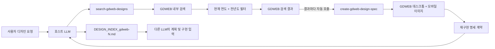
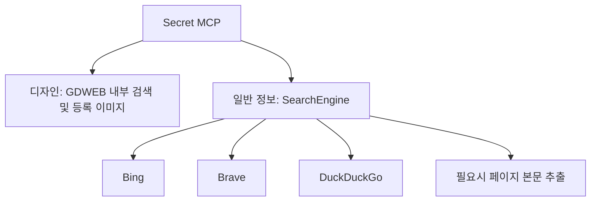

# Secret MCP

카카오를 포함한 MCP 호스트 LLM이 필요에 따라 자동 호출하는 로컬 검색 MCP(Model Context Protocol) 서버입니다.

일반 정보는 범용 웹 검색으로 찾고, 웹 디자인 작업은 GDWEB 내부 검색에서 최근 레퍼런스를 찾은 뒤 **검색 결과마다 재구현용 `DESIGN_INDEX` 명세서**를 작성하게 합니다. 사용자가 검색엔진, 작품 번호, GDWEB URL, 후속 도구를 직접 선택하거나 입력하는 구조가 아닙니다.

## 핵심 목표

디자인 레퍼런스를 단순히 나열하는 것이 목적이 아닙니다. GDWEB에 등록된 데스크톱·모바일 이미지를 현재 호스트 LLM에 시각 근거로 제공하고, 다른 LLM이 그 문서만 읽어도 유사한 프론트엔드를 구현할 수 있을 정도로 레이아웃과 구현 과제를 명세하는 것이 목적입니다.

예를 들어 사용자가 다음처럼 요청합니다.

```text
최근 금융 서비스 레퍼런스를 찾아서 각각의 화면 구조를 구현 가능한 명세서로 만들어줘.
```

호스트 LLM은 다음 흐름을 자동 수행합니다.



별도의 `/web-design` 명령은 필요하지 않습니다. MCP 클라이언트가 도구 설명을 LLM에 제공하면 LLM이 디자인 의도를 판단해 검색 도구와 결과별 명세 도구를 연속으로 호출합니다.

## 공개 도구

현재 서버는 다섯 개의 MCP 도구를 공개합니다.

| 도구 | LLM이 사용하는 상황 | 내부 동작 |
| --- | --- | --- |
| `search-gdweb-designs` | 디자인 레퍼런스, 시각 방향, 레이아웃, 구현 계획, 최근 수상작이 필요할 때 | GDWEB 내부 검색 직접 호출 및 연도 필터 |
| `create-gdweb-design-spec` | GDWEB 검색 결과를 재구현 가능한 프론트엔드 명세로 만들 때 | 작품별 GDWEB 이미지와 강제 명세 계약을 호스트 LLM에 반환 |
| `full-web-search` | 일반 웹 자료와 페이지 본문까지 필요할 때 | 범용 검색 후 본문 추출 |
| `get-web-search-summaries` | 일반 검색 결과를 빠르게 훑을 때 | 제목, URL, 설명 반환 |
| `get-single-web-page-content` | 이미 알고 있는 일반 페이지의 본문이 필요할 때 | 해당 URL 본문 추출 |

디자인 요청에는 `search-gdweb-designs`가 우선입니다. 디자인 계획이나 구현까지 요청받으면 LLM은 반환된 **모든 결과에 대해** `create-gdweb-design-spec`를 한 번씩 이어서 호출해야 합니다.

## GDWEB 검색 구조

### 1. 내부 검색

`GdwebDesignSearch`는 디자인 레퍼런스를 찾을 때 브라우저 자동화나 외부 검색엔진을 사용하지 않습니다.

```text
LLM이 정한 자연어 검색어
  -> POST https://www.gdweb.co.kr/sub/search.asp
  -> form field: Txt_word=<검색어>
  -> GDWEB 검색 결과 HTML 파싱
  -> 작품 번호, 부문, 등록 연도 수집
  -> 현재 연도와 전년도만 유지
  -> GDWEB 상세 페이지에서 작품 메타데이터 보강
  -> 구조화된 결과 반환
```

GDWEB 상단 검색 폼과 같은 `/sub/search.asp` 엔드포인트를 사용합니다. 결과의 `/sub/view.asp` 작품 링크를 수집하고 작품 중복을 제거합니다.

### 2. 최신성 필터

연도 필터는 점수 조정이 아니라 강제 제외 방식입니다.

- `year`를 생략하면 실행 시점의 현재 연도를 사용합니다.
- `includePreviousYear` 기본값은 `true`입니다.
- 2026년에 기본 허용되는 작품은 2026년과 2025년 등록작입니다.
- `includePreviousYear: false`이면 대상 연도 하나만 허용합니다.
- 허용 연도보다 오래된 작품은 반환하지 않습니다.
- `awardOnly` 기본값은 `true`이며 수상명이 없는 작품은 제외합니다.
- `limit`은 1부터 10까지 지정할 수 있습니다.

### 3. 검색 결과

각 작품은 다음 정보를 반환합니다.

| 필드 | 설명 |
| --- | --- |
| `strNo` | GDWEB 작품 번호이며 `gdweb-<strNo>` 참조 ID와 파일명에 사용 |
| `txtFgbn` | GDWEB 작품 부문 값 |
| `title` | 작품명 |
| `gdwebUrl` | GDWEB 작품 상세 페이지 |
| `registeredDate` / `registeredYear` | 등록일과 필터 기준 연도 |
| `award` | 수상명 |
| `concept` | 디자인 컨셉 |
| `primaryColor` | 주색상 |
| `productionCompany` | 제작사 |
| `desktopImageUrl` | GDWEB 등록 데스크톱 캡처 (`sgbn=1`) |
| `mobileImageUrl` | GDWEB 등록 모바일 캡처 (`sgbn=3`) |
| `imageUrl` | 기존 클라이언트 호환용 데스크톱 이미지 별칭 |

검색 응답에는 각 결과의 `Reference ID`, 두 이미지 URL, 후속 `create-gdweb-design-spec` 호출 인수가 함께 포함됩니다. LLM은 이 값을 그대로 전달하므로 사용자에게 URL을 다시 묻지 않습니다.

## 결과별 DESIGN_INDEX 생성

`create-gdweb-design-spec`는 전달받은 GDWEB 상세 URL에서 작품 정보를 다시 확인하고 다음 자료를 MCP 콘텐츠로 반환합니다.

- GDWEB의 전체 데스크톱 등록 이미지
- 제공되는 경우 GDWEB의 모바일 등록 이미지
- 각 이미지의 종류, 원본 URL, MIME 타입, 픽셀 크기, 바이트 크기
- `secret-mcp/design-index/v1` 명세 작성 계약
- `DESIGN_INDEX_gdweb-<strNo>.md` 파일명과 완료 조건

이 도구가 별도의 외부 LLM API를 내부에서 다시 호출하는 것은 아닙니다. 이미 MCP를 사용하는 **현재 호스트 LLM**이 반환된 이미지들을 직접 보고 명세서를 작성합니다. 따라서 호스트의 인증 정보나 특정 모델 SDK를 서버에 하드코딩할 필요가 없습니다.

작품의 실제 운영 사이트를 열거나 DOM을 크롤링하지 않습니다. 시각적 근거는 GDWEB에 등록된 이미지와 메타데이터로 제한됩니다.

### 명세서 필수 구조

각 `DESIGN_INDEX`에는 다음 15개 영역이 모두 있어야 합니다.

| 영역 | 반드시 명세할 내용 |
| --- | --- |
| 재구성 목표 | 참조 ID, 목표 충실도, 라우트, 대상 뷰포트, 비목표 |
| 근거 목록 | 이미지 종류·크기·출처·가시 범위·한계 |
| 정보 구조 | 헤더부터 푸터까지 순서, 섹션 역할과 컴포넌트 순서 |
| 섹션 레이아웃 | DOM 계층, grid/flex, 폭, 여백, 비율, 정렬, 고정·겹침 관계 |
| 컴포넌트 추상화 | 컴포넌트 트리, props, variants, slots, 상태, 이벤트, 데이터 계약 |
| 디자인 토큰 | 색상, 타이포그래피, 간격, radius, border, shadow, z-index, breakpoint, motion |
| 타이포그래피 | 글꼴, 크기, 굵기, 행간, 정렬, 말줄임, 반응형 변화 |
| 에셋 명세 | 역할, 비율, crop, focal point, object-fit, 우선순위, 대체 전략 |
| 반응형 규칙 | 열 축소, 순서 변경, 숨김·대체, 내비게이션, 간격, 이미지 crop, 터치 영역 |
| 상호작용·모션 | 링크, 버튼, 탭, 폼, hover/focus/pressed/disabled, 스크롤, 전환 |
| 접근성 | landmark, heading, 키보드, focus, label, alt, contrast, reduced motion |
| 프론트엔드 구조 | 라우트, 디렉터리, 모듈, 스타일링, 데이터 모델, 상태 소유권, 서버·클라이언트 경계 |
| 구현 작업 그래프 | 작업 ID, 의존성, 입력·출력, 대상 컴포넌트, 완료 조건, 병렬화 가능 범위 |
| 인수 조건 | 데스크톱·모바일 시각 비교, overflow, 텍스트, 에셋, 키보드, 성능 검사 |
| 불확실성과 결정 | 이미지에서 확인 불가능한 항목과 대신 채택한 구현 결정 |

모든 주요 판단은 다음 근거 수준 중 하나로 표시합니다.

- `OBSERVED`: GDWEB 이미지나 메타데이터에서 직접 확인됨
- `INFERRED`: 동일한 결과를 구현하기 위해 합리적으로 추론함
- `UNKNOWN`: 정적 이미지로 확인할 수 없으며 사실처럼 단정하지 않음

`큰 여백`, `모던한 느낌` 같은 표현만 쓰지 않고 가능한 한 픽셀, 비율, 열 수, breakpoint, 시간 값으로 구체화합니다. 완료된 문서는 다른 LLM이 원본 GDWEB을 다시 열지 않고도 컴포넌트 트리, 토큰, 반응형 규칙, 에셋, 구현 순서와 검증 항목을 도출할 수 있어야 합니다.

## 일반 웹 검색과의 경계

범용 웹 검색은 디자인 전용 경로와 분리되어 있습니다.



- 디자인 경로: Axios와 Cheerio로 GDWEB 검색·상세·등록 이미지를 직접 요청
- 일반 검색 경로: `SearchEngine`이 Bing, Brave, DuckDuckGo를 순서대로 시도
- 일반 본문 추출: Axios 우선, 필요한 경우 Playwright fallback

GDWEB 검색과 명세 근거 수집에는 Playwright 브라우저가 필요하지 않습니다.

## 설치

요구 사항은 Node.js 18 이상과 npm입니다.

```bash
git clone https://github.com/yyeongjin/secret_mcp.git
cd secret_mcp
npm install
npm run build
```

일반 웹 검색의 Bing·Brave 경로까지 사용할 경우 Playwright 브라우저도 설치합니다.

```bash
npx playwright install chromium firefox
```

GDWEB 전용 경로만 사용할 때는 브라우저 설치가 필요하지 않습니다.

## MCP 등록

MCP 클라이언트 설정에 로컬 빌드 결과를 등록합니다.

```json
{
  "mcpServers": {
    "secret-mcp": {
      "command": "node",
      "args": [
        "/absolute/path/to/secret_mcp/dist/index.js"
      ]
    }
  }
}
```

서버는 HTTP 포트를 열지 않습니다. MCP 클라이언트가 `node dist/index.js`를 자식 프로세스로 실행하고 stdio로 JSON-RPC 메시지를 주고받습니다. 일반 로그는 stderr로 출력해 stdout의 프로토콜 스트림을 오염시키지 않습니다.

## 자동 호출 예시

다음과 같은 사용자 요청은 검색과 결과별 명세 생성을 연속으로 유도합니다.

```text
최근 금융권 수상작을 참고해서 각 레퍼런스의 레이아웃과 컴포넌트 명세서를 만들어줘.
```

```text
교육 서비스 디자인을 GDWEB에서 찾고, 그대로 개발 계획에 넣을 수 있는 DESIGN_INDEX를 결과마다 작성해줘.
```

```text
신뢰감 있는 기업 사이트 사례를 찾아 반응형 구조와 프론트엔드 구현 과제까지 추상화해줘.
```

도구를 직접 검증할 때의 1단계 입력은 다음과 같습니다.

```json
{
  "name": "search-gdweb-designs",
  "arguments": {
    "query": "금융",
    "limit": 5,
    "awardOnly": true,
    "includePreviousYear": true
  }
}
```

호스트 LLM은 각 검색 결과의 `gdwebUrl`을 사용해 2단계를 자동 반복합니다.

```json
{
  "name": "create-gdweb-design-spec",
  "arguments": {
    "gdwebUrl": "https://www.gdweb.co.kr/sub/view.asp?Txt_fgbn=5&str_no=26905"
  }
}
```

## 소스 구조

```text
secret_mcp/
├── src/
│   ├── index.ts                       MCP 서버와 다섯 개 도구 등록, 자동 호출 설명
│   ├── gdweb-design-search.ts         GDWEB 내부 검색, 연도 필터, 등록 이미지 로드
│   ├── design-spec-contract.ts        결과별 DESIGN_INDEX 필수 명세 계약
│   ├── search-engine.ts               일반 Bing, Brave, DuckDuckGo 검색
│   ├── enhanced-content-extractor.ts  일반 페이지 본문 추출
│   ├── browser-pool.ts                일반 본문 추출용 브라우저 풀
│   ├── rate-limiter.ts                일반 웹 검색 요청 제한
│   ├── types.ts                       검색 및 도구 타입
│   └── utils.ts                       URL, 텍스트, 타임스탬프 유틸리티
├── .github/workflows/
│   ├── ci.yml                         빌드, lint, 패키지 검증
│   ├── gdweb-smoke.yml                검색 및 작품 이미지 실사용 테스트
│   └── release.yml                    릴리스 패키지 생성
├── tmp/DESIGN_CONTEST_SITES.md        디자인 공모 및 어워드 사이트 목록
├── mcp.json                           로컬 MCP 등록 예시
└── package.json
```

## 개발 및 검증

```bash
npm run build
npm run lint
```

GDWEB smoke workflow는 Playwright 없이 실제 내부 검색을 실행하고, 첫 결과의 데스크톱·모바일 등록 이미지를 읽어 이미지 형식과 크기를 확인합니다. MCP stdio 수준에서는 도구 5개 노출, 검색 결과 전달, 이미지 콘텐츠와 명세 계약 반환을 검증할 수 있습니다.

## 런타임 환경변수

아래 설정은 일반 웹 검색 및 본문 추출 경로에 적용됩니다. GDWEB 전용 경로는 이 브라우저 설정을 사용하지 않습니다.

| 이름 | 기본값 | 설명 |
| --- | --- | --- |
| `MAX_CONTENT_LENGTH` | `500000` | 일반 페이지에서 추출할 본문 최대 길이 |
| `DEFAULT_TIMEOUT` | `6000` | 일반 HTTP 및 브라우저 요청 timeout |
| `MAX_BROWSERS` | `3` | 일반 추출용 최대 브라우저 수 |
| `BROWSER_TYPES` | `chromium,firefox` | 일반 검색 및 추출에 사용할 브라우저 |
| `BROWSER_HEADLESS` | `true` | Playwright headless 실행 여부 |
| `FORCE_MULTI_ENGINE_SEARCH` | `false` | 일반 검색에서 모든 엔진을 비교할지 여부 |
| `DEBUG_BROWSER_LIFECYCLE` | `false` | 브라우저 생명주기 로그 출력 여부 |

## 문서

- [디자인 공모 및 어워드 사이트 목록](tmp/DESIGN_CONTEST_SITES.md)
