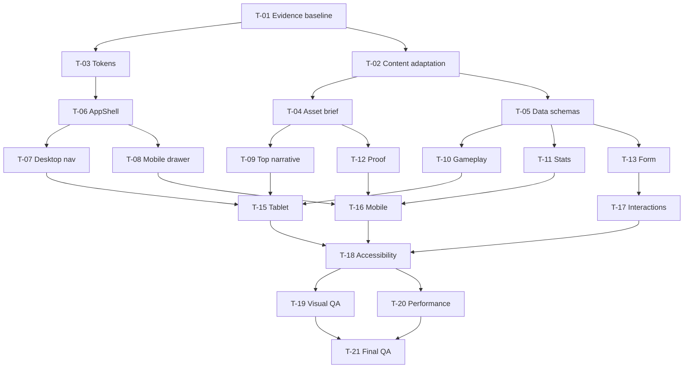

# DESIGN_INDEX — gdweb-26853 / 꾸블랙치킨

- [OBSERVED · HIGH] 스키마: `secret-mcp/design-index/v2`.
- [OBSERVED · HIGH] 레퍼런스 ID: `gdweb-26853`.
- [OBSERVED · HIGH] 등록일: 2026-04-15.
- [OBSERVED · HIGH] 수상: `WINNER PRIZE`.
- [OBSERVED · HIGH] 제작사 메타데이터: 잇다소프트.
- [OBSERVED · HIGH] 원본 증거 크기: desktop `700×9992px`, mobile `243×3469px`.
- [INFERRED · HIGH] 구현 대상은 원 브랜드의 식별 자산을 재현하는 사이트가 아니라, 동일한 화면 구조를 이용하는 Godot 기반 음식/액션 프로젝트 소개 사이트다.
- [INFERRED · HIGH] 문서 내 구현용 가칭은 `EMBER RUN`이며 실제 프로젝트명으로 교체 가능한 콘텐츠 필드다.

## 1. Reconstruction Goal and Scope

### 1.1 재구성 목표

- [INFERRED · HIGH] 목표는 강한 흑백 대비, 선명한 적색 구간, 음식 중심 대형 비주얼, 수치 증거, 카드형 정보, 문의 폼으로 이어지는 장문 서사를 재사용 가능한 구현 명세로 변환하는 것이다.
- [INFERRED · HIGH] 시각적 충실도 목표는 주요 섹션 경계 `±4px`, 반복 간격 `±2px`, 평면 UI 색상 `deltaE <= 3`, 텍스트 블록 높이 `±4px`다.
- [INFERRED · HIGH] Godot 프로젝트 문맥에서는 프랜차이즈 매출 서사를 게임의 조리 전투 루프, 빌드 통계, 커뮤니티 검증, 시스템 요구사항, 플레이테스트 신청으로 치환한다.
- [INFERRED · HIGH] 원본의 정보 밀도와 섹션 순서는 보존하되 원 로고, 상호, 슬로건, 매장 사진, 음식 사진, 리뷰 캡처, 회사 실적, 가격표 문구는 복제하지 않는다.
- [INFERRED · HIGH] 지원 페이지는 `Page P-01` 한 개이며 기본 경로는 `/`다.
- [OBSERVED · HIGH] 첨부 증거는 페이지 전환 경계가 없는 하나의 연속 캔버스를 보여 준다.
- [MEASURED · HIGH] 7개 데스크톱 타일의 prepared y 오프셋은 `0, 1520, 3040, 4560, 6080, 7600, 9120px`이고 인접 타일은 각각 `80px` 중첩된다.
- [MEASURED · HIGH] 중첩을 제거한 데스크톱 전체 높이는 타일 합이 아니라 prepared canvas의 `9992px`다.
- [MEASURED · HIGH] 모바일 비율 `243/700 = 0.347143`, 높이 비율 `3469/9992 = 0.347178`로 차이는 `0.000035`다.
- [OBSERVED · HIGH] 모바일 증거는 데스크톱의 4열·2열·5열 구성까지 유지한 축소판이며 별도 모바일 DOM 재배치를 직접 증명하지 않는다.
- [INFERRED · HIGH] 실제 360/390px 구현은 증거의 순서와 이미지 초점을 유지하면서 접근성을 위해 1열 또는 2열로 재배치한다.

### 1.2 대상 뷰포트

| 근거 수준 | 뷰포트 | 용도 | 구현 기준 | 시각 QA 허용치 |
| --- | ---: | --- | --- | --- |
| MEASURED · HIGH | `700px` | 데스크톱 prepared evidence | 모든 원본 bounds의 기준 폭 | `±2px` 판독 오차 |
| MEASURED · HIGH | `243px` | 모바일 prepared evidence | 순서·축소 비율·초점 유지 검증 | `±2px` 판독 오차 |
| INFERRED · HIGH | `1440px` | 와이드 데스크톱 | 최대 콘텐츠 `1200px`, 좌우 gutter `120px` | 주요 edge `±4px` |
| INFERRED · HIGH | `1280px` | 표준 데스크톱 | 최대 콘텐츠 `1120px`, 좌우 gutter `80px` | 주요 edge `±4px` |
| INFERRED · MEDIUM | `1024px` | 소형 데스크톱 | 콘텐츠 `928px`, 좌우 gutter `48px` | 주요 edge `±4px` |
| INFERRED · MEDIUM | `768px` | 태블릿 | 콘텐츠 `704px`, 좌우 gutter `32px` | 주요 edge `±4px` |
| INFERRED · HIGH | `390px` | 모바일 | 콘텐츠 `358px`, 좌우 gutter `16px` | 주요 edge `±4px` |
| INFERRED · HIGH | `360px` | 소형 모바일 | 콘텐츠 `328px`, 좌우 gutter `16px` | 주요 edge `±4px` |

### 1.3 프레임워크 독립 요구사항

- [INFERRED · HIGH] 의미론적 HTML 또는 동등한 접근성 트리를 사용한다.
- [INFERRED · HIGH] 레이아웃은 CSS Grid/Flexbox와 `aspect-ratio`로 재현하며 스크린샷을 한 장의 배경 이미지로 사용하지 않는다.
- [INFERRED · HIGH] 반복 항목은 데이터 배열에서 렌더링하고 순서를 DOM 순서와 일치시킨다.
- [INFERRED · HIGH] Godot 게임 실행은 별도 Web export iframe 또는 실행 링크로 연결하되 본 레퍼런스 증거에는 플레이어 UI가 없으므로 기본 구현 범위 밖이다.
- [INFERRED · HIGH] 이미지에는 반응형 소스와 고정된 intrinsic 크기를 제공해 누적 레이아웃 이동을 막는다.
- [INFERRED · HIGH] 모든 인터랙션은 포인터, 키보드, 터치에 동등하게 접근 가능해야 한다.

### 1.4 명시적 비목표

- [INFERRED · HIGH] 원 브랜드명, 로고타입, 고유 슬로건, 전화번호, 주소, 매출 수치, 점포명은 구현하지 않는다.
- [INFERRED · HIGH] 원 음식·인테리어·유니폼·리뷰 스크린샷은 다운로드하거나 추출하지 않는다.
- [INFERRED · HIGH] 보이지 않는 하위 페이지, 결제, 회원가입, 실제 프랜차이즈 상담 백엔드는 만들지 않는다.
- [INFERRED · HIGH] 정적 증거로 확인되지 않는 자동 재생, 스크롤 패럴랙스, 헤더 변형을 원본 동작이라고 주장하지 않는다.

## 2. Evidence Inventory and Coordinate System

### 2.1 첨부 이미지 목록

| 근거 수준 | Evidence ID | 종류/part | source | prepared | attached crop `(x,y,w,h)` | source-mapped crop | scale | 보이는 범위 | 한계 |
| --- | --- | --- | ---: | ---: | --- | --- | --- | --- | --- |
| MEASURED · HIGH | E-D01 | desktop 1/7 | `700×9992px` | `700×9992px` | `(0,0,700,1600)` | `(0,0,700,1600)` | `1×1` | 헤더~메뉴 전환 | 마지막 58px가 E-D02와 연결됨 |
| MEASURED · HIGH | E-D02 | desktop 2/7 | `700×9992px` | `700×9992px` | `(0,1520,700,1600)` | `(0,1520,700,1600)` | `1×1` | 메뉴~인테리어 | 앞 80px는 E-D01 중복 |
| MEASURED · HIGH | E-D03 | desktop 3/7 | `700×9992px` | `700×9992px` | `(0,3040,700,1600)` | `(0,3040,700,1600)` | `1×1` | 인테리어~플레이어 판타지 | 앞 80px는 E-D02 중복 |
| MEASURED · HIGH | E-D04 | desktop 4/7 | `700×9992px` | `700×9992px` | `(0,4560,700,1600)` | `(0,4560,700,1600)` | `1×1` | 핵심 3요소~수익 명세 | 앞 80px는 E-D03 중복 |
| MEASURED · HIGH | E-D05 | desktop 5/7 | `700×9992px` | `700×9992px` | `(0,6080,700,1600)` | `(0,6080,700,1600)` | `1×1` | 수익 명세~운영자 비주얼 | 앞 80px는 E-D04 중복 |
| MEASURED · HIGH | E-D06 | desktop 6/7 | `700×9992px` | `700×9992px` | `(0,7600,700,1600)` | `(0,7600,700,1600)` | `1×1` | 운영자 비주얼~요구사항 표 | 앞 80px는 E-D05 중복 |
| MEASURED · HIGH | E-D07 | desktop 7/7 | `700×9992px` | `700×9992px` | `(0,9120,700,872)` | `(0,9120,700,872)` | `1×1` | 요구사항 표~푸터 | 앞 80px는 E-D06 중복 |
| MEASURED · HIGH | E-M01 | mobile 1/1 | `243×3469px` | `243×3469px` | `(0,0,243,3469)` | `(0,0,243,3469)` | `1×1` | 전체 페이지 축소판 | 실사용 모바일 재배치 판독 불가 |

### 2.2 좌표 원칙

- [MEASURED · HIGH] 정규 원점은 desktop prepared canvas 좌상단 `(0,0)`이다.
- [MEASURED · HIGH] x축은 오른쪽, y축은 아래쪽으로 증가한다.
- [MEASURED · HIGH] E-D02의 로컬 `y=0`은 full-canvas `y=1520`이고 E-D03는 `3040`, E-D04는 `4560`, E-D05는 `6080`, E-D06는 `7600`, E-D07는 `9120`이다.
- [MEASURED · HIGH] 로컬 좌표를 full-canvas로 변환하는 식은 `y_full = y_crop_offset + y_local`이다.
- [MEASURED · HIGH] 데스크톱 인접 타일의 `[1520,1600]`, `[3040,3120]`, `[4560,4640]`, `[6080,6160]`, `[7600,7680]`, `[9120,9200]` 구간은 한 번만 계수한다.
- [MEASURED · HIGH] 모바일 대응 좌표의 검증식은 `y_mobile ≈ round(y_desktop × 243 / 700)`이다.
- [INFERRED · HIGH] 이후 target CSS geometry는 prepared evidence의 구도를 직접 복사하는 값이 아니라 1440/1280/1024/768/390/360의 접근 가능한 구현 값이다.
- [INFERRED · HIGH] 모든 section bounds의 측정 허용 오차는 경계가 사진 텍스처인 경우 `±6px`, 평면색 경계인 경우 `±3px`다.

### 2.3 full-canvas 경계 색인

| 근거 수준 | Section | desktop y 범위 | mobile 대응 y 범위 | 주 Evidence | 경계 판독 |
| --- | --- | ---: | ---: | --- | --- |
| MEASURED · HIGH | P01-S01 Header | `0–56px` | `0–19px` | E-D01/E-M01 | hero 위 중첩 |
| MEASURED · HIGH | P01-S02 Hero | `0–467px` | `0–162px` | E-D01/E-M01 | ticker 상단 평면 경계 |
| MEASURED · HIGH | P01-S03 Marquee | `467–508px` | `162–176px` | E-D01/E-M01 | 적색 띠 |
| MEASURED · HIGH | P01-S04 Milestone | `508–1120px` | `176–389px` | E-D01/E-M01 | 흰 배경 전환 |
| MEASURED · HIGH | P01-S05 Premise | `1120–1542px` | `389–535px` | E-D01/E-M01 | 텍스트+그릴 비주얼 |
| MEASURED · HIGH | P01-S06 Loadout | `1542–2100px` | `535–729px` | E-D01/E-D02/E-M01 | 적색 평면 구간 |
| MEASURED · HIGH | P01-S07 Flavor | `2100–2500px` | `729–868px` | E-D02/E-M01 | 흑색 향신료 비주얼 |
| MEASURED · HIGH | P01-S08 CookLoop | `2500–2902px` | `868–1007px` | E-D02/E-M01 | 흰 제목+4단 이미지 |
| MEASURED · HIGH | P01-S09 Arena | `2902–3335px` | `1007–1157px` | E-D02/E-D03/E-M01 | 흰 제목+파노라마 |
| MEASURED · HIGH | P01-S10 ArtSystem | `3335–4037px` | `1157–1401px` | E-D03/E-M01 | 흰 갤러리 |
| MEASURED · MEDIUM | P01-S11 PlayerFantasy | `4037–4560px` | `1401–1583px` | E-D03/E-D04/E-M01 | 옅은 회색 구간 |
| MEASURED · MEDIUM | P01-S12 ThreePillars | `4560–4984px` | `1583–1730px` | E-D04/E-M01 | 흰 3열 카드 |
| MEASURED · HIGH | P01-S13 SpeedLoop | `4984–5522px` | `1730–1917px` | E-D04/E-M01 | 회색 비디오 카드 |
| MEASURED · MEDIUM | P01-S14 FourWays | `5522–6518px` | `1917–2262px` | E-D04/E-D05/E-M01 | 흑색+불꽃, 4열+2열 |
| MEASURED · HIGH | P01-S15 RunResult | `6518–6959px` | `2262–2415px` | E-D05/E-M01 | 흑색 도넛 차트 |
| MEASURED · HIGH | P01-S16 Rewards | `6959–7358px` | `2415–2554px` | E-D05/E-M01 | 적색 3×2 카드 |
| MEASURED · MEDIUM | P01-S17 Builds | `7358–7608px` | `2554–2641px` | E-D05/E-D06/E-M01 | 흑색+5개 흰 타일 |
| MEASURED · HIGH | P01-S18 DevFocus | `7608–7914px` | `2641–2747px` | E-D05/E-D06/E-M01 | 인물 사진 위 카피 |
| MEASURED · HIGH | P01-S19 TrackRecord | `7914–8315px` | `2747–2887px` | E-D06/E-M01 | 암적색+2개 카드 |
| MEASURED · HIGH | P01-S20 Community | `8315–8908px` | `2887–3093px` | E-D06/E-M01 | 흑색+2행 리뷰 스트립 |
| MEASURED · HIGH | P01-S21 Requirements | `8908–9339px` | `3093–3242px` | E-D06/E-D07/E-M01 | 흰 표 |
| MEASURED · HIGH | P01-S22 PlaytestForm | `9339–9886px` | `3242–3432px` | E-D07/E-M01 | 흑색 폼 |
| MEASURED · HIGH | P01-S23 Footer | `9886–9992px` | `3432–3469px` | E-D07/E-M01 | 진회색 푸터 |

## 3. Site Map and Page/Route Inventory

### 3.1 직접 보이는 페이지

| 근거 수준 | Page ID | route/name | 목적 | Evidence | shell | desktop | mobile | active nav | confidence |
| --- | --- | --- | --- | --- | --- | --- | --- | --- | --- |
| OBSERVED · HIGH | P-01 | `/` / 프로젝트 홈 | 음식/액션 프로젝트의 세계관, 게임 루프, 성과, 검증, 요구사항, 신청을 한 흐름으로 제시 | E-D01~E-D07, E-M01 | `transparent-to-solid candidate` | 있음 | 전체 축소 증거 있음 | 첫 항목 또는 홈 로고 | HIGH |

### 3.2 보이지 않는 경로

| 근거 수준 | 후보 | 상태 | 구현 범위 | 결정 |
| --- | --- | --- | --- | --- |
| UNKNOWN · LOW | `/about` | 내비게이션 문구만으로 독립 route 여부를 알 수 없음 | 제외 | P-01의 `#premise` anchor 사용 |
| UNKNOWN · LOW | `/gameplay` | 독립 route 여부를 알 수 없음 | 제외 | P-01의 `#cook-loop` anchor 사용 |
| UNKNOWN · LOW | `/community` | 독립 route 여부를 알 수 없음 | 제외 | P-01의 `#community` anchor 사용 |
| UNKNOWN · LOW | `/playtest` | 독립 route 여부를 알 수 없음 | 제외 | P-01의 `#playtest` anchor 사용 |
| UNKNOWN · LOW | 상세 리뷰·비용 페이지 | 정적 캔버스에서 링크 존재를 판독할 수 없음 | 제외 | 카드 링크는 데이터의 optional URL로 둠 |

### 3.3 내비게이션 정보 구조

| 근거 수준 | 순서 | 구현 라벨 | target | 활성 조건 | 원 증거와의 관계 |
| --- | ---: | --- | --- | --- | --- |
| INFERRED · HIGH | 1 | 프로젝트 | `#premise` | 해당 section이 header 아래 40% 지점 통과 | 첫 소개 계열 항목 대체 |
| INFERRED · HIGH | 2 | 조리 전투 | `#cook-loop` | P01-S08~P01-S13 | 경쟁력 계열 항목 대체 |
| INFERRED · HIGH | 3 | 런 통계 | `#run-result` | P01-S14~P01-S16 | 수치 증거 계열 항목 대체 |
| INFERRED · HIGH | 4 | 커뮤니티 | `#community` | P01-S20 | 검증 계열 항목 대체 |
| INFERRED · HIGH | 5 | 플레이테스트 | `#playtest` | P01-S21~P01-S22 | 문의 계열 항목 대체 |

## 4. Shared Application Shell

### 4.1 전역 프리미티브

- [OBSERVED · HIGH] 페이지는 별도 사이드바 없이 폭 전체를 사용하는 수직 스크롤 구조다.
- [MEASURED · HIGH] prepared desktop 전역 폭은 `700px`; full-bleed section은 `x=0, w=700px`다.
- [MEASURED · MEDIUM] 데스크톱 반복 콘텐츠의 대표 좌우 경계는 `x=58px`와 `x=642px`, 즉 `584px` 폭과 `58px` gutter다.
- [INFERRED · HIGH] 1440px 구현의 공용 container는 `max-width:1200px; margin-inline:auto; padding-inline:0`이다.
- [INFERRED · HIGH] 1280px에서는 container `1120px`, 1024px에서는 `928px`, 768px에서는 `704px`다.
- [INFERRED · HIGH] 390/360px에서는 `width:auto; margin-inline:16px`다.
- [OBSERVED · HIGH] 주요 page chrome은 header, 첫 hero, 섹션형 main, 문의 form, footer다.
- [OBSERVED · HIGH] 증거에는 쿠키 배너, 채팅 위젯, 모달, 공지 띠가 없다.
- [UNKNOWN · MEDIUM] 쿠키 동의 UI의 실제 존재 여부는 확인할 수 없다.
- [INFERRED · HIGH] 쿠키 UI는 본 구현에서 넣지 않는다.

### 4.2 배경과 스크롤

- [INFERRED · HIGH] `html, body` 배경은 `#000000`, body 기본 텍스트는 `#111111`이다.
- [INFERRED · HIGH] page root는 `min-width:320px; overflow-x:clip`이다.
- [INFERRED · HIGH] 스크롤바 점유로 인한 중심 이동을 막기 위해 `scrollbar-gutter:stable`을 사용한다.
- [INFERRED · HIGH] anchor section에는 desktop `scroll-margin-top:88px`, mobile `scroll-margin-top:64px`를 둔다.
- [INFERRED · HIGH] 이미지 지연 로딩 placeholder는 section 배경색과 같게 하며 skeleton shimmer는 사용하지 않는다.
- [UNKNOWN · LOW] 원 페이지의 smooth scrolling 여부는 증거로 알 수 없다.
- [INFERRED · HIGH] 구현은 `scroll-behavior:smooth`를 사용하되 reduced motion에서는 `auto`로 바꾼다.

### 4.3 stacking context

| 근거 수준 | layer | z-index | 적용 대상 | 비고 |
| --- | ---: | ---: | --- | --- |
| INFERRED · HIGH | content | `0` | section backgrounds/media | 기본 문맥 |
| INFERRED · HIGH | media-copy | `10` | 사진 위 제목·버튼 | 각 section 내부 |
| INFERRED · HIGH | carousel-control | `20` | 좌우 화살표·dots | media 위 |
| INFERRED · HIGH | header | `100` | sticky desktop/mobile bar | menu 닫힘 |
| INFERRED · HIGH | scrim | `900` | mobile menu overlay | `rgba(0,0,0,.72)` |
| INFERRED · HIGH | drawer | `1000` | mobile navigation panel | focus trap |
| INFERRED · HIGH | skip-link | `1100` | skip navigation | focus 시 표시 |
| INFERRED · HIGH | toast | `1200` | submit result live region | 최대 1개 |

## 5. Navigation and Header Specification

### 5.1 데스크톱 geometry

| 근거 수준 | 필드 | prepared evidence | 1440px 구현 | tolerance |
| --- | --- | ---: | ---: | ---: |
| MEASURED · MEDIUM | total header height | `56px` | INFERRED `80px` | `±3px` |
| OBSERVED · HIGH | utility-bar height | 보이지 않음 | INFERRED `0px` | `0px` |
| MEASURED · MEDIUM | content width | 약 `584px` | INFERRED `1200px` | `±4px` |
| MEASURED · MEDIUM | left/right padding | 약 `58px` | INFERRED `120px` viewport gutter | `±4px` |
| MEASURED · MEDIUM | logo bounds | `(58,8,65,18)px` | INFERRED `(120,24,134,32)px` | `±4px` |
| MEASURED · LOW | menu start x | 약 `367px` | INFERRED `690px` | `±8px` |
| MEASURED · LOW | item width/padding | 약 `46px` / `7px` | INFERRED auto / `14px` | `±4px` |
| MEASURED · LOW | item gap | 약 `15px` | INFERRED `20px` | `±3px` |
| MEASURED · LOW | label baseline | 약 `20px` | INFERRED `45px` | `±3px` |
| OBSERVED · HIGH | icon size | 별도 icon 없음 | INFERRED `20px` optional | `±2px` |
| INFERRED · HIGH | action area width | 증거 불명 | `146px` | `±4px` |
| OBSERVED · HIGH | border | 첫 화면에서 뚜렷하지 않음 | INFERRED `0 0 1px rgba(255,255,255,.12)` | deltaE N/A |
| MEASURED · HIGH | background | hero와 함께 `#000000` 우세 | INFERRED `rgba(0,0,0,.18)` | alpha `±.05` |
| UNKNOWN · MEDIUM | position mode | 정적 캡처만으로 판정 불가 | INFERRED `sticky; top:0` | behavior QA |
| INFERRED · HIGH | z-index | 증거 불명 | `100` | exact |

### 5.2 모바일 geometry

| 근거 수준 | 필드 | E-M01 관찰 | 390/360 구현 | tolerance |
| --- | --- | --- | --- | ---: |
| MEASURED · LOW | bar height | 약 `19px` 축소본 | INFERRED `64px` | `±2px` |
| MEASURED · LOW | side padding | 약 `20px` logo 시작 | INFERRED `16px` | `±2px` |
| MEASURED · LOW | logo bounds | 약 `(20,3,22,6)px` | INFERRED `(16,20,112,24)px` | `±3px` |
| OBSERVED · LOW | menu-control bounds | 식별 가능한 단일 control 없음 | INFERRED `(330,8,48,48)px` at 390 | `±2px` |
| INFERRED · HIGH | touch target | 증거가 축소되어 판정 불가 | `48×48px` | 최소값 |
| UNKNOWN · HIGH | open-panel origin | 열린 상태 없음 | INFERRED `top:0; right:0` | exact |
| UNKNOWN · HIGH | panel width/height | 열린 상태 없음 | INFERRED `min(336px, 88vw) × 100dvh` | `±2px` |
| UNKNOWN · HIGH | row height | 열린 상태 없음 | INFERRED `56px` | `±2px` |
| UNKNOWN · HIGH | indentation | 열린 상태 없음 | INFERRED level 1 `24px`, level 2 `40px` | `±2px` |
| UNKNOWN · HIGH | divider | 열린 상태 없음 | INFERRED `1px solid #333333` | deltaE `<=3` |
| UNKNOWN · HIGH | overlay | 열린 상태 없음 | INFERRED `rgba(0,0,0,.72)` | alpha `±.05` |
| UNKNOWN · HIGH | close behavior | 정적 증거로 알 수 없음 | INFERRED close button, Escape, scrim click, route select | functional |
| UNKNOWN · HIGH | scroll locking | 정적 증거로 알 수 없음 | INFERRED body lock, scrollbar compensation | no shift |

### 5.3 DOM과 레이아웃

```html
<header class="site-header" data-state="top|scrolled|menu-open">
  <a class="brand" href="#top" aria-label="EMBER RUN 홈">...</a>
  <nav class="desktop-nav" aria-label="주요">...</nav>
  <button class="menu-button" aria-controls="mobile-menu" aria-expanded="false">...</button>
  <div class="mobile-scrim" hidden></div>
  <nav id="mobile-menu" class="mobile-drawer" aria-label="모바일 주요" hidden>...</nav>
</header>
```

```css
.site-header {
  position: sticky;
  top: 0;
  z-index: var(--z-header);
  height: var(--header-desktop);
  display: grid;
  grid-template-columns: minmax(134px, 1fr) auto auto;
  align-items: center;
  gap: 24px;
}
@media (max-width: 767px) {
  .site-header { height: 64px; grid-template-columns: 1fr 48px; padding-inline: 16px; }
  .desktop-nav { display: none; }
}
```

### 5.4 표시 상태

| 근거 수준 | state | trigger | 배경 | text/icon | border/transform | timing |
| --- | --- | --- | --- | --- | --- | --- |
| INFERRED · HIGH | default/top | page top | `rgba(0,0,0,.18)` | `#FFFFFF` | bottom `rgba(255,255,255,.12)` | `0ms` |
| INFERRED · HIGH | hover | pointer | `rgba(255,255,255,.08)` item | `#FFFFFF` | underline `2px #EE0011` | `160ms ease-out` |
| INFERRED · HIGH | focus-visible | keyboard | `#000000` | `#FFFFFF` | `2px #FFFFFF` + `4px #EE0011` outer | `0ms` |
| INFERRED · HIGH | pressed | pointer down | `rgba(238,0,17,.18)` | `#EEEEEE` | `translateY(1px)` | `80ms linear` |
| INFERRED · HIGH | active | section observer | transparent | `#FFFFFF` | underline `3px #EE0011` | `160ms ease-out` |
| INFERRED · HIGH | disabled | `aria-disabled=true` | transparent | `rgba(255,255,255,.38)` | none | `0ms` |
| INFERRED · MEDIUM | scrolled | scrollY `>=24px` | `rgba(0,0,0,.94)` | `#FFFFFF` | shadow `0 6px 20px rgba(0,0,0,.24)` | `180ms ease-out` |
| INFERRED · HIGH | menu-open | button activate | bar `#000000` | `#FFFFFF` | drawer `translateX(0)` | `220ms cubic-bezier(.2,.8,.2,1)` |
| UNKNOWN · HIGH | submenu-open | 원본 submenu 증거 없음 | 구현 안 함 | N/A | N/A | N/A |

### 5.5 키보드·스크롤 동작

- [INFERRED · HIGH] desktop nav는 DOM 순서대로 Tab 이동하고 Enter/Space로 anchor를 활성화한다.
- [INFERRED · HIGH] mobile menu button은 `aria-expanded`, `aria-controls`, 접근 가능한 이름을 가진다.
- [INFERRED · HIGH] drawer가 열리면 focus를 close button으로 이동하고 drawer 내부에서 focus를 순환시킨다.
- [INFERRED · HIGH] Escape는 drawer를 닫고 focus를 menu button으로 복원한다.
- [INFERRED · HIGH] anchor 선택 후 drawer를 닫고 목적 section heading에 `tabindex=-1`로 focus를 보낸다.
- [INFERRED · HIGH] reduced motion에서는 drawer transition을 `0ms`, smooth scroll을 비활성화한다.
- [UNKNOWN · HIGH] 원본 header가 static/sticky/fixed인지 확정할 수 없다.
- [INFERRED · MEDIUM] 긴 페이지의 탐색성을 위해 target 구현은 sticky를 채택한다.

## 6. Page-by-Page Specifications

### Page P-01: 음식/액션 프로젝트 홈

#### 6.1 정체성과 진입점

- [INFERRED · HIGH] route는 `/`, 이름은 `프로젝트 홈`이다.
- [INFERRED · HIGH] 목적은 음식 조리와 액션 전투가 결합된 Godot 프로젝트를 소개하고 플레이테스트 신청으로 전환하는 것이다.
- [INFERRED · HIGH] 진입점은 로고, 외부 캠페인 링크, 커뮤니티 게시물, 각 section anchor다.
- [INFERRED · HIGH] shared shell variant는 `hero-overlay-header`다.
- [INFERRED · HIGH] 기본 active nav는 `프로젝트`; 스크롤에 따라 section observer가 활성 항목을 바꾼다.
- [OBSERVED · HIGH] 지원 증거는 E-D01~E-D07과 E-M01 전체다.

#### 6.2 데스크톱 canvas model

- [MEASURED · HIGH] reference prepared viewport는 `700×9992px`다.
- [MEASURED · HIGH] full page height는 `9992px`이며 중첩 타일을 합산하지 않는다.
- [INFERRED · MEDIUM] 1440px target 예상 페이지 높이는 콘텐츠 reflow 전 `15080px`다.
- [INFERRED · MEDIUM] 1280px target 예상 페이지 높이는 `14840px`다.
- [INFERRED · MEDIUM] 1024px target 예상 페이지 높이는 `15240px`다.
- [INFERRED · HIGH] content max-width는 1440에서 `1200px`, 1280에서 `1120px`, 1024에서 `928px`다.
- [INFERRED · HIGH] 전역 gutter는 각각 `120px`, `80px`, `48px`다.
- [INFERRED · HIGH] 기본 본문은 단일 column이고 section 내부에서 최대 4열 grid를 사용한다.
- [OBSERVED · HIGH] 배경은 section별 `#000000`, `#FFFFFF`, `#EEEEEE`, `#EE0011`이 번갈아 나타난다.

#### 6.3 모바일 canvas model

- [MEASURED · HIGH] E-M01 reference viewport는 `243×3469px`다.
- [MEASURED · HIGH] E-M01은 desktop order를 `0.34714`배로 축소하고 4열/2열 배치를 유지한다.
- [INFERRED · HIGH] 접근 가능한 390px target 예상 페이지 높이는 `17680px`다.
- [INFERRED · HIGH] 접근 가능한 360px target 예상 페이지 높이는 `18120px`다.
- [INFERRED · HIGH] mobile side padding은 `16px`, edge-to-edge media 예외는 `0px`다.
- [INFERRED · HIGH] stacking order는 heading → body → media/cards → controls이며 source DOM 순서를 바꾸지 않는다.
- [INFERRED · HIGH] 4열 카드군은 390/360에서 1열 또는 정보 밀도가 낮은 경우 2열로 바뀐다.
- [INFERRED · HIGH] carousel은 가로 overflow를 허용하되 page root 자체의 horizontal overflow는 금지한다.

#### 6.4 Ordered section geometry

| 근거 수준 | ID / Evidence | Bounds `(x,y,w,h)` evidence px | role / container | layout / spacing / alignment | surface | content | responsive |
| --- | --- | --- | --- | --- | --- | --- | --- |
| MEASURED · MEDIUM | P01-S01 / E-D01 `(0,0)-(700,56)` | `(0,0,700,56)` | header / max `584px`, gutter `58px` | overlay grid; `0px` outer; center | transparent-black; no radius | logo+5 nav labels | <=767 drawer; INFERRED HIGH |
| MEASURED · HIGH | P01-S02 / E-D01 `(0,0)-(700,467)` | `(0,0,700,467)` | hero / full bleed | block+absolute; copy centered; media cover | black photographic, red title | eyebrow,title,body,food/action key art | mobile crop center, min-h `640px`; INFERRED HIGH |
| MEASURED · HIGH | P01-S03 / E-D01 `(0,467)-(700,508)` | `(0,467,700,41)` | complementary/marquee / full | horizontal flex; gap `24px`; nowrap | `#EE0011`; black text | repeated short phrase 3× | 44px high, text continues clipped; INFERRED HIGH |
| MEASURED · HIGH | P01-S04 / E-D01 `(0,508)-(700,1120)` | `(0,508,700,612)` | section / full | centered overlay; bottom metric | storefront-like full media | heading,caption,panorama,large metric | 390 uses `760px`, same focal; INFERRED HIGH |
| MEASURED · HIGH | P01-S05 / E-D01 `(0,1120)-(700,1542)` | `(0,1120,700,422)` | section / full+`584px` intro | 2-col intro then full media; gap `24px` | white intro, black media | premise lockup,body,action image | 1-col intro, media 16:10; INFERRED HIGH |
| MEASURED · HIGH | P01-S06 / E-D01/E-D02 | `(0,1542,700,558)` | section / full | centered heading, tabs, 3-item stage | `#EE0011`; cutout images | title,tabs,3 dishes,arrow controls | horizontal snap carousel; INFERRED HIGH |
| MEASURED · HIGH | P01-S07 / E-D02 `(0,580)-(700,980)` | `(0,2100,700,400)` | section / full | copy centered over media | black/red spice image | title,body,decorative media | copy max `320px`; INFERRED HIGH |
| MEASURED · HIGH | P01-S08 / E-D02 `(0,980)-(700,1382)` | `(0,2500,700,402)` | section / full | white heading band + 4-col media | white then black photos | heading,body,4 numbered steps | cards stack 1-col; INFERRED HIGH |
| MEASURED · HIGH | P01-S09 / E-D02/E-D03 | `(0,2902,700,433)` | section / full | heading band + carousel | white + interior-like panorama | title,large image,arrows,dots | image 4:3; controls 48px; INFERRED HIGH |
| MEASURED · HIGH | P01-S10 / E-D03 `(0,295)-(700,997)` | `(0,3335,700,702)` | section / max `584px` | title then asymmetric 2-col gallery; gap `8px` | white, no outer shadow | heading,body,5 media tiles | 2-col retained, lead spans 2; INFERRED HIGH |
| MEASURED · MEDIUM | P01-S11 / E-D03/E-D04 | `(0,4037,700,523)` | section / max `584px` | centered title+single 16:9 media | `#F7F7F7` | player fantasy title,poster | 1-col unchanged; INFERRED HIGH |
| MEASURED · MEDIUM | P01-S12 / E-D04 `(0,0)-(700,424)` | `(0,4560,700,424)` | section / max `584px` | centered copy+3 equal cards; gap `10px` | white | heading,body,3 process cards | 1-col at <=767; INFERRED HIGH |
| MEASURED · HIGH | P01-S13 / E-D04 `(0,424)-(700,962)` | `(0,4984,700,538)` | section / max `584px` | centered title, 16:9 media, caption | `#F3F3F3` | timed-loop video poster,metric | full width; INFERRED HIGH |
| MEASURED · MEDIUM | P01-S14 / E-D04/E-D05 | `(0,5522,700,996)` | section / max `584px` | 4-col cards then 2-col receipts; gaps `8/10px` | black ember texture | heading,4 modes,subhead,2 stat sheets | 2-col modes,1-col sheets; INFERRED HIGH |
| MEASURED · HIGH | P01-S15 / E-D05 `(0,438)-(700,879)` | `(0,6518,700,441)` | section / max `520px` | title then 2-col chart/table | black | heading,donut,5-row table | stack chart then table; INFERRED HIGH |
| MEASURED · HIGH | P01-S16 / E-D05 `(0,879)-(700,1278)` | `(0,6959,700,399)` | section / max `584px` | title+3×2 grid; gap `8px` | `#EE0011` | reward heading,6 tiles | 2-col mobile; INFERRED HIGH |
| MEASURED · MEDIUM | P01-S17 / E-D05/E-D06 | `(0,7358,700,250)` | section / full | centered title+5 equal horizontal tiles | black, white cards | heading,5 build/status cards | horizontal snap list; INFERRED HIGH |
| MEASURED · HIGH | P01-S18 / E-D05/E-D06 | `(0,7608,700,306)` | section / full | media cover+left aligned copy | dark photo overlay | dev-focus statement | min-h `360px` mobile; INFERRED HIGH |
| MEASURED · HIGH | P01-S19 / E-D06 `(0,314)-(700,715)` | `(0,7914,700,401)` | section / max `584px` | title+2 equal cards | dark red-to-black photographic | studio proof,2 portfolio cards | 1-col mobile; INFERRED HIGH |
| MEASURED · HIGH | P01-S20 / E-D06 `(0,715)-(700,1308)` | `(0,8315,700,593)` | section / full | centered title+2 nowrap card rails | black | heading,10+ review cards,badge | drag/controls; rail clips; INFERRED HIGH |
| MEASURED · HIGH | P01-S21 / E-D06/E-D07 | `(0,8908,700,431)` | section / max `584px` | centered title+table | `#F7F7F7`, pink header,red total | heading,caption,6-row requirement table | card-list table at <=767; INFERRED HIGH |
| MEASURED · HIGH | P01-S22 / E-D07 `(0,219)-(700,766)` | `(0,9339,700,547)` | section / max `486px` form | title+dark panel+2-col fields | black; panel `#1B1B1B` | heading,7 fields,consent,submit | panel full width, fields 1-col; INFERRED HIGH |
| MEASURED · HIGH | P01-S23 / E-D07 `(0,766)-(700,872)` | `(0,9886,700,106)` | footer / full+max `584px` | centered/legal, top button right | `#222222` | legal text,links,top control | stacked legal, 48px top button; INFERRED HIGH |

#### 6.4.1 Normalized geometry fields

| Evidence level | Section ID | Evidence | Bounds | Semantic role | Container | Layout | Spacing | Alignment | Surface | Content | Responsive |
| --- | --- | --- | --- | --- | --- | --- | --- | --- | --- | --- | --- |
| MEASURED · MEDIUM | P01-S01 | E-D01 `x0–700,y0–56` | `x0,y0,w700,h56px` | header | max `584px`, gutter `58px` | grid `1fr auto`, overlay | outer `0`, child gap `15px` | center cross-axis, end nav | transparent over `#000000`, border none | logo+5 links | <=767: 64px bar+drawer; INFERRED HIGH |
| MEASURED · HIGH | P01-S02 | E-D01 `x0–700,y0–467` | `x0,y0,w700,h467px` | hero | full bleed | block+absolute layers | section `0`, copy gap `16px` | centered copy/media focal 50/60 | black photo+gradient, no radius | eyebrow,H1,body,key art | 390/360: h640px, 4:5 crop; INFERRED HIGH |
| MEASURED · HIGH | P01-S03 | E-D01 `x0–700,y467–508` | `x0,y467,w700,h41px` | complementary | full bleed | flex nowrap track | gap `24px`, padding `0` | center cross-axis | `#EE0011`, black text | phrase repeated >=3 | desktop h56/mobile h44; INFERRED HIGH |
| MEASURED · HIGH | P01-S04 | E-D01 `x0–700,y508–1120` | `x0,y508,w700,h612px` | section | full bleed | absolute copy over media | top `96px`, bottom `72px` target | center/center | photo+black bottom overlay | heading,caption,metric | mobile h760px, focal 50/54; INFERRED HIGH |
| MEASURED · HIGH | P01-S05 | E-D01 `x0–700,y1120–1542` | `x0,y1120,w700,h422px` | section | intro max `584px`, media full | intro 2-col then block media | intro pad `72px`, gap `72px` target | left text, centered media | `#FFFFFF` then black photo | lockup,body,action media | <=767 intro 1-col, gap20; INFERRED HIGH |
| MEASURED · HIGH | P01-S06 | E-D01/D02 `y1542–2100` | `x0,y1542,w700,h558px` | section/carousel | full bleed, inner max `1200px` target | heading+tabs+3-item track | pad `80px`, track gap `44px` | center stage | `#EE0011`, no border | title,tabs,3 dishes,arrows | mobile horizontal snap 84% basis; INFERRED HIGH |
| MEASURED · HIGH | P01-S07 | E-D02 local `y580–980` | `x0,y2100,w700,h400px` | section | full bleed | media+absolute heading | top `84px`, heading gap `18px` target | top-center | black/red media+overlay | title,body,spice visual | mobile h560px, max text320; INFERRED HIGH |
| MEASURED · HIGH | P01-S08 | E-D02 local `y980–1382` | `x0,y2500,w700,h402px` | section/list | full bleed | block heading+4-col grid | heading pad `72px`, card gap `0` | heading center, cards start | white band+black photos | heading,body,4 steps | <=767 1-col cards h300; INFERRED HIGH |
| MEASURED · HIGH | P01-S09 | E-D02/D03 `y2902–3335` | `x0,y2902,w700,h433px` | section/carousel | full bleed | heading band+relative carousel | heading pad `64px`, controls inset `32px` | center | white+panorama media | title,slides,2 arrows,7 dots | mobile image 4:3, inset12; INFERRED HIGH |
| MEASURED · HIGH | P01-S10 | E-D03 local `y295–997` | `x0,y3335,w700,h702px` | section/gallery | max `584px` prepared | 2-col grid, lead span2 | section pad `72px`, grid gap `8px` | heading center, captions end | `#FFFFFF`, radius0 | heading,body,5 figures | mobile 2-col, gap6; INFERRED HIGH |
| MEASURED · MEDIUM | P01-S11 | E-D03/D04 `y4037–4560` | `x0,y4037,w700,h523px` | section | max `584px` prepared | block heading+poster | pad `72/80px`, gap `36px` | center | `#F7F7F7` | title,16:8 poster,overlay text | mobile 1-col poster16:10; INFERRED HIGH |
| MEASURED · MEDIUM | P01-S12 | E-D04 local `y0–424` | `x0,y4560,w700,h424px` | section/list | max `584px` prepared | heading+3-col grid | pad `72px`, gap `10px` prepared | centered heading/cards | `#FFFFFF` | heading,body,3 pillars | <=767 1-col media/text rows; INFERRED HIGH |
| MEASURED · HIGH | P01-S13 | E-D04 local `y424–962` | `x0,y4984,w700,h538px` | section/media | max `584px` prepared | block heading+16:9 frame | pad `72px`, media gap `36px` | center | `#F3F3F3` | heading,video poster,metric | mobile 16:10, play56px; INFERRED HIGH |
| MEASURED · MEDIUM | P01-S14 | E-D04/D05 `y5522–6518` | `x0,y5522,w700,h996px` | section/stats | max `584px` prepared | 4-col modes+2-col sheets | pad `80px`, gaps `8/10px` prepared | center headings, left rows | black+ember texture | 4 modes,2 sheets | mobile 2-col modes/1-col sheets; INFERRED HIGH |
| MEASURED · HIGH | P01-S15 | E-D05 local `y438–879` | `x0,y6518,w700,h441px` | section/figure | max `520px` prepared | heading+2-col result grid | pad `72px`, target gap `64px` | center then stretch | `#000000` | heading,donut,5-row table | <=767 stack chart/table; INFERRED HIGH |
| MEASURED · HIGH | P01-S16 | E-D05 local `y879–1278` | `x0,y6959,w700,h399px` | section/list | max `584px` prepared | heading+3×2 grid | pad `72px`, gap `8px` prepared | center | `#EE0011`, black cards | heading+6 rewards | mobile 2×3 gap10; INFERRED HIGH |
| MEASURED · MEDIUM | P01-S17 | E-D05/D06 `y7358–7608` | `x0,y7358,w700,h250px` | section/list | full bleed, inner max target | heading+5-col rail | pad `56px`, card gap `8px` | center | black section+white cards | heading+5 build cards | mobile horizontal snap, card156; INFERRED HIGH |
| MEASURED · HIGH | P01-S18 | E-D05/D06 `y7608–7914` | `x0,y7608,w700,h306px` | section | full bleed | media+absolute copy | target pad `80px`, copy max760 | left-center | dark photo+overlay `.46` | title+body over developer art | mobile h360, copy bottom; INFERRED HIGH |
| MEASURED · HIGH | P01-S19 | E-D06 local `y314–715` | `x0,y7914,w700,h401px` | section/list | max `584px` prepared | heading+2-col cards | pad `72px`, card gap `10px` prepared | center | `#291010→#111111` | heading+2 portfolio cards | <=767 1-col gap16; INFERRED HIGH |
| MEASURED · HIGH | P01-S20 | E-D06 local `y715–1308` | `x0,y8315,w700,h593px` | section/list | full bleed | heading+2 overflow rails | pad `72px`, rail gap `12px` target | center heading, rails start | `#000000` | title,10+ reviews,badge | mobile card280, 1.18 visible; INFERRED HIGH |
| MEASURED · HIGH | P01-S21 | E-D06/D07 `y8908–9339` | `x0,y8908,w700,h431px` | section/table | max `584px` prepared | block heading+4-col table | pad `64px`, row min `52px` target | center heading,left cells | `#F7F7F7`, pink/red table bands | heading,6 rows,summary | <=767 stacked dl cards; INFERRED HIGH |
| MEASURED · HIGH | P01-S22 | E-D07 local `y219–766` | `x0,y9339,w700,h547px` | section/form | panel max `486px` prepared | heading+panel, fields 2-col | pad `72px`, panel target `56×72px` | center heading,left form | black+panel `#1B1B1B` | 7 fields,consent,submit | <=767 labels above, panel full; INFERRED HIGH |
| MEASURED · HIGH | P01-S23 | E-D07 local `y766–872` | `x0,y9886,w700,h106px` | footer | max `584px` prepared | legal flex/wrap+top control | target pad `48px`, link gap16 | centered legal | `#222222` | legal links,copyright,top | mobile stack, min-h240; INFERRED HIGH |

#### 6.5 페이지 전용 상태와 상호작용 요약

- [INFERRED · HIGH] P01-S06은 이전/다음 버튼, tabs, 현재 slide live label을 갖는 단일 선택 carousel이다.
- [INFERRED · HIGH] P01-S09은 panorama slide와 dot indicator를 갖지만 자동 재생은 기본 비활성이다.
- [INFERRED · HIGH] P01-S13의 poster는 명시적 play 버튼으로 Godot gameplay clip을 재생한다.
- [INFERRED · HIGH] P01-S20 review rails는 drag, wheel+Shift, arrow buttons를 지원한다.
- [INFERRED · HIGH] P01-S22 form은 idle, validating, submitting, success, error 상태를 가진다.
- [UNKNOWN · HIGH] 원본 carousel의 자동 재생·loop·swipe 동작은 정적 이미지로 알 수 없다.
- [UNKNOWN · HIGH] 원본 문의 폼의 실제 validation, 전송 endpoint, 개인정보 보관 정책은 알 수 없다.

#### 6.6 페이지 자산과 대체 원칙

- [INFERRED · HIGH] 모든 음식 이미지는 프로젝트가 직접 제작한 실사/3D render 또는 생성 허가된 이미지로 대체한다.
- [INFERRED · HIGH] 매장 전경은 Godot로 렌더링한 주방 허브 또는 프로젝트 전시 부스 panorama로 대체한다.
- [INFERRED · HIGH] 인물·유니폼은 개발자 촬영 동의본 또는 캐릭터 concept art로 대체한다.
- [INFERRED · HIGH] 리뷰 screenshot은 실제 opt-in 커뮤니티 후기 데이터로 만든 자체 카드 UI로 대체한다.
- [INFERRED · HIGH] 원 로고 자리에는 text+symbol 조합의 신규 `EMBER RUN` logo asset을 사용한다.

#### 6.7 페이지 acceptance 요약

- [INFERRED · HIGH] 1440/1280/1024/768/390/360에서 section 순서가 geometry table과 일치해야 한다.
- [INFERRED · HIGH] 390/360에서 200% zoom 시 horizontal page overflow가 없어야 한다.
- [INFERRED · HIGH] 모든 주요 heading은 두 줄을 초과하지 않으며 긴 한국어 단어도 container 밖으로 나가지 않아야 한다.
- [INFERRED · HIGH] hero LCP image는 1440에서 `<=300KB AVIF`, mobile에서 `<=180KB AVIF`를 목표로 한다.
- [INFERRED · HIGH] form submit 결과는 keyboard focus와 live region 양쪽에 전달되어야 한다.

#### 6.8 페이지 로컬 계약 색인

- [INFERRED · HIGH] P-01 component/data boundary는 Section 8의 `HeroSection`부터 `PlaytestForm`까지와 Section 15의 page entities를 사용한다.
- [INFERRED · HIGH] P-01 local state는 carousel index 2개 이상, video play state, review rail position, form state를 포함한다.
- [INFERRED · HIGH] P-01 interaction은 Section 13의 nav/tab/carousel/media/form matrix를 구현한다.
- [INFERRED · HIGH] P-01 responsive transition은 Section 12의 6개 viewport 값과 Section 6.4.1의 행별 변환을 동시에 만족한다.
- [INFERRED · HIGH] P-01 accessibility는 Section 14의 heading, keyboard, mobile drawer, alt, form, contrast 계약을 적용한다.
- [INFERRED · HIGH] P-01 assets는 Section 11의 A-LOGO~A-REVIEW를 쓰며 원 reference bitmap을 입력으로 사용하지 않는다.
- [INFERRED · HIGH] P-01 acceptance는 Section 18의 visual/navigation/section/form/accessibility 체크리스트를 모두 통과해야 한다.

## 7. Section and Layout Deep Dives

### 7.1 P01-S01 Header

- [OBSERVED · HIGH] DOM: `Header > BrandLink + DesktopNav > NavLink*5 + MenuButton + MobileScrim + MobileDrawer`.
- [INFERRED · HIGH] desktop `display:grid; grid-template-columns:1fr auto; align-items:center; height:80px`.
- [INFERRED · HIGH] desktop brand는 `justify-self:start`, nav는 `justify-self:end; display:flex; gap:20px`다.
- [INFERRED · HIGH] 1024px에서 header container는 `928px`, nav gap은 `12px`, label font는 `13px`다.
- [INFERRED · HIGH] <=767px에서 desktop nav를 숨기고 48px menu button을 표시한다.
- [INFERRED · HIGH] drawer는 `position:fixed; inset:0 0 0 auto; width:min(336px,88vw); overflow-y:auto`다.
- [INFERRED · HIGH] drawer open transform은 `translateX(0)`이고 closed는 `translateX(100%)`다.
- [INFERRED · HIGH] header의 sticky offset은 `0px`; section anchor offset은 desktop `88px`, mobile `72px`다.
- [INFERRED · HIGH] brand image intrinsic box는 `268×64`, 표시 크기는 desktop `134×32`, mobile `112×27px`다.
- [UNKNOWN · MEDIUM] 원 header의 hero 이후 높이 축소 여부는 보이지 않으므로 높이를 고정한다.

### 7.2 P01-S02 Hero

- [OBSERVED · HIGH] DOM: `Hero > Picture/KeyArt + Overlay + HeroContent(Eyebrow,H1,Body,PrimaryAction) + ScrollCue`.
- [MEASURED · MEDIUM] E-D01 hero key art는 full bleed `700×467px`, 중심 음식 덩어리의 가시 중심은 약 `(350,315)px`다.
- [INFERRED · HIGH] 1440/1280 desktop hero는 `min-height:900px; height:min(900px,100svh)`다.
- [INFERRED · HIGH] 1024 desktop hero는 `min-height:760px`, 768 tablet은 `720px`다.
- [INFERRED · HIGH] 390/360 mobile hero는 `640px`, media는 `object-fit:cover; object-position:50% 60%`다.
- [INFERRED · HIGH] content max-width는 desktop `760px`, mobile `328px`; 좌우 중앙 정렬이다.
- [INFERRED · HIGH] H1 상단은 desktop header bottom에서 `100px`, mobile에서 `76px` 떨어진다.
- [INFERRED · HIGH] overlay는 `linear-gradient(180deg,rgba(0,0,0,.35) 0%,rgba(0,0,0,0) 38%,rgba(0,0,0,.55) 100%)`다.
- [INFERRED · HIGH] H1은 최대 2줄, body는 최대 2줄이며 clip이나 ellipsis를 쓰지 않는다.
- [INFERRED · HIGH] CTA는 원 증거에 뚜렷하지 않으므로 접근 가능한 target에서는 48px 높이의 단일 `플레이테스트` 버튼만 배치한다.

### 7.3 P01-S03 Marquee

- [OBSERVED · HIGH] DOM: `Marquee[aria-hidden=true] > Track > Phrase*4`, 별도 sr-only 요약 1개.
- [MEASURED · HIGH] prepared 높이는 `41px`, 폭은 `700px`, 검은 uppercase phrase가 최소 3회 보인다.
- [INFERRED · HIGH] target 높이는 desktop `56px`, mobile `44px`다.
- [INFERRED · HIGH] track는 `display:flex; width:max-content; gap:32px; white-space:nowrap`다.
- [INFERRED · HIGH] 문구는 고유 슬로건 대신 `COOK FAST / STRIKE HOT / RUN AGAIN`을 locale 데이터로 제공한다.
- [INFERRED · MEDIUM] 기본 motion은 `24s linear infinite translateX`, hover/focus-within에서 pause다.
- [INFERRED · HIGH] reduced motion에서는 animation을 제거하고 첫 phrase를 중앙에 정적으로 둔다.
- [INFERRED · HIGH] overflow는 section 내부에서 `hidden`, page level에는 전달하지 않는다.

### 7.4 P01-S04 Milestone

- [OBSERVED · HIGH] DOM: `Milestone > Picture + Shade + HeadingGroup + MetricBlock`.
- [MEASURED · HIGH] evidence bounds는 `(0,508,700,612)px`, 모든 media가 full width다.
- [INFERRED · HIGH] target desktop `min-height:980px`, tablet `760px`, mobile `760px`다.
- [INFERRED · HIGH] title group은 top `96px`, centered, max-width `720px`다.
- [INFERRED · HIGH] metric block은 bottom `72px`, centered, 숫자 line-height `1`이다.
- [INFERRED · HIGH] background는 Godot kitchen hub screenshot, `object-position:50% 54%`를 사용한다.
- [INFERRED · HIGH] bottom overlay는 `linear-gradient(0deg,rgba(0,0,0,.88),rgba(0,0,0,0) 44%)`다.
- [INFERRED · HIGH] metric은 실제 측정값만 사용하고 fixture에서는 `완주 테스트 12,480회`처럼 출처 필드를 함께 둔다.
- [INFERRED · HIGH] 수치 출처가 없으면 MetricBlock 자체를 숨기고 여백을 `48px` 줄인다.

### 7.5 P01-S05 Premise

- [OBSERVED · HIGH] DOM: `Premise > IntroContainer(WordmarkLikeHeading,Body) + ActionPicture`.
- [MEASURED · MEDIUM] intro content prepared bounds는 약 `(58,1120,584,104)px`다.
- [INFERRED · HIGH] desktop intro는 `grid-template-columns:240px 1fr; gap:72px; padding:72px 0`다.
- [INFERRED · HIGH] tablet intro는 `grid-template-columns:200px 1fr; gap:40px`다.
- [INFERRED · HIGH] mobile intro는 `grid-template-columns:1fr; gap:20px; padding:48px 16px`다.
- [INFERRED · HIGH] media는 desktop `aspect-ratio:16/7`, mobile `aspect-ratio:16/10`이다.
- [INFERRED · HIGH] action image는 손과 조리 도구를 중심으로 `object-position:50% 58%` 한다.
- [INFERRED · HIGH] heading은 신규 프로젝트 category lockup으로 만들고 원 영어 lockup을 복제하지 않는다.
- [INFERRED · HIGH] body max-width는 desktop `680px`, mobile `100%`, 줄 길이 최대 `42ch`다.

### 7.6 P01-S06 Loadout Carousel

- [OBSERVED · HIGH] DOM: `Loadout > Heading + TabList + Carousel(Viewport > Slide*3) + Controls + Status`.
- [MEASURED · HIGH] evidence red section은 `558px` 높이, 3개 dish cutout이 좌/중/우에 동시에 보인다.
- [INFERRED · HIGH] desktop viewport는 `overflow:hidden`, slide track는 3열 `minmax(0,1fr)`다.
- [INFERRED · HIGH] 중앙 slide 너비는 `440px`, side peek는 각각 `300px`, track gap은 `44px`다.
- [INFERRED · HIGH] mobile slide basis는 `84%`, gap `12px`, `scroll-snap-type:x mandatory`다.
- [INFERRED · HIGH] dish image box는 desktop `440×300px`, mobile `300×220px`, `object-fit:contain`이다.
- [INFERRED · HIGH] tab 최소 크기는 `88×40px`, active는 black pill, inactive는 transparent text다.
- [INFERRED · HIGH] carousel arrow는 `48×48px`, Lucide `ChevronLeft/Right` 24px를 쓴다.
- [INFERRED · HIGH] incomplete row는 중앙 정렬하며 clone slide를 DOM 접근성 트리에 넣지 않는다.
- [UNKNOWN · HIGH] 원본 slide 수, loop, autoplay는 판독 불가; target은 3~6개, finite, manual-only다.

### 7.7 P01-S07 Flavor

- [OBSERVED · HIGH] DOM: `Flavor > Picture + Overlay + HeadingGroup`.
- [MEASURED · HIGH] evidence 높이는 `400px`; copy는 상단 중앙, 향신료는 중앙 하단이다.
- [INFERRED · HIGH] desktop target `min-height:720px`, mobile `560px`다.
- [INFERRED · HIGH] heading group top은 desktop `84px`, mobile `48px`; max-width는 각각 `620px`, `320px`다.
- [INFERRED · HIGH] media는 신규 sauce-particle render, `object-fit:cover; object-position:50% 65%`다.
- [INFERRED · HIGH] body는 최대 `3`줄 또는 `46ch`, heading과 gap `18px`다.
- [INFERRED · HIGH] 불꽃/입자 장식은 raster/video media 안에 포함하고 별도 pointer target으로 만들지 않는다.
- [INFERRED · HIGH] video를 쓰면 muted, playsinline만 허용하고 poster를 필수로 제공한다.

### 7.8 P01-S08 CookLoop

- [OBSERVED · HIGH] DOM: `CookLoop > HeadingBand + StepGrid > StepCard*4`.
- [MEASURED · HIGH] heading band는 evidence 약 `168px`, step media row는 약 `234px`다.
- [INFERRED · HIGH] desktop StepGrid는 `grid-template-columns:repeat(4,1fr); gap:0`다.
- [INFERRED · HIGH] 1024에서도 4열을 유지하되 card min-width는 `232px`다.
- [INFERRED · HIGH] <=767에서는 `grid-template-columns:1fr`, 각 card는 `min-height:300px`다.
- [INFERRED · HIGH] step image ratio는 desktop `3/4`, mobile `16/10`; `object-fit:cover`다.
- [INFERRED · HIGH] card copy는 top-left absolute `24px`, number label과 제목 gap `10px`다.
- [INFERRED · HIGH] mobile DOM에서는 각 image 직후 caption을 읽도록 동일 card 안에서 유지한다.
- [INFERRED · HIGH] item count는 정확히 4개; 빠진 데이터가 있으면 empty placeholder를 만들지 않고 section을 error 처리한다.

### 7.9 P01-S09 Arena Carousel

- [OBSERVED · HIGH] DOM: `Arena > HeadingBand + Carousel(Picture* + Arrows + DotList)`.
- [MEASURED · HIGH] prepared panorama는 대략 `700×290px`; 좌우 원형 화살표와 중앙 dot 7개가 보인다.
- [INFERRED · MEDIUM] target slide count fixture는 `7`, 실제 데이터는 `3–8`개를 허용한다.
- [INFERRED · HIGH] desktop picture ratio는 `16/7`, tablet `16/8`, mobile `4/3`이다.
- [INFERRED · HIGH] arrow anchor는 수직 중앙, edge에서 desktop `32px`, mobile `12px`다.
- [INFERRED · HIGH] dots는 bottom `20px`, dot `6px`, gap `8px`, active width `18px`다.
- [INFERRED · HIGH] carousel wrapper는 `isolation:isolate`, media z `0`, controls z `20`이다.
- [INFERRED · HIGH] slide 전환은 opacity+translateX `240ms cubic-bezier(.2,.8,.2,1)`이다.
- [UNKNOWN · HIGH] 원 자동 재생 여부는 알 수 없으므로 target은 자동 재생하지 않는다.

### 7.10 P01-S10 ArtSystem Gallery

- [OBSERVED · HIGH] DOM: `ArtSystem > HeadingGroup + Gallery > Figure*5`.
- [MEASURED · MEDIUM] prepared gallery outer bounds는 약 `(58,3504,584,476)px`다.
- [MEASURED · MEDIUM] lead figure는 `584×160px`, 하단 4개 figure는 약 `288×168px`다.
- [INFERRED · HIGH] desktop grid는 `repeat(2,minmax(0,1fr))`, gap `8px`, lead는 `grid-column:1/-1`다.
- [INFERRED · HIGH] mobile은 동일 2열을 유지하되 gap `6px`, lead ratio `16/7`, small ratio `4/3`이다.
- [INFERRED · HIGH] figure caption은 bottom-right overlay, inset `12px`, 13px white다.
- [INFERRED · HIGH] media는 Godot kitchen environment, UI card art, prop sheets, packaging-inspired pickup assets, character costume로 대체한다.
- [INFERRED · HIGH] 모든 figure는 `overflow:hidden; border-radius:0`; nested card 스타일을 쓰지 않는다.
- [INFERRED · HIGH] incomplete last row는 left aligned; 1개가 남으면 span하지 않는다.

### 7.11 P01-S11 PlayerFantasy

- [OBSERVED · HIGH] DOM: `PlayerFantasy > Heading + HeroPoster`.
- [MEASURED · MEDIUM] prepared content width는 `584px`, poster는 약 `584×294px`다.
- [INFERRED · HIGH] desktop section padding은 `72px 0 80px`, mobile은 `48px 16px 56px`다.
- [INFERRED · HIGH] poster는 `aspect-ratio:16/8`, max-width `1200px`, margin-top `36px`다.
- [INFERRED · HIGH] media 위 accent copy는 safe area inset desktop `44px`, mobile `18px`다.
- [INFERRED · HIGH] title은 게임의 player fantasy를 설명하는 신규 문구로 제한한다.
- [INFERRED · HIGH] poster alt는 이미지 안 text를 반복하지 않고 행동 장면을 서술한다.
- [INFERRED · HIGH] text baked into image는 금지하며 overlay copy를 HTML로 렌더링한다.

### 7.12 P01-S12 ThreePillars

- [OBSERVED · HIGH] DOM: `ThreePillars > HeadingGroup + PillarGrid > PillarCard*3`.
- [MEASURED · MEDIUM] evidence cards는 3열, 각 약 `190×176px`, gap 약 `8px`다.
- [INFERRED · HIGH] desktop grid는 `repeat(3,minmax(0,1fr)); gap:16px`다.
- [INFERRED · HIGH] tablet 768은 3열 `224px`를 유지하고 font를 한 단계 줄인다.
- [INFERRED · HIGH] <=767은 1열, card는 `display:grid; grid-template-columns:120px 1fr`다.
- [INFERRED · HIGH] image desktop ratio `1/1`, mobile `4/3`; body는 최대 2줄이다.
- [INFERRED · HIGH] pillar count는 정확히 3이며 order는 `열 조절`, `소스 조합`, `타이밍 액션`의 게임용 fixture다.
- [INFERRED · HIGH] incomplete data에서는 전체 section을 empty state로 바꾸고 임의 보충하지 않는다.

### 7.13 P01-S13 SpeedLoop

- [OBSERVED · HIGH] DOM: `SpeedLoop > HeadingGroup + MediaFrame(VideoPoster,PlayButton) + MetricCaption`.
- [MEASURED · MEDIUM] prepared media는 약 `(58,5125,584,292)px`, 중앙에 작은 play control이 보인다.
- [INFERRED · HIGH] desktop media max-width `1200px`, `aspect-ratio:16/9`, mobile `16/10`이다.
- [INFERRED · HIGH] play button은 `64×64px`, mobile `56×56px`, icon Lucide `Play` 28px다.
- [INFERRED · HIGH] poster에 controls가 없을 때 button은 frame 정중앙에 absolute 배치한다.
- [INFERRED · HIGH] click 후 native controls를 보이고 focus를 video element로 이동한다.
- [INFERRED · HIGH] caption은 media 아래 `28px`, accent metric은 `#EE0011`이다.
- [UNKNOWN · HIGH] evidence가 실제 video인지 image slider인지 알 수 없어 target에서 명시적 video component로 결정한다.

### 7.14 P01-S14 FourWays

- [OBSERVED · HIGH] DOM: `FourWays > Heading + ModeGrid(ModeCard*4) + Subheading + ResultSheetGrid(ResultSheet*2)`.
- [MEASURED · MEDIUM] prepared ModeGrid width `584px`, 4 cards 각 약 `140px`, gap `8px`다.
- [MEASURED · MEDIUM] ResultSheet는 2열, 각 약 `288px`, 사이 gap `10px`다.
- [INFERRED · HIGH] desktop ModeGrid는 `repeat(4,minmax(0,1fr)); gap:16px`다.
- [INFERRED · HIGH] tablet/mobile ModeGrid는 `repeat(2,minmax(0,1fr)); gap:12px`다.
- [INFERRED · HIGH] ModeCard media ratio는 `4/5`, caption band 최소 높이 `92px`다.
- [INFERRED · HIGH] ResultSheetGrid는 <=767에서 1열, sheet row 최소 높이 `44px`다.
- [INFERRED · HIGH] sheet bottom의 톱니 모양은 `clip-path:polygon(...)` 또는 mask로 만들되 텍스트 영역과 `20px` 분리한다.
- [INFERRED · HIGH] texture는 신규 ember particle image이고 배경 평면 `#000000` 위 opacity `.55`다.
- [INFERRED · HIGH] 데이터는 실제 런 통계이며 화폐 매출 구조를 복제하지 않는다.

### 7.15 P01-S15 RunResult

- [OBSERVED · HIGH] DOM: `RunResult > HeadingGroup + ResultGrid(DonutFigure,MetricTable)`.
- [MEASURED · MEDIUM] prepared chart/table 합산 폭은 약 `460px`; 두 열은 거의 1:1이다.
- [INFERRED · HIGH] desktop ResultGrid는 `grid-template-columns:1fr 1fr; gap:64px; max-width:960px`다.
- [INFERRED · HIGH] mobile ResultGrid는 1열, chart `280×280px`, table width `100%`다.
- [INFERRED · HIGH] donut은 SVG 또는 chart library로 그리고 raster screenshot을 사용하지 않는다.
- [INFERRED · HIGH] donut 중심에 `완주율` label과 percentage value를 HTML 또는 SVG text로 제공한다.
- [INFERRED · HIGH] segment 색은 red, three grays, black이며 값 합계는 validation에서 `100% ±0.1`이어야 한다.
- [INFERRED · HIGH] table row는 label, ratio, count의 3 columns, 마지막 summary row는 red background다.
- [INFERRED · HIGH] screen reader용 동일 데이터 table을 제공하고 chart는 `aria-hidden=true`로 중복 제거한다.

### 7.16 P01-S16 Rewards

- [OBSERVED · HIGH] DOM: `Rewards > HeadingGroup + RewardGrid > RewardCard*6`.
- [MEASURED · MEDIUM] evidence grid는 3×2, 외곽 width `584px`, column/row gap 약 `8px`다.
- [INFERRED · HIGH] desktop grid는 `repeat(3,minmax(0,1fr)); gap:16px`다.
- [INFERRED · HIGH] 768에서는 3열 유지, <=767에서는 2열 `gap:10px`다.
- [INFERRED · HIGH] RewardCard aspect는 desktop `2/1`, mobile `1/1`, padding 각각 `24px`, `16px`다.
- [INFERRED · HIGH] card surface는 black, badge는 red 또는 단일 yellow special variant다.
- [INFERRED · HIGH] title은 최대 2줄, body 2줄, overflow 시 글자 크기를 줄이지 않고 card 높이를 늘린다.
- [INFERRED · HIGH] rewards는 게임 내 cosmetic, soundtrack, test credit 등 비금전성 보상으로 대체한다.

### 7.17 P01-S17 Builds

- [OBSERVED · HIGH] DOM: `Builds > HeadingGroup + BuildRail > BuildCard*5`.
- [MEASURED · MEDIUM] prepared rail은 5개 흰 card가 edge-to-edge로 한 줄에 보인다.
- [INFERRED · HIGH] desktop rail은 `grid-template-columns:repeat(5,1fr); gap:8px`다.
- [INFERRED · HIGH] card min-height는 desktop `144px`, icon/label/status의 vertical stack이다.
- [INFERRED · HIGH] <=767 rail은 `display:flex; overflow-x:auto; scroll-snap-type:x mandatory`다.
- [INFERRED · HIGH] mobile card는 `flex:0 0 156px`, gap `8px`, rail padding-inline `16px`다.
- [INFERRED · HIGH] status pill은 max `72×24px`, text가 넘치면 pill을 `min-width`가 아니라 padding으로 확장한다.
- [INFERRED · HIGH] 플랫폼 또는 공개 build가 1개뿐이면 rail 대신 중앙 single card를 사용한다.

### 7.18 P01-S18 DevFocus

- [OBSERVED · HIGH] DOM: `DevFocus > Picture + Overlay + Quote`.
- [MEASURED · HIGH] evidence bounds는 full width `700×306px`; copy는 중앙보다 왼쪽에 배치된다.
- [INFERRED · HIGH] desktop min-height `560px`, mobile `360px`다.
- [INFERRED · HIGH] quote container max-width `760px`, viewport 왼쪽 gutter와 정렬한다.
- [INFERRED · HIGH] image focal point는 사람의 손과 도구가 있는 `(64%,55%)`다.
- [INFERRED · HIGH] overlay는 전체 `rgba(0,0,0,.46)`와 bottom gradient를 합성한다.
- [INFERRED · HIGH] quote는 `blockquote`가 아니라 프로젝트 운영 원칙 heading+body로 의미를 부여한다.
- [INFERRED · HIGH] 인물이 식별 가능하면 alt에 역할만 쓰고 추정 이름·성별을 쓰지 않는다.

### 7.19 P01-S19 TrackRecord

- [OBSERVED · HIGH] DOM: `TrackRecord > HeadingGroup + PortfolioGrid > PortfolioCard*2`.
- [MEASURED · MEDIUM] prepared cards는 2열, 각 약 `288×208px`, gap 약 `10px`다.
- [INFERRED · HIGH] desktop grid는 `repeat(2,minmax(0,1fr)); gap:20px`다.
- [INFERRED · HIGH] <=767 grid는 1열, gap `16px`다.
- [INFERRED · HIGH] card image ratio는 `16/8`, caption band min-height `112px`다.
- [INFERRED · HIGH] section background는 top `#291010`에서 bottom `#111111`로 수직 변화한다.
- [INFERRED · HIGH] 실제 studio history가 없으면 portfolio cards 대신 team capabilities 2개를 보여 준다.
- [INFERRED · HIGH] 외부 프로젝트 link는 새 탭일 때 이름에 `(새 창)`을 접근 가능하게 추가한다.

### 7.20 P01-S20 Community

- [OBSERVED · HIGH] DOM: `Community > HeadingGroup + ReviewRail*2 + CountBadge`.
- [MEASURED · MEDIUM] evidence에서 각 rail은 약 6개 card가 보이고 양끝이 잘려 연속성을 암시한다.
- [INFERRED · HIGH] desktop card는 `240×300px`, rail gap `12px`; 두 번째 rail은 시각 방향만 반대로 배치한다.
- [INFERRED · HIGH] mobile card는 `280×340px`, gap `12px`, viewport에 1.18개가 보이게 한다.
- [INFERRED · HIGH] card는 user media ratio `4/3`, body 5줄, source/meta 1줄 구조다.
- [INFERRED · HIGH] rail은 CSS overflow scroll이며 자동 무한 이동을 기본 활성화하지 않는다.
- [INFERRED · HIGH] arrow control이 추가되면 rail마다 previous/next `48×48px`를 둔다.
- [INFERRED · HIGH] review 수 badge는 실제 집계만 표시하고 데이터 미제공 시 숨긴다.
- [INFERRED · HIGH] 빈 상태는 `첫 플레이테스트 후기가 여기에 표시됩니다` 한 문장과 signup anchor를 제공한다.

### 7.21 P01-S21 Requirements

- [OBSERVED · HIGH] DOM: `Requirements > HeadingGroup + ResponsiveTable + Footnotes`.
- [MEASURED · MEDIUM] prepared table outer width는 약 `584px`, header+6 rows+red total bar다.
- [INFERRED · HIGH] desktop table columns는 `120px minmax(320px,1fr) 140px 140px`다.
- [INFERRED · HIGH] row min-height는 `52px`, cell padding `14px 18px`, border `1px #EEEEEE`다.
- [INFERRED · HIGH] <=767에서 각 row를 `dl` card로 바꾸고 label/value를 2열 `104px 1fr`로 정렬한다.
- [INFERRED · HIGH] target content는 OS, CPU, memory, GPU, storage, input, build size다.
- [INFERRED · HIGH] red bottom bar는 다운로드 크기 또는 build version summary로 대체한다.
- [INFERRED · HIGH] optional value가 없으면 `확인 중`을 표시하고 빈 cell로 두지 않는다.
- [INFERRED · HIGH] 숫자 단위는 locale과 무관하게 `GB`, `MB`, `fps` 표준 기호를 사용한다.

### 7.22 P01-S22 PlaytestForm

- [OBSERVED · HIGH] DOM: `Playtest > HeadingGroup + FormPanel > Form(Field* + Consent + Submit + Status)`.
- [MEASURED · MEDIUM] prepared panel은 약 `(108,9450,484,368)px`; form 입력은 panel 내부 약 `320px` 폭이다.
- [INFERRED · HIGH] desktop panel max-width `960px`, padding `56px 72px`; form content max-width `720px`다.
- [INFERRED · HIGH] desktop field grid는 `160px minmax(0,1fr)`, row gap `16px`, label 우측 정렬이다.
- [INFERRED · HIGH] <=767 field grid는 1열, label 좌측, gap `8px`, row margin `18px`다.
- [INFERRED · HIGH] input/select height `48px`, textarea min-height `160px`, submit `280×48px`다.
- [INFERRED · HIGH] 플랫폼 선택은 select, 플레이 시간대는 select, 연락 방식은 radio group으로 구현한다.
- [INFERRED · HIGH] required error는 field 아래 red text와 `aria-describedby`, summary link를 모두 제공한다.
- [INFERRED · HIGH] submitting에서는 button text를 유지하고 spinner+`aria-busy=true`, success에서 form을 무조건 제거하지 않는다.
- [UNKNOWN · HIGH] endpoint와 개인정보 정책 URL은 알 수 없어 environment/config dependency로 둔다.

### 7.23 P01-S23 Footer

- [OBSERVED · HIGH] DOM: `Footer > LegalNav + Copyright + BackToTop`.
- [MEASURED · HIGH] evidence footer 높이는 `106px`, surface는 `#222222`가 대표적이다.
- [INFERRED · HIGH] desktop min-height `176px`, padding `48px 0`, content max-width `1200px`다.
- [INFERRED · HIGH] mobile min-height `240px`, padding `40px 16px 88px`, text center다.
- [INFERRED · HIGH] legal links gap은 desktop `16px`, mobile은 wrap row gap `12px`다.
- [INFERRED · HIGH] BackToTop은 desktop viewport right `32px`/bottom `32px` sticky candidate, mobile `16px`/`16px`, `48×48px`다.
- [UNKNOWN · MEDIUM] 증거의 TOP control이 fixed인지 footer 내부인지 판정 불가하다.
- [INFERRED · HIGH] target은 `position:fixed`로 쓰되 footer 교차 시 footer 안쪽으로 떠 보이게 한다.
- [INFERRED · HIGH] control은 Lucide `ArrowUp` 22px와 tooltip `맨 위로`를 가진다.

### 7.24 CSS-ready geometry sketch

```css
.section-container { width: min(1200px, calc(100% - 240px)); margin-inline: auto; }
.full-bleed { width: 100%; }
.four-grid { display: grid; grid-template-columns: repeat(4, minmax(0, 1fr)); gap: 16px; }
.two-grid { display: grid; grid-template-columns: repeat(2, minmax(0, 1fr)); gap: 20px; }
.media-cover { width: 100%; height: 100%; object-fit: cover; }
@media (max-width: 1279px) {
  .section-container { width: min(1120px, calc(100% - 160px)); }
}
@media (max-width: 1023px) {
  .section-container { width: calc(100% - 64px); }
  .four-grid { gap: 12px; }
}
@media (max-width: 767px) {
  .section-container { width: calc(100% - 32px); }
  .four-grid { grid-template-columns: repeat(2, minmax(0, 1fr)); gap: 10px; }
  .two-grid { grid-template-columns: 1fr; gap: 16px; }
}
```

### 7.25 spacing exceptions

- [MEASURED · HIGH] P01-S03의 `41px` evidence 높이는 8px spacing scale에 맞지 않는 예외다.
- [INFERRED · HIGH] target P01-S03은 접근 가능한 line box를 위해 `44px` mobile, `56px` desktop으로 정규화한다.
- [MEASURED · MEDIUM] P01-S10 gallery의 약 `8px` gap은 공용 desktop `16px`보다 조밀한 예외다.
- [INFERRED · HIGH] P01-S10만 `8px` desktop/`6px` mobile gap을 유지한다.
- [INFERRED · HIGH] P01-S14 sheet bottom mask는 content padding과 독립적인 `20px` decorative allowance다.
- [INFERRED · HIGH] P01-S20 rail은 viewport edge까지 확장되므로 container gutter를 음수 margin으로 상쇄하지 않고 별도 full-bleed wrapper를 쓴다.

## 8. Component Abstraction

### 8.1 전체 component tree

```text
AppShell
├── SkipLink
├── SiteHeader
│   ├── BrandLink
│   ├── DesktopNavigation
│   ├── MobileMenuButton
│   └── MobileNavigationDrawer
├── Main[P-01]
│   ├── HeroSection[P01-S02]
│   ├── MomentumMarquee[P01-S03]
│   ├── MilestoneSection[P01-S04]
│   ├── PremiseSection[P01-S05]
│   ├── LoadoutCarousel[P01-S06]
│   ├── FlavorSection[P01-S07]
│   ├── CookLoopSteps[P01-S08]
│   ├── ArenaCarousel[P01-S09]
│   ├── ArtSystemGallery[P01-S10]
│   ├── PlayerFantasySection[P01-S11]
│   ├── ThreePillars[P01-S12]
│   ├── SpeedLoopMedia[P01-S13]
│   ├── FourWaysSection[P01-S14]
│   ├── RunResultChart[P01-S15]
│   ├── RewardGrid[P01-S16]
│   ├── BuildRail[P01-S17]
│   ├── DevFocusSection[P01-S18]
│   ├── TrackRecordGrid[P01-S19]
│   ├── CommunityRails[P01-S20]
│   ├── RequirementsTable[P01-S21]
│   └── PlaytestForm[P01-S22]
├── SiteFooter[P01-S23]
├── BackToTop
└── SubmitToastRegion
```

### 8.2 공용 shell components

| 근거 수준 | component | 책임 | props | state/events | async states | 접근성 | mapping |
| --- | --- | --- | --- | --- | --- | --- | --- |
| INFERRED · HIGH | AppShell | token/theme/landmark 조립 | `children:Node`, `locale:'ko'|'en'` | shared locale | loading 없음 | document lang, skip target | P-01 전체 |
| INFERRED · HIGH | SiteHeader | brand와 global nav | `brand:Brand`, `items:NavItem[]`, `activeId?:string` | `menuOpen`, `scrolled`; `onNavigate` | nav error 없음 | header landmark | P01-S01 |
| INFERRED · HIGH | DesktopNavigation | 5 anchor link 렌더 | `items`, `activeId` | hover/focus/active | disabled target optional | `aria-current='location'` | P01-S01 |
| INFERRED · HIGH | MobileNavigationDrawer | modal navigation | `open:boolean`, `items`, `onClose` | focus trap, Escape | loading 없음 | dialog-like nav, inert background | P01-S01 |
| INFERRED · HIGH | SectionHeading | eyebrow/title/body 공통 조합 | `as:'h2'|'h3'`, `tone`, `align`, `maxWidth` | 없음 | empty body 허용 | heading semantics | S04~S22 |
| INFERRED · HIGH | MediaFrame | responsive image/video shell | `sources`, `alt`, `ratio`, `fit`, `position`, `priority` | loaded/error | skeleton, fallback | alt/caption | 다수 section |
| INFERRED · HIGH | CarouselControls | carousel 조작 | `index`, `count`, `onPrev`, `onNext`, `label` | disabled at ends | 없음 | named buttons/status | S06/S09/S20 |
| INFERRED · HIGH | SiteFooter | legal, copyright | `links`, `copyright` | 없음 | 없음 | footer landmark | P01-S23 |

### 8.3 P-01 section components A

| 근거 수준 | component | responsibility | 주요 props/types | state/events | loading/empty/error | accessibility | mapping |
| --- | --- | --- | --- | --- | --- | --- | --- |
| INFERRED · HIGH | HeroSection | 첫 가치·key art | `hero:HeroContent`, `cta?:Link` | CTA click | image placeholder/fallback | 한 개의 h1 | P01-S02 |
| INFERRED · HIGH | MomentumMarquee | 짧은 리듬 문구 반복 | `phrases:string[]`, `durationMs:number` | pause on hover/focus | empty면 숨김 | duplicate aria-hidden | P01-S03 |
| INFERRED · HIGH | MilestoneSection | 장면+검증 수치 | `media:Asset`, `metric?:Metric` | 없음 | metric optional | source note 연결 | P01-S04 |
| INFERRED · HIGH | PremiseSection | 프로젝트 전제 설명 | `heading`, `body`, `media` | 없음 | body required | h2 다음 body | P01-S05 |
| INFERRED · HIGH | LoadoutCarousel | 음식/무기 loadout 비교 | `items:Loadout[3..6]`, `tabs:Tab[]` | `activeTab`, `index`; change | skeleton, empty panel, image error | tablist+carousel labels | P01-S06 |
| INFERRED · HIGH | FlavorSection | 소스/효과 콘셉트 | `title`, `body`, `media` | video play optional | poster fallback | decorative particle hidden | P01-S07 |
| INFERRED · HIGH | CookLoopSteps | 4단 조리 전투 루프 | `steps:Tuple4<Step>` | 없음 | invalid count error | ordered list | P01-S08 |
| INFERRED · HIGH | ArenaCarousel | arena 환경 소개 | `slides:Arena[3..8]` | index, swipe, arrow | first image eager, rest lazy | roledescription carousel | P01-S09 |

### 8.4 P-01 section components B

| 근거 수준 | component | responsibility | 주요 props/types | state/events | loading/empty/error | accessibility | mapping |
| --- | --- | --- | --- | --- | --- | --- | --- |
| INFERRED · HIGH | ArtSystemGallery | 5개 visual system 자산 | `lead:Figure`, `items:Tuple4<Figure>` | optional lightbox 없음 | broken image fallback | figure/figcaption | P01-S10 |
| INFERRED · HIGH | PlayerFantasySection | 행동 결과 포스터 | `title`, `media`, `overlayCopy` | 없음 | overlay copy optional | baked text 금지 | P01-S11 |
| INFERRED · HIGH | ThreePillars | 핵심 3요소 | `items:Tuple3<Pillar>` | 없음 | exact count validation | list of 3 articles | P01-S12 |
| INFERRED · HIGH | SpeedLoopMedia | timing demo | `poster`, `video?:VideoAsset`, `metric` | idle/playing/ended/error | poster fallback | captions/transcript | P01-S13 |
| INFERRED · HIGH | FourWaysSection | mode와 결과 sheet | `modes:Tuple4<Mode>`, `sheets:Tuple2<RunSheet>` | 없음 | stat loading/error | tables, not visual-only | P01-S14 |
| INFERRED · HIGH | RunResultChart | 분포와 완주율 | `segments:Segment[]`, `summary:Metric` | tooltip focus | loading/empty/error | equivalent data table | P01-S15 |
| INFERRED · HIGH | RewardGrid | 참여 보상 | `items:Tuple6<Reward>` | card link optional | missing link disabled | list semantics | P01-S16 |
| INFERRED · HIGH | BuildRail | 공개 build/status | `builds:Build[1..5]` | rail position | empty CTA | list+status text | P01-S17 |

### 8.5 P-01 section components C

| 근거 수준 | component | responsibility | 주요 props/types | state/events | loading/empty/error | accessibility | mapping |
| --- | --- | --- | --- | --- | --- | --- | --- |
| INFERRED · HIGH | DevFocusSection | 개발 원칙 선언 | `media`, `title`, `body` | 없음 | media fallback | text contrast overlay | P01-S18 |
| INFERRED · HIGH | TrackRecordGrid | 팀/과거 프로젝트 증거 | `items:Tuple2<Portfolio>` | link activate | empty capabilities fallback | external link notice | P01-S19 |
| INFERRED · HIGH | CommunityRails | 후기 rail 2행 | `reviews:Review[]`, `count?:number` | scroll, prev/next | skeleton/empty/error | list labels, pause motion | P01-S20 |
| INFERRED · HIGH | RequirementsTable | build 요구사항 | `rows:Requirement[]`, `summary` | 없음 | unknown values explicit | table→dl equivalent | P01-S21 |
| INFERRED · HIGH | PlaytestForm | 신청 수집 | `schema`, `endpoint`, `policyUrl` | dirty, errors, submitting, result | disabled/loading/error/success | labels, summary, live region | P01-S22 |
| INFERRED · HIGH | BackToTop | 최상단 이동 | `thresholdPx:number=720` | visible, click | 없음 | `aria-label='맨 위로'` | P01-S23 |

### 8.6 Type contracts

```ts
type EvidenceLevel = 'MEASURED' | 'OBSERVED' | 'INFERRED' | 'UNKNOWN';
type Asset = {
  src: string; width: number; height: number; alt: string;
  focalPoint?: { xPct: number; yPct: number };
};
type NavItem = { id: string; label: string; href: `#${string}`; disabled?: boolean };
type Metric = { label: string; value: number; unit: string; sourceLabel?: string };
type Loadout = { id: string; name: string; category: string; media: Asset; stats: Stat[] };
type Step = { id: string; order: 1|2|3|4; title: string; body: string; media: Asset };
type Segment = { id: string; label: string; valuePct: number; count: number; colorToken: string };
type Review = { id: string; authorAlias: string; body: string; media?: Asset; rating?: number; consent: true };
type Requirement = { id: string; label: string; minimum: string; recommended?: string };
type FormState = 'idle'|'validating'|'submitting'|'success'|'error';
```

### 8.7 상태 소유권

- [INFERRED · HIGH] `SiteHeader`가 menu open과 scrolled 상태를 소유한다.
- [INFERRED · HIGH] 각 carousel은 자신의 index를 소유하고 URL에는 반영하지 않는다.
- [INFERRED · HIGH] active nav는 AppShell의 IntersectionObserver controller가 소유한다.
- [INFERRED · HIGH] PlaytestForm 상태는 form component가 소유하고 성공 후 최소 10초 유지한다.
- [INFERRED · HIGH] 서버 데이터 cache는 page loader가 소유하며 presentation components에는 정규화된 data만 전달한다.
- [INFERRED · HIGH] locale은 AppShell context로 공유하고 media alt도 locale bundle에서 가져온다.

### 8.8 component boundary, variant, slot, dependency completion

| 근거 수준 | component | reusable boundary | variants | slots | data dependency | disabled contract |
| --- | --- | --- | --- | --- | --- | --- |
| INFERRED · HIGH | AppShell | 전 page 공유 | `default`, `hero-overlay` | header/main/footer/toast | `ProjectPage.locale` | N/A |
| INFERRED · HIGH | SiteHeader | 전 page 공유 | `top`, `scrolled`, `menu-open` | brand/nav/action | `NavItem[]` | disabled link는 anchor 대신 text |
| INFERRED · HIGH | DesktopNavigation | shell 공유 | `light-on-dark` | item | `NavItem[]`, activeId | opacity `.38`, focus 제외 |
| INFERRED · HIGH | MobileNavigationDrawer | shell 공유 | `closed`, `open` | header/items/footer | `NavItem[]` | open trigger disabled only while transition lock |
| INFERRED · HIGH | SectionHeading | 전 section 공유 | `light`, `dark`, `red`; left/center | eyebrow/title/body | localized strings | required title 없으면 section error |
| INFERRED · HIGH | MediaFrame | 전 section 공유 | `image`, `video`, `decorative`; cover/contain | media/overlay/caption | `Asset` | error fallback keeps box |
| INFERRED · HIGH | CarouselControls | S06/S09/S20 공유 | `light`, `dark`, `finite` | prev/status/next | index/count | finite ends disabled |
| INFERRED · HIGH | HeroSection | P-01 page scoped | `default` | media/copy/action | `HeroContent` | CTA optional; hero itself not disabled |
| INFERRED · HIGH | MomentumMarquee | 일반화 가능 | `animated`, `static` | phrase | `string[]` | reduced motion forces static |
| INFERRED · HIGH | MilestoneSection | P-01 page scoped | `with-metric`, `without-metric` | media/heading/metric | `Metric?`, `Asset` | metric hidden when unverified |
| INFERRED · HIGH | PremiseSection | 일반화 가능 | `media-bottom` | heading/body/media | premise fields | missing media fallback |
| INFERRED · HIGH | LoadoutCarousel | P-01 page scoped | category variants | tabs/slides/controls | `Loadout[]`, `Tab[]` | arrows disabled at finite ends |
| INFERRED · HIGH | FlavorSection | P-01 page scoped | `still`, `video` | media/copy | flavor content | play disabled if no video |
| INFERRED · HIGH | CookLoopSteps | P-01 page scoped | `four-step` only | heading/step list | `Tuple4<Step>` | invalid tuple blocks render |
| INFERRED · HIGH | ArenaCarousel | 일반화 가능 | `panorama`, `mobile-crop` | slides/controls/dots | `Arena[]` | arrows finite; dots always enabled |
| INFERRED · HIGH | ArtSystemGallery | P-01 page scoped | `lead-plus-four` | heading/figures | five figures | broken figure fallback only |
| INFERRED · HIGH | PlayerFantasySection | P-01 page scoped | `overlay-left`, `overlay-split` | media/overlay copy | poster content | N/A |
| INFERRED · HIGH | ThreePillars | 일반화 가능 | `cards`, `media-rows` | heading/items | `Tuple3<Pillar>` | invalid tuple blocks section |
| INFERRED · HIGH | SpeedLoopMedia | 일반화 가능 | `poster`, `playing`, `error` | media/play/caption | video asset+metric | play disabled without source |
| INFERRED · HIGH | FourWaysSection | P-01 page scoped | `modes-and-sheets` | heading/modes/sheets | tuple4+tuple2 | invalid data shows section error |
| INFERRED · HIGH | RunResultChart | 일반화 가능 | `loading`, `ready`, `empty`, `error` | chart/table/legend | segment data | legend disabled while loading |
| INFERRED · HIGH | RewardGrid | 일반화 가능 | `default`, `special` card | heading/items | `Tuple6<Reward>` | missing link renders article |
| INFERRED · HIGH | BuildRail | 일반화 가능 | `grid`, `rail`, `single` | heading/items/controls | `Build[]` | unavailable build is article/status |
| INFERRED · HIGH | DevFocusSection | P-01 page scoped | `photo`, `concept-art` | media/copy | developer content | N/A |
| INFERRED · HIGH | TrackRecordGrid | 일반화 가능 | `portfolio`, `capability` | heading/cards | `Tuple2<Portfolio>` | missing URL renders article |
| INFERRED · HIGH | CommunityRails | 일반화 가능 | `two-rail`, `empty` | heading/rails/badge | `Review[]` | controls disabled for <=1 item |
| INFERRED · HIGH | RequirementsTable | 일반화 가능 | `table`, `definition-list` | heading/rows/summary | `Requirement[]` | N/A; unknown values explicit |
| INFERRED · HIGH | PlaytestForm | P-01 page scoped | five `FormState` values | fields/consent/actions/status | schema+endpoint+policy | all actions disabled only submitting |
| INFERRED · HIGH | SiteFooter | 전 page 공유 | `default` | legal/copyright/top | footer config | unavailable legal URL blocks release |
| INFERRED · HIGH | BackToTop | 전 page 공유 | `hidden`, `visible` | icon/tooltip | threshold only | hidden before threshold |

### 8.9 component-wide async and accessibility rules

- [INFERRED · HIGH] 모든 data component의 loading/empty/error는 기존 box 크기를 유지하며 layout shift를 만들지 않는다.
- [INFERRED · HIGH] required tuple component는 silently truncate/pad하지 않고 개발 환경에서 schema error를 발생시킨다.
- [INFERRED · HIGH] optional link가 없는 card는 disabled anchor가 아니라 비상호작용 `article`로 렌더링한다.
- [INFERRED · HIGH] slots는 DOM heading order를 바꾸지 못하며 interactive slot은 하나의 명확한 accessible name을 제공한다.
- [INFERRED · HIGH] event callback은 `onNavigate`, `onIndexChange`, `onPlay`, `onSubmit`, `onRetry`처럼 사용자 의미 단위로 노출한다.
- [INFERRED · HIGH] shared state는 locale/active navigation뿐이고 section local state를 AppShell로 끌어올리지 않는다.

## 9. Design Tokens and Exact Color Specification

### 9.1 측정 palette 해석

- [MEASURED · HIGH] E-D01 대표 palette는 `#000000 24.46%`, `#FFFFFF 5.23%`, `#221111 4.50%`, `#110000 3.37%`, `#332222 2.88%`, `#EE0011 2.85%`, `#331111 2.76%`, `#442222 2.31%`다.
- [MEASURED · HIGH] E-D02 대표 palette는 `#000000 20.96%`, `#EE0011 20.01%`, `#FFFFFF 15.56%`, `#110000 4.21%`, `#FF0011 1.88%`, `#222222 1.46%`, `#220000 1.41%`, `#111111 1.39%`다.
- [MEASURED · HIGH] E-D03 대표 palette는 `#FFFFFF 32.68%`, `#000000 8.20%`, `#111111 7.97%`, `#EEEEEE 2.78%`, `#222222 2.01%`, `#443333 1.92%`, `#332222 1.82%`, `#221111 1.68%`다.
- [MEASURED · HIGH] E-D04 대표 palette는 `#FFFFFF 28.29%`, `#000000 14.63%`, `#110000 5.50%`, `#EEEEEE 5.04%`, `#111111 3.13%`, `#000011 1.87%`, `#222222 1.47%`, `#DDDDDD 1.35%`다.
- [MEASURED · HIGH] E-D05 대표 palette는 `#000000 36.07%`, `#FFFFFF 13.28%`, `#EE0011 10.25%`, `#111111 3.31%`, `#EEEEEE 3.07%`, `#222222 2.17%`, `#110000 2.12%`, `#FF0011 1.98%`다.
- [MEASURED · HIGH] E-D06 대표 palette는 `#FFFFFF 16.83%`, `#000000 14.00%`, `#111111 8.28%`, `#221111 4.11%`, `#EEEEEE 3.78%`, `#DDDDDD 2.73%`, `#222222 2.19%`, `#333322 2.13%`다.
- [MEASURED · HIGH] E-D07 대표 palette는 `#000000 31.65%`, `#222222 27.81%`, `#FFFFFF 22.67%`, `#111111 4.40%`, `#EEEEEE 2.70%`, `#EE0011 1.44%`, `#555555 1.27%`, `#DDDDDD 1.07%`다.
- [MEASURED · HIGH] E-M01 대표 palette는 `#000000 11.11%`, `#FFFFFF 7.08%`, `#111111 4.58%`, `#EEEEEE 3.56%`, `#222222 3.47%`, `#DDDDDD 2.96%`, `#444444 2.55%`, `#CCCCCC 2.36%`다.
- [OBSERVED · HIGH] 암적색·갈색의 다수 색상은 사진의 불꽃·벽돌·음식 pixel일 가능성이 높다.
- [INFERRED · HIGH] 평면 UI token은 반복되는 black/white/red/gray만 채택하고 사진 색상을 surface token으로 과잉 일반화하지 않는다.

### 9.2 CSS-ready color tokens

| 근거 수준 | token | HEX | RGB | HSL | alpha | role / usage | source | confidence | tolerance |
| --- | --- | --- | --- | --- | ---: | --- | --- | --- | --- |
| INFERRED · HIGH | `--color-bg-dark` | `#000000` | `rgb(0, 0, 0)` | `hsl(0, 0%, 0%)` | `1` | body, S02/S07/S14/S15/S20/S22 | MEASURED E-D01~D07 palettes | HIGH | deltaE `<=3` |
| INFERRED · HIGH | `--color-surface-dark` | `#111111` | `rgb(17, 17, 17)` | `hsl(0, 0%, 6.7%)` | `1` | dark card, track area | MEASURED E-D02~D07 | HIGH | deltaE `<=3` |
| INFERRED · HIGH | `--color-surface-raised` | `#222222` | `rgb(34, 34, 34)` | `hsl(0, 0%, 13.3%)` | `1` | form panel/footer | MEASURED E-D03~D07 | HIGH | deltaE `<=3` |
| INFERRED · HIGH | `--color-bg-light` | `#FFFFFF` | `rgb(255, 255, 255)` | `hsl(0, 0%, 100%)` | `1` | S05/S08/S09/S10/S12 cards | MEASURED E-D01~D07 | HIGH | deltaE `<=3` |
| INFERRED · HIGH | `--color-bg-soft` | `#EEEEEE` | `rgb(238, 238, 238)` | `hsl(0, 0%, 93.3%)` | `1` | S11/S13/S21 | MEASURED E-D03~D07 | HIGH | deltaE `<=3` |
| INFERRED · HIGH | `--color-border` | `#DDDDDD` | `rgb(221, 221, 221)` | `hsl(0, 0%, 86.7%)` | `1` | light border/table | MEASURED E-D04~D07 | HIGH | deltaE `<=3` |
| INFERRED · MEDIUM | `--color-border-dark` | `#444444` | `rgb(68, 68, 68)` | `hsl(0, 0%, 26.7%)` | `1` | drawer divider/dark panel input | MEASURED E-M01 | MEDIUM | deltaE `<=3` |
| INFERRED · HIGH | `--color-text-on-dark` | `#FFFFFF` | `rgb(255, 255, 255)` | `hsl(0, 0%, 100%)` | `1` | dark section text | MEASURED E-D01~D07 | HIGH | deltaE `<=3` |
| INFERRED · HIGH | `--color-text-main` | `#111111` | `rgb(17, 17, 17)` | `hsl(0, 0%, 6.7%)` | `1` | light section text | MEASURED E-D03~D07 | HIGH | deltaE `<=3` |
| INFERRED · MEDIUM | `--color-text-muted` | `#555555` | `rgb(85, 85, 85)` | `hsl(0, 0%, 33.3%)` | `1` | body/caption on light | MEASURED E-D07 | MEDIUM | deltaE `<=3` |
| INFERRED · HIGH | `--color-primary` | `#EE0011` | `rgb(238, 0, 17)` | `hsl(355.7, 100%, 46.7%)` | `1` | accent band/button/highlight | MEASURED E-D01/D02/D05/D07 | HIGH | deltaE `<=3` |
| INFERRED · MEDIUM | `--color-primary-bright` | `#FF0011` | `rgb(255, 0, 17)` | `hsl(356, 100%, 50%)` | `1` | hover/accent photography edge | MEASURED E-D02/D05 | MEDIUM | deltaE `<=4` |
| INFERRED · MEDIUM | `--color-primary-dark` | `#110000` | `rgb(17, 0, 0)` | `hsl(0, 100%, 3.3%)` | `1` | dark red section gradient stop | MEASURED E-D01~D06 | MEDIUM | deltaE `<=4` |
| INFERRED · LOW | `--color-secondary` | `#221111` | `rgb(34, 17, 17)` | `hsl(0, 33.3%, 10%)` | `1` | ember-tinted raised surface | MEASURED E-D01/D03/D06 | LOW | deltaE `<=4` |
| INFERRED · LOW | `--color-warning` | `#F6D84A` | `rgb(246, 216, 74)` | `hsl(49.5, 90.5%, 62.7%)` | `1` | special reward badge | OBSERVED E-D05 small yellow badge | LOW | deltaE `<=6` |
| INFERRED · HIGH | `--color-danger` | `#EE0011` | `rgb(238, 0, 17)` | `hsl(355.7, 100%, 46.7%)` | `1` | validation error | primary token reuse | HIGH | deltaE `<=3` |
| INFERRED · MEDIUM | `--color-success` | `#18864B` | `rgb(24, 134, 75)` | `hsl(152.7, 69.6%, 31%)` | `1` | form success only | no direct screenshot state | MEDIUM | WCAG contrast |
| INFERRED · MEDIUM | `--color-focus` | `#FFFFFF` | `rgb(255, 255, 255)` | `hsl(0, 0%, 100%)` | `1` | inner focus ring on dark | white palette | MEDIUM | exact |
| INFERRED · MEDIUM | `--color-focus-outer` | `#EE0011` | `rgb(238, 0, 17)` | `hsl(355.7, 100%, 46.7%)` | `1` | outer focus ring | red palette | MEDIUM | exact |
| INFERRED · HIGH | `--color-overlay` | `#000000` | `rgb(0, 0, 0)` | `hsl(0, 0%, 0%)` | `.72` | mobile scrim | screenshot-invisible decision | HIGH | alpha `±.05` |
| INFERRED · HIGH | `--color-hover-dark` | `#FFFFFF` | `rgb(255, 255, 255)` | `hsl(0, 0%, 100%)` | `.08` | dark item hover | screenshot-invisible decision | HIGH | alpha `±.02` |
| INFERRED · HIGH | `--color-pressed` | `#EE0011` | `rgb(238, 0, 17)` | `hsl(355.7, 100%, 46.7%)` | `.18` | button pressed fill | screenshot-invisible decision | HIGH | alpha `±.03` |
| INFERRED · HIGH | `--color-disabled` | `#FFFFFF` | `rgb(255, 255, 255)` | `hsl(0, 0%, 100%)` | `.38` | disabled on dark | accessibility decision | HIGH | alpha `±.03` |

### 9.3 custom properties

```css
:root {
  --color-bg-dark: #000000;
  --color-surface-dark: #111111;
  --color-surface-raised: #222222;
  --color-bg-light: #FFFFFF;
  --color-bg-soft: #EEEEEE;
  --color-border: #DDDDDD;
  --color-border-dark: #444444;
  --color-text-main: #111111;
  --color-text-muted: #555555;
  --color-text-on-dark: #FFFFFF;
  --color-primary: #EE0011;
  --color-primary-bright: #FF0011;
  --color-primary-dark: #110000;
  --color-secondary: #221111;
  --color-success: #18864B;
  --color-warning: #F6D84A;
  --color-danger: #EE0011;
  --color-overlay: rgb(0 0 0 / 72%);
  --focus-ring: 0 0 0 2px #FFFFFF, 0 0 0 4px #EE0011;
  --container-xl: 1200px;
  --container-lg: 1120px;
  --container-md: 928px;
  --container-sm: 704px;
  --gutter-xl: 120px;
  --gutter-lg: 80px;
  --gutter-md: 48px;
  --gutter-sm: 32px;
  --gutter-mobile: 16px;
  --header-desktop: 80px;
  --header-mobile: 64px;
  --radius-none: 0px;
  --radius-control: 4px;
  --radius-panel: 8px;
  --border-thin: 1px;
  --border-active: 3px;
  --shadow-header: 0 6px 20px rgb(0 0 0 / 24%);
  --z-content: 0;
  --z-copy: 10;
  --z-controls: 20;
  --z-header: 100;
  --z-scrim: 900;
  --z-drawer: 1000;
  --z-toast: 1200;
  --motion-fast: 80ms;
  --motion-ui: 160ms;
  --motion-panel: 220ms;
  --motion-slide: 240ms;
  --ease-standard: cubic-bezier(.2,.8,.2,1);
}
```

### 9.4 spacing scale

| 근거 수준 | token | value | 용도 |
| --- | --- | ---: | --- |
| INFERRED · HIGH | `--space-0` | `0px` | full bleed 경계 |
| INFERRED · HIGH | `--space-1` | `4px` | icon optical nudge |
| INFERRED · HIGH | `--space-2` | `8px` | dense gallery gap |
| INFERRED · HIGH | `--space-3` | `12px` | mobile card gap |
| INFERRED · HIGH | `--space-4` | `16px` | 기본 card gap/padding |
| INFERRED · HIGH | `--space-5` | `20px` | nav gap, mask allowance |
| INFERRED · HIGH | `--space-6` | `24px` | heading child gap |
| INFERRED · HIGH | `--space-8` | `32px` | mobile section rhythm |
| INFERRED · HIGH | `--space-10` | `40px` | compact band padding |
| INFERRED · HIGH | `--space-12` | `48px` | mobile section padding |
| INFERRED · HIGH | `--space-14` | `56px` | panel padding |
| INFERRED · HIGH | `--space-16` | `64px` | grid/heading separation |
| INFERRED · HIGH | `--space-18` | `72px` | desktop compact section |
| INFERRED · HIGH | `--space-20` | `80px` | desktop standard section |
| INFERRED · HIGH | `--space-24` | `96px` | desktop major section |
| INFERRED · HIGH | `--space-30` | `120px` | desktop wide gutter |

### 9.5 dimensions, radii, borders, shadows, opacity

| 근거 수준 | category | exact values | 적용 |
| --- | --- | --- | --- |
| INFERRED · HIGH | control heights | `40, 44, 48, 56px` | tabs, marquee, inputs/buttons, drawer row |
| INFERRED · HIGH | icon sizes | `16, 20, 22, 24, 28px` | inline, nav, top, arrow, play |
| INFERRED · HIGH | touch targets | minimum `44×44px`, preferred `48×48px` | 모든 interactive control |
| INFERRED · HIGH | radii | cards `0px`, controls `4px`, panel `8px`, circular control `999px` | evidence의 각진 인상 보존 |
| INFERRED · HIGH | borders | default `1px`, active `3px`, focus `2px+2px` | tables/nav/focus |
| INFERRED · HIGH | shadows | header only `0 6px 20px rgba(0,0,0,.24)` | section/card에는 shadow 없음 |
| INFERRED · HIGH | image overlay | `.35`, `.46`, `.55`, `.72`, `.88` | hero, person, texture, scrim, bottom metric |
| INFERRED · HIGH | disabled opacity | `.38` text, `.45` image | disabled UI |
| INFERRED · HIGH | breakpoints | `767px`, `1023px`, `1279px`, `1439px` | mobile/tablet/desktop/wide transition |

## 10. Typography Matrix

### 10.1 family and loading

- [INFERRED · HIGH] display family는 self-hosted `Pretendard Variable` 700–900 또는 동등한 한글 grotesk다.
- [INFERRED · HIGH] body family는 `Pretendard Variable, Pretendard, "Noto Sans KR", Arial, sans-serif`다.
- [INFERRED · HIGH] Latin impact role은 `Arial Black, Impact, Pretendard Variable, sans-serif`다.
- [INFERRED · HIGH] font source는 WOFF2 self-host, `font-display:swap`, Korean subset과 Latin subset 분리다.
- [UNKNOWN · HIGH] 원본 font family와 정확한 glyph metrics는 screenshot만으로 알 수 없다.
- [INFERRED · HIGH] 모든 role의 letter-spacing은 `0`이며 viewport 기반 font scaling을 사용하지 않는다.

### 10.2 text roles

| 근거 수준 | role | family | desktop size/rem | weight | line-height | casing/decoration | align/max-width | mobile | wrap |
| --- | --- | --- | ---: | ---: | --- | --- | --- | --- | --- |
| INFERRED · HIGH | nav label | body | `14px/.875rem` | `700` | `20px/1.43` | none | center/auto | `16px`, `24px` | no wrap desktop |
| INFERRED · HIGH | utility text | body | `12px/.75rem` | `500` | `18px/1.5` | none | left/auto | `12px`, `18px` | wrap |
| INFERRED · HIGH | hero eyebrow | body | `24px/1.5rem` | `800` | `32px/1.33` | none | center/680px | `16px`, `24px` | 1 line preferred |
| INFERRED · HIGH | hero title | display | `88px/5.5rem` | `900` | `92px/1.05` | none | center/760px | `40px`, `44px` | max 2 lines |
| INFERRED · HIGH | hero body | body | `24px/1.5rem` | `700` | `36px/1.5` | none | center/680px | `17px`, `26px` | max 3 lines |
| INFERRED · HIGH | marquee | Latin impact | `24px/1.5rem` | `900` | `56px/2.33` | uppercase | center/unbounded | `16px`, `44px` | nowrap |
| INFERRED · HIGH | section eyebrow | body | `16px/1rem` | `800` | `24px/1.5` | uppercase optional | inherit/600px | `13px`, `20px` | 1 line |
| INFERRED · HIGH | section heading | display | `48px/3rem` | `900` | `56px/1.17` | none | center/880px | `28px`, `36px` | max 2 lines |
| INFERRED · HIGH | section body | body | `17px/1.0625rem` | `500` | `28px/1.65` | none | center/680px | `15px`, `24px` | no truncation |
| INFERRED · HIGH | metric value | display | `72px/4.5rem` | `900` | `72px/1` | tabular nums | center/900px | `42px`, `46px` | 1 line or wrap unit |
| INFERRED · HIGH | card step | body | `14px/.875rem` | `800` | `20px/1.43` | uppercase | left/auto | `12px`, `18px` | 1 line |
| INFERRED · HIGH | card title | display | `24px/1.5rem` | `800` | `30px/1.25` | none | left/100% | `20px`, `26px` | max 2 lines |
| INFERRED · HIGH | card body | body | `15px/.9375rem` | `500` | `23px/1.53` | none | left/100% | `14px`, `22px` | 2–5 lines by card |
| INFERRED · HIGH | card meta | body | `13px/.8125rem` | `500` | `20px/1.54` | none | left/100% | `12px`, `18px` | 1–2 lines |
| INFERRED · HIGH | table header | body | `14px/.875rem` | `800` | `20px/1.43` | none | left/cell | `13px`, `19px` | wrap |
| INFERRED · HIGH | table cell | body | `15px/.9375rem` | `500` | `22px/1.47` | tabular nums | left/cell | `14px`, `21px` | wrap |
| INFERRED · HIGH | control label | body | `15px/.9375rem` | `700` | `22px/1.47` | none | center/100% | `15px`, `22px` | max 2 lines |
| INFERRED · HIGH | form label | body | `14px/.875rem` | `700` | `20px/1.43` | none | right/160px | `14px`, `20px`, left | wrap |
| INFERRED · HIGH | form input | body | `16px/1rem` | `500` | `24px/1.5` | none | left/100% | same | no ellipsis |
| INFERRED · HIGH | form error | body | `13px/.8125rem` | `600` | `20px/1.54` | none | left/100% | same | wrap |
| INFERRED · HIGH | caption | body | `13px/.8125rem` | `500` | `20px/1.54` | none | center/680px | `12px`, `18px` | max 3 lines |
| INFERRED · HIGH | footer text | body | `12px/.75rem` | `500` | `18px/1.5` | none | center/960px | `12px`, `19px` | wrap |

### 10.3 font metric acceptance

- [INFERRED · HIGH] hero H1의 desktop cap-height 시각 box는 `176±6px` 이내다.
- [INFERRED · HIGH] section heading 2줄의 line box는 `112±4px`, mobile은 `72±4px`다.
- [INFERRED · HIGH] Korean word break는 `word-break:keep-all; overflow-wrap:anywhere` 조합이다.
- [INFERRED · HIGH] 숫자 표와 metric에는 `font-variant-numeric:tabular-nums`를 적용한다.
- [INFERRED · HIGH] button text는 `line-height:1.2`, vertical alignment는 grid `place-items:center`로 보장한다.
- [INFERRED · HIGH] OS font fallback에서도 section 높이 변화가 `8px`를 넘으면 visual QA 실패다.

## 11. Asset and Icon Manifest

### 11.1 brand and key media

| 근거 수준 | ID / section | role/evidence crop | display desktop | source ratio | crop/focal | responsive | priority/format | alt/replacement |
| --- | --- | --- | --- | --- | --- | --- | --- | --- |
| INFERRED · HIGH | A-LOGO / S01 | 신규 프로젝트 logo, E-D01 header | `134×32px` | `4.19:1` | contain/center | mobile `112×27px` | eager SVG/PNG | `EMBER RUN 홈`; 원 logo 금지 |
| INFERRED · HIGH | A-HERO / S02 | 음식+액션 key art, E-D01 `(0,0,700,467)` | full `1440×900px` | `16:10` | cover/`50% 60%` | mobile source `4:5` preferred | eager AVIF/WebP | 조리 전투 장면; 신규 render |
| INFERRED · HIGH | A-HUB / S04 | 주방 hub panorama, E-D01 `(0,508,700,612)` | `1440×980px` | `72:49` | cover/`50% 54%` | mobile `390×760px` crop | eager near fold AVIF | Godot hub 전경 |
| INFERRED · HIGH | A-PREMISE / S05 | hands/action grill, E-D01 `(0,1224,700,318)` | `1440×630px` | `16:7` | cover/`50% 58%` | mobile `16:10` | lazy AVIF | 조리 도구를 사용하는 캐릭터 손 |
| INFERRED · HIGH | A-FLAVOR / S07 | sauce particle still, E-D02 | `1440×720px` | `2:1` | cover/`50% 65%` | mobile `390×560px` | lazy AVIF/poster | 붉은 소스 효과 render |
| INFERRED · HIGH | A-DEV / S18 | developer focus photo/art, E-D06 top | `1440×560px` | `18:7` | cover/`64% 55%` | mobile focal art-direction | lazy AVIF | 개발 중인 손과 컨트롤러 |

### 11.2 repeated media

| 근거 수준 | ID / section | count | evidence crop | display box | fit/position | mobile | loading | replacement strategy |
| --- | ---: | ---: | --- | --- | --- | --- | --- | --- |
| INFERRED · HIGH | A-LOADOUT / S06 | `3–6` | E-D02 red section | center `440×300px` | contain/center | `300×220px` | first eager, rest lazy | project dish renders on transparent BG |
| INFERRED · HIGH | A-STEPS / S08 | `4` | E-D02 4-step row | fluid `1/4×468px` | cover/center | `328×300px` | lazy | gameplay capture per step |
| INFERRED · HIGH | A-ARENA / S09 | `3–8` | E-D02/D03 panorama | `1440×630px` | cover/center | `358×269px` | first eager in section | Godot environment screenshots |
| INFERRED · HIGH | A-GALLERY-LEAD / S10 | `1` | E-D03 lead storefront | `1200×329px` | cover/center | `358×157px` | lazy | environment facade/hub |
| INFERRED · HIGH | A-GALLERY-SM / S10 | `4` | E-D03 collage | `596×348px` | cover/center | `176×132px` | lazy | UI, prop, pickup, costume art |
| INFERRED · HIGH | A-FANTASY / S11 | `1` | E-D03 lower poster | `1200×600px` | cover/`50% 45%` | `358×224px` | lazy | hero holding plated reward |
| INFERRED · HIGH | A-PILLAR / S12 | `3` | E-D04 top cards | `389×389px` | cover/center | `120×160px` crop | lazy | heat/sauce/timing captures |
| INFERRED · HIGH | A-SPEED / S13 | `1` poster+video | E-D04 center | `1200×675px` | cover/center | `358×224px` | poster lazy, video on demand | authored gameplay clip |
| INFERRED · HIGH | A-MODE / S14 | `4` | E-D04 black cards | `288×360px` | cover/center | `159×199px` | lazy | four game mode captures |
| INFERRED · HIGH | A-TRACK / S19 | `2` | E-D06 portfolio | `590×295px` | cover/center | `358×179px` | lazy | studio project/capability media |
| INFERRED · HIGH | A-REVIEW / S20 | `10+` | E-D06 rails | `240×180px` media | cover/center | `280×210px` | lazy | consented user screenshots |

### 11.3 decorative assets and icons

| 근거 수준 | asset/icon | section | bounds | stroke/fill | optical alignment | behavior/alt |
| --- | --- | --- | --- | --- | --- | --- |
| INFERRED · HIGH | ember texture | S14/S19 | cover section | raster alpha `.55` | center-bottom | decorative, empty alt |
| INFERRED · HIGH | `Menu` / Lucide | S01 | `24×24px` in 48px target | `2px` white stroke | `0px` nudge | label `메뉴 열기` |
| INFERRED · HIGH | `X` / Lucide | S01 drawer | `24×24px` in 48px target | `2px` white stroke | center | label `메뉴 닫기` |
| INFERRED · HIGH | `ChevronLeft` | S06/S09/S20 | `24×24px` in 48px button | `2px` currentColor | `-1px` x | previous label |
| INFERRED · HIGH | `ChevronRight` | S06/S09/S20 | `24×24px` in 48px button | `2px` currentColor | `+1px` x | next label |
| INFERRED · HIGH | `Play` | S13 | `28×28px` in 64px button | fill white | `+2px` x | video play label |
| INFERRED · HIGH | `Clock3` | S13 metric | `20×20px` | `2px #EE0011` | baseline `-2px` | decorative if text adjacent |
| INFERRED · HIGH | `Check` | S22 consent/success | `18×18px` | `2px` stroke | center | state conveyed by text too |
| INFERRED · HIGH | `AlertCircle` | S22 error | `18×18px` | `2px #EE0011` | baseline `-2px` | hidden if duplicate title |
| INFERRED · HIGH | `ArrowUp` | S23 | `22×22px` in 48px button | `2px` white stroke | center | label `맨 위로` |

### 11.4 media performance

- [INFERRED · HIGH] A-HERO는 `fetchpriority=high`, explicit width/height, `<picture>` AVIF→WebP fallback을 사용한다.
- [INFERRED · HIGH] below-fold image는 `loading=lazy`, `decoding=async`다.
- [INFERRED · HIGH] 1440 hero 최대 전송량은 `300KB`, section panorama `220KB`, repeated card `90KB`다.
- [INFERRED · HIGH] mobile source는 desktop보다 최소 45% 작은 pixel payload를 제공한다.
- [INFERRED · HIGH] video는 user activation 전 preload `metadata`, poster 필수, 30초 clip 기준 `<=6MB`다.
- [INFERRED · HIGH] 이미지 error fallback은 surface color+짧은 텍스트이며 layout box 크기를 유지한다.

## 12. Responsive Behavior Matrix

### 12.1 page and shell

| 근거 수준 / 속성 | 1440 | 1280 | 1024 | 768 | 390 | 360 |
| --- | ---: | ---: | ---: | ---: | ---: | ---: |
| INFERRED · HIGH / container | `1200px` | `1120px` | `928px` | `704px` | `358px` | `328px` |
| INFERRED · HIGH / gutters | `120px` | `80px` | `48px` | `32px` | `16px` | `16px` |
| INFERRED · HIGH / header height | `80px` | `80px` | `72px` | `64px` | `64px` | `64px` |
| INFERRED · HIGH / nav mode | 5-link desktop | 5-link desktop | compact 5-link | drawer | drawer | drawer |
| INFERRED · MEDIUM / page est. height | `15080px` | `14840px` | `15240px` | `16360px` | `17680px` | `18120px` |
| INFERRED · HIGH / h1 | `88/92px` | `80/86px` | `68/74px` | `52/58px` | `42/46px` | `40/44px` |
| INFERRED · HIGH / h2 | `48/56px` | `46/54px` | `42/50px` | `36/44px` | `30/38px` | `28/36px` |
| INFERRED · HIGH / section y padding | `80–120px` | `72–104px` | `64–88px` | `56–72px` | `48–64px` | `48–64px` |
| INFERRED · HIGH / touch target | `44px` min | `44px` min | `44px` min | `48px` | `48px` | `48px` |

### 12.2 major visual sections

| 근거 수준 / component | 1440 | 1280 | 1024 | 768 | 390 | 360 |
| --- | --- | --- | --- | --- | --- | --- |
| INFERRED · HIGH / Hero S02 | `900px`, center 60% | `840px` | `760px` | `720px` | `640px`, 4:5 art | `640px`, 4:5 art |
| INFERRED · HIGH / Milestone S04 | `980px`, full | `900px` | `820px` | `760px` | `760px`, focal 54% | `760px`, focal 54% |
| INFERRED · HIGH / Premise S05 | 2-col intro | 2-col | 2-col | 2-col narrow | 1-col | 1-col |
| INFERRED · HIGH / Flavor S07 | `720px` | `680px` | `620px` | `580px` | `560px` | `560px` |
| INFERRED · HIGH / Arena S09 | image `16:7` | `16:7` | `16:8` | `16:8` | `4:3` | `4:3` |
| INFERRED · HIGH / DevFocus S18 | `560px`, copy left | `520px` | `480px` | `440px` | `360px`, copy bottom | `360px`, copy bottom |

### 12.3 repeated layouts

| 근거 수준 / component | 1440 | 1280 | 1024 | 768 | 390 | 360 |
| --- | --- | --- | --- | --- | --- | --- |
| INFERRED · HIGH / Loadout S06 | center+2 peeks | center+2 peeks | 3 items tight | 1.5 items snap | 1.16 items snap | 1.12 items snap |
| INFERRED · HIGH / CookLoop S08 | 4 columns | 4 | 4 | 4 | 1 | 1 |
| INFERRED · HIGH / ArtGallery S10 | 2 cols, lead span2 | same | same | same | 2 cols, lead span2 | same |
| INFERRED · HIGH / Pillars S12 | 3 columns | 3 | 3 | 3 | 1 media/text row | 1 media/text row |
| INFERRED · HIGH / ModeGrid S14 | 4 columns | 4 | 4 | 2 | 2 | 2 |
| INFERRED · HIGH / ResultSheets S14 | 2 columns | 2 | 2 | 2 | 1 | 1 |
| INFERRED · HIGH / ResultChart S15 | chart+table 2 cols | 2 | 2 | 2 | 1 | 1 |
| INFERRED · HIGH / Rewards S16 | 3×2 | 3×2 | 3×2 | 3×2 | 2×3 | 2×3 |
| INFERRED · HIGH / Builds S17 | 5 cols | 5 | 5 | horizontal 3.8 visible | horizontal 2.2 | horizontal 2.0 |
| INFERRED · HIGH / TrackRecord S19 | 2 cols | 2 | 2 | 2 | 1 | 1 |
| INFERRED · HIGH / Reviews S20 | card `240px`, 5+ visible | `228px` | `220px` | `216px` | `280px`, 1.18 visible | `272px`, 1.15 visible |
| INFERRED · HIGH / Requirements S21 | 4-col table | table | table | table | stacked `dl` rows | stacked `dl` rows |
| INFERRED · HIGH / Form S22 | label+field | label+field | label+field | label+field | labels above | labels above |

### 12.4 breakpoint transition rules

- [INFERRED · HIGH] `>=1280px`: wide desktop container, 5-link header, 4열/3열 evidence hierarchy를 모두 유지한다.
- [INFERRED · HIGH] `1024–1279px`: container와 type만 축소하며 section 순서와 열 수를 최대한 보존한다.
- [INFERRED · HIGH] `768–1023px`: header를 drawer로 전환하고 일부 4열 grid는 2열로 바꾸지만 prepared 768의 고밀도 성격을 유지한다.
- [INFERRED · HIGH] `<=767px`: text accessibility를 우선해 4열 step은 1열, receipt/track record/form은 1열로 바꾼다.
- [INFERRED · HIGH] 390→360에서 gutter는 `16px`로 동일하고 content만 `30px` 줄어 레이아웃 점프를 방지한다.
- [INFERRED · HIGH] responsive order는 모든 폭에서 P01-S01→S23으로 동일하다.
- [MEASURED · HIGH] E-M01이 보여 주는 축소-only 규칙은 `scale=0.34714`이며 다른 crop 또는 순서 변화는 관찰되지 않는다.
- [INFERRED · HIGH] E-M01의 축소-only 규칙은 텍스트가 실사용 크기보다 작아 WCAG reflow 요구와 충돌하므로 target CSS에는 직접 적용하지 않는다.
- [INFERRED · MEDIUM] 768/1024 수치는 해당 폭의 직접 evidence가 없어 데스크톱 hierarchy와 mobile 순서를 잇는 보간 결정이다.

## 13. Interaction and Motion State Matrix

### 13.1 global link and button states

| 근거 수준 | 대상/state | trigger | visual delta | duration/easing | focus/keyboard | reduced motion |
| --- | --- | --- | --- | --- | --- | --- |
| INFERRED · HIGH | text link/default | none | currentColor, underline offset `4px` | `0ms` | Tab reachable | same |
| INFERRED · HIGH | text link/hover | pointer hover | color `#EE0011`, underline thickness `2px` | `160ms ease-out` | N/A | color only |
| INFERRED · HIGH | text link/focus | focus-visible | `box-shadow:var(--focus-ring)` | `0ms` | Enter activate | same |
| INFERRED · HIGH | button/default | enabled | red `#EE0011`, white text, radius `4px` | `0ms` | Space/Enter | same |
| INFERRED · HIGH | button/hover | pointer | fill `#FF0011`, `translateY(-1px)` | `160ms ease-out` | N/A | transform removed |
| INFERRED · HIGH | button/pressed | pointer/Space down | fill `rgba(238,0,17,.82)`, `translateY(1px)` | `80ms linear` | Space click on release | transform removed |
| INFERRED · HIGH | button/focus | focus-visible | white 2px+red 2px outer ring | `0ms` | visible before activate | same |
| INFERRED · HIGH | button/disabled | disabled/aria-disabled | opacity `.38`, cursor default | `0ms` | native disabled skipped | same |
| INFERRED · HIGH | button/loading | async action | opacity `.72`, 18px spinner, label retained | spinner `800ms linear` | `aria-busy=true` | static progress icon+text |
| INFERRED · HIGH | button/success | request success | fill `#18864B`, Check 18px | `160ms ease-out` | focus remains | color/icon only |
| INFERRED · HIGH | button/error | request error | fill `#EE0011`, 2px white border | `160ms ease-out` | error summary focused | color only |

### 13.2 navigation and menu

| 근거 수준 | component/state | trigger | exact visual | motion | keyboard/focus | close/alternative |
| --- | --- | --- | --- | --- | --- | --- |
| INFERRED · HIGH | nav active | IntersectionObserver ratio `>=.4` | bottom `3px #EE0011`, text white | `160ms` | `aria-current=location` | no motion needed |
| INFERRED · HIGH | header scrolled | `scrollY>=24px` | bg `rgba(0,0,0,.94)`, shadow | `180ms ease-out` | no focus change | instant reduced |
| INFERRED · HIGH | drawer opening | menu button | scrim `.72`, drawer x `100%→0` | `220ms standard` | focus close button | instant reduced |
| INFERRED · HIGH | drawer open | animation end | body overflow hidden | none | focus trapped | Escape/scrim/link close |
| INFERRED · HIGH | drawer closing | close event | drawer x `0→100%`, scrim alpha `0` | `180ms ease-in` | restore trigger | instant reduced |
| UNKNOWN · HIGH | submenu | no visible evidence | no implementation | N/A | N/A | N/A |

### 13.3 tabs, carousels, rails, media

| 근거 수준 | component/state | trigger | exact delta | duration/easing | keyboard | reduced motion |
| --- | --- | --- | --- | --- | --- | --- |
| INFERRED · HIGH | tab/default | idle | transparent, black text | `0ms` | arrow navigation | same |
| INFERRED · HIGH | tab/selected | click/arrow | black fill, white text | `160ms ease-out` | `aria-selected=true`, tabindex 0 | instant |
| INFERRED · HIGH | carousel prev/next | button/swipe | track translate one slide | `240ms standard` | named arrow buttons | instant jump |
| INFERRED · HIGH | carousel finite end | first/last | unavailable arrow opacity `.38` | `0ms` | disabled button | same |
| INFERRED · HIGH | carousel slide focus | keyboard enters | active slide focus ring | `0ms` | inactive slides `inert` | same |
| INFERRED · HIGH | dot selected | index change | width `6→18px`, red fill | `160ms ease-out` | button name `n번째 장면` | instant width |
| INFERRED · HIGH | review rail drag | pointer drag | native scroll, cursor grabbing | direct/manipulation | controls remain available | same |
| INFERRED · HIGH | video idle | poster loaded | central play button | `0ms` | Enter/Space play | same |
| INFERRED · HIGH | video playing | play | poster hidden, native controls visible | `160ms opacity` | focus video controls | no fade |
| INFERRED · HIGH | video error | media failure | dark fallback, text+retry | `0ms` | retry button focusable | same |
| UNKNOWN · HIGH | autoplay | static evidence insufficient | disabled by decision | N/A | N/A | N/A |

### 13.4 cards, chart, table

| 근거 수준 | component/state | trigger | exact delta | timing | keyboard/a11y |
| --- | --- | --- | --- | --- | --- |
| INFERRED · HIGH | linked card/default | none | no shadow, border transparent | `0ms` | whole-card link only once |
| INFERRED · HIGH | linked card/hover | pointer | image scale `1→1.02`, border `#EE0011` | `180ms standard` | no content shift |
| INFERRED · HIGH | linked card/focus | focus-visible | focus ring at card perimeter | `0ms` | link name includes title |
| INFERRED · HIGH | card/disabled | missing URL | opacity `1`, no hover, status text | `0ms` | rendered as article not link |
| INFERRED · HIGH | chart segment hover | pointer | segment opacity `1`, others `.55` | `120ms ease-out` | same detail on focusable legend |
| INFERRED · HIGH | chart selected | click/Enter | 2px white separator + details | `120ms` | `aria-pressed` legend button |
| INFERRED · HIGH | table row hover | pointer | bg `#F7F7F7` | `120ms` | not required for reading |
| INFERRED · HIGH | data loading | fetch pending | stable skeleton blocks, opacity `.18` | no shimmer | `aria-busy=true` on section |
| INFERRED · HIGH | data empty | empty array | explanatory text+relevant CTA | none | heading preserved |
| INFERRED · HIGH | data error | fetch failed | inline error panel, retry | none | `role=alert` only after user action |

### 13.5 form states

| 근거 수준 | state | trigger | field/control visual | status/focus | motion |
| --- | --- | --- | --- | --- | --- |
| INFERRED · HIGH | idle | initial | white field, `1px #DDDDDD` | no live message | none |
| INFERRED · HIGH | hover | pointer | border `#AAAAAA` | unchanged | `120ms` |
| INFERRED · HIGH | focus | focus-visible | border `#111111`, focus ring | label remains visible | `0ms` |
| INFERRED · HIGH | invalid | blur/submit | border `2px #EE0011`, error below | first invalid focused on submit | `0ms` |
| INFERRED · HIGH | validating | submit | fields enabled, button busy | polite `입력값 확인 중` | spinner or static reduced |
| INFERRED · HIGH | submitting | valid request | fields read-only, button opacity `.72` | `aria-busy=true` | spinner `800ms` |
| INFERRED · HIGH | success | 2xx | green status panel `#18864B` | status focused with `tabindex=-1` | `160ms` fade or instant |
| INFERRED · HIGH | server error | non-2xx/network | red status, retry button | error summary focused | `0ms` |
| INFERRED · HIGH | disabled field | dependency unmet | bg `#EEEEEE`, text `#777777` | native disabled | none |

### 13.6 absent interaction classes

- [OBSERVED · HIGH] accordion은 증거에 보이지 않는다.
- [INFERRED · HIGH] accordion component를 P-01에 도입하지 않는다.
- [OBSERVED · HIGH] modal은 증거에 보이지 않는다.
- [INFERRED · HIGH] gallery/video는 modal 없이 inline으로 동작한다.
- [OBSERVED · HIGH] checkbox 형태는 form consent에서만 작은 원형/체크 control로 보인다.
- [INFERRED · HIGH] target에서는 native checkbox를 시각적으로 숨기지 않고 20×20px로 확장한다.
- [UNKNOWN · HIGH] 원 form success/error 화면은 정적 증거에 없다.
- [INFERRED · HIGH] target 상태는 위 form matrix를 구현 계약으로 사용한다.

## 14. Accessibility Contract

### 14.1 landmarks and headings

- [INFERRED · HIGH] landmark 순서는 `header`, `nav`, `main#main-content`, section groups, `form`, `footer`다.
- [INFERRED · HIGH] skip link는 DOM 첫 focusable이며 text는 `본문으로 건너뛰기`다.
- [INFERRED · HIGH] P01-S02에 유일한 `h1`을 둔다.
- [INFERRED · HIGH] P01-S04~P01-S22의 각 section title은 순서대로 `h2`다.
- [INFERRED · HIGH] card title은 section heading 아래 `h3`다.
- [INFERRED · HIGH] 시각적으로 제목이 없는 P01-S03은 `aria-label='프로젝트 모토'`를 가진 complementary region이다.
- [INFERRED · HIGH] footer legal group은 heading 없이 `nav aria-label='법적 고지'`를 사용할 수 있다.

### 14.2 keyboard and focus order

- [INFERRED · HIGH] focus 순서는 skip link → brand → nav links/menu button → main의 시각적 DOM 순서 → form → footer다.
- [INFERRED · HIGH] carousel slide 내부 interactive element는 active/visible slide만 Tab 순서에 둔다.
- [INFERRED · HIGH] rail 자체는 `tabindex=0`을 남발하지 않고 control buttons와 card links로 조작한다.
- [INFERRED · HIGH] focus ring은 최소 `2px`, 요소와 `2px` offset, dark/light 양쪽에서 식별 가능해야 한다.
- [INFERRED · HIGH] 고정 header가 focus target을 가리지 않도록 모든 target에 `scroll-margin-top`을 제공한다.
- [INFERRED · HIGH] BackToTop 활성화 후 focus는 `#top` 또는 h1 직전 anchor로 이동한다.

### 14.3 mobile navigation semantics

- [INFERRED · HIGH] menu button은 `type=button`, `aria-controls=mobile-menu`, `aria-expanded`를 가진다.
- [INFERRED · HIGH] menu open 시 background에 `inert`, body scroll lock을 적용한다.
- [INFERRED · HIGH] drawer 첫 focus는 close button, 마지막은 최종 nav link다.
- [INFERRED · HIGH] Escape, close button, scrim click, nav 선택으로 닫힌다.
- [INFERRED · HIGH] 닫힌 뒤 trigger로 focus를 복원하되 anchor 선택 때는 목적 heading으로 이동한다.
- [INFERRED · HIGH] active page/section link에는 `aria-current='location'`을 사용하고 색만으로 상태를 전달하지 않는다.

### 14.4 names, alt, captions

- [INFERRED · HIGH] 정보성 media alt는 화면에 없는 핵심 행동·환경만 80자 이내로 설명한다.
- [INFERRED · HIGH] 장식 texture, particle, 중복 thumbnail은 `alt=''`와 `aria-hidden=true`다.
- [INFERRED · HIGH] 이미지 안 text를 피하고 불가피한 경우 alt가 동일 내용을 포함한다.
- [INFERRED · HIGH] gameplay video에는 Korean captions와 text transcript를 제공한다.
- [INFERRED · HIGH] chart는 시각용 SVG와 동등한 table을 함께 제공한다.
- [INFERRED · HIGH] icon-only button은 명확한 accessible name과 hover tooltip을 가진다.

### 14.5 forms and live regions

- [INFERRED · HIGH] 모든 input은 visible label과 programmatic association을 가진다.
- [INFERRED · HIGH] required는 text와 `aria-required=true`로 표시하고 별표 색만으로 표현하지 않는다.
- [INFERRED · HIGH] error는 field별 `aria-describedby`와 상단 error summary에 연결한다.
- [INFERRED · HIGH] submit 진행은 polite live region, success/error는 focusable status와 `role=status` 또는 `role=alert`를 상황에 맞게 쓴다.
- [INFERRED · HIGH] 개인정보 동의 checkbox label은 정책 링크와 분리된 충분한 click target을 가진다.
- [INFERRED · HIGH] server error 후 입력값은 유지하고 재입력을 강제하지 않는다.

### 14.6 contrast, motion, zoom, touch

- [INFERRED · HIGH] 일반 text contrast는 WCAG AA `4.5:1`, 24px bold 이상은 `3:1`, UI boundary는 `3:1`을 목표로 한다.
- [INFERRED · HIGH] red `#EE0011` 위 black text는 role별 contrast를 검사하고 작은 text에는 white 또는 black 중 AA를 만족하는 색을 사용한다.
- [INFERRED · HIGH] overlay text는 실제 asset별 automated contrast mask와 수동 QA를 통과해야 한다.
- [INFERRED · HIGH] `prefers-reduced-motion:reduce`에서 marquee, slide transform, image scale, smooth scroll을 제거한다.
- [INFERRED · HIGH] 320px CSS width와 400% zoom에서 DOM 순서와 모든 내용이 유지된다.
- [INFERRED · HIGH] 최소 touch target은 `44×44px`, 주요 mobile control은 `48×48px`다.
- [INFERRED · HIGH] touch targets 사이 최소 visible gap은 `8px`다.

## 15. Data and Content Model

### 15.1 page entity

| 근거 수준 | entity | fields | cardinality | optional/order | locale/format | empty/error |
| --- | --- | --- | --- | --- | --- | --- |
| INFERRED · HIGH | `ProjectPage` | `seo, nav, hero, sections, footer` | `1` | sections fixed order S02–S22 | ko required, en optional | route 500 fallback |
| INFERRED · HIGH | `HeroContent` | `eyebrow,title,body,keyArt,cta` | `1` | cta optional | plain rich text 제한 | key art fallback |
| INFERRED · HIGH | `Metric` | `label,value,unit,sourceLabel,asOf` | `0..n` | source recommended | Intl.NumberFormat ko-KR | source 없으면 hide |
| INFERRED · HIGH | `Asset` | `src,width,height,alt,focalPoint,credit` | `1..n` | alt empty only decorative | locale alt | media fallback |

### 15.2 repeated entities

| 근거 수준 | entity | fields | cardinality | ordering | optional values | validation |
| --- | --- | --- | --- | --- | --- | --- |
| INFERRED · HIGH | `Loadout` | `id,name,category,description,media,stats` | `3..6` | editorial | stats optional | unique id/name |
| INFERRED · HIGH | `CookStep` | `id,order,title,body,media` | exactly `4` | order asc | body optional | order 1–4 complete |
| INFERRED · HIGH | `Arena` | `id,name,caption,media` | `3..8` | editorial | caption optional | ratio/focal required |
| INFERRED · HIGH | `GalleryFigure` | `id,kind,title,media,lead` | exactly `5` | lead first | title required | one lead only |
| INFERRED · HIGH | `Pillar` | `id,title,body,media` | exactly `3` | editorial | none | count enforced |
| INFERRED · HIGH | `Mode` | `id,title,body,media` | exactly `4` | gameplay flow | body optional | count enforced |
| INFERRED · HIGH | `RunSheet` | `id,title,rows,total,unit` | exactly `2` | compare order | total optional | rows >=3 |
| INFERRED · HIGH | `ResultSegment` | `id,label,valuePct,count,colorToken` | `2..6` | descending or semantic | count optional | pct sum `100±0.1` |
| INFERRED · HIGH | `Reward` | `id,badge,title,body,variant` | exactly `6` | editorial | badge optional | variant enum |
| INFERRED · HIGH | `Build` | `id,label,platform,status,url` | `1..5` | release priority | url optional | status enum |
| INFERRED · HIGH | `Portfolio` | `id,title,body,media,url` | exactly `2` | recent first | url optional | external flag |
| INFERRED · HIGH | `Review` | `id,alias,body,media,rating,consent,createdAt` | `0..n` | pinned then recent | media/rating optional | consent true required |
| INFERRED · HIGH | `Requirement` | `id,label,minimum,recommended` | `5..8` | technical order | recommended optional | plain text only |

### 15.3 form entity

| 근거 수준 | field | type | required | constraints | formatting | error copy role |
| --- | --- | --- | --- | --- | --- | --- |
| INFERRED · HIGH | `name` | text | yes | `2..40` chars | trim spaces | 이름 입력 요청 |
| INFERRED · HIGH | `email` | email | yes | RFC-style browser+server validation | lowercase domain | 이메일 형식 안내 |
| INFERRED · HIGH | `platform` | select | yes | enum `windows,mac,linux,web` | localized label | 플랫폼 선택 요청 |
| INFERRED · HIGH | `experience` | select | yes | enum `new,casual,core` | localized label | 경험 선택 요청 |
| INFERRED · HIGH | `contactMethod` | radio | yes | `email,discord` | one selection | 연락 방식 선택 요청 |
| INFERRED · HIGH | `handle` | text | conditional | `2..64` when discord | preserve case | 핸들 입력 요청 |
| INFERRED · HIGH | `message` | textarea | no | max `1000` chars | remaining count | 글자 수 안내 |
| INFERRED · HIGH | `consent` | checkbox | yes | true | timestamp server-side | 동의 필요 안내 |

### 15.4 content adaptation map

| 근거 수준 | evidence content role | target content role | 복제 금지 | 유지할 구조 |
| --- | --- | --- | --- | --- |
| OBSERVED→INFERRED · HIGH | 브랜드 hero slogan | 프로젝트 premise/title | 고유 문구/로고 | 2줄 red display+1줄 support |
| OBSERVED→INFERRED · HIGH | 매장 오픈 매출 proof | demo/test milestone | 원 수치/매장 photo | panorama+대형 metric |
| OBSERVED→INFERRED · HIGH | 메뉴 carousel | dish/loadout carousel | 원 메뉴명/사진 | 3 item stage+tabs |
| OBSERVED→INFERRED · HIGH | 조리 4단계 | gameplay cook loop | 원 공정 문구/사진 | 4 numbered cards |
| OBSERVED→INFERRED · HIGH | 매장 인테리어 | game arena environment | 원 인테리어 사진 | panorama carousel |
| OBSERVED→INFERRED · HIGH | 브랜딩 collage | Godot visual system | 원 sign/poster/package | 1 lead+4 small tiles |
| OBSERVED→INFERRED · HIGH | 매출 4-way | four gameplay modes | 매출 문구/가격 | 4 cards+2 sheets |
| OBSERVED→INFERRED · HIGH | 원가 donut | run outcome distribution | 원 비용 수치 | donut+table |
| OBSERVED→INFERRED · HIGH | 창업 지원 | playtest rewards | 지원금/혜택 문구 | 3×2 high-contrast grid |
| OBSERVED→INFERRED · HIGH | 가맹점 목록 | playable builds | 점포명 | 5 white cards rail |
| OBSERVED→INFERRED · HIGH | 리뷰 collage | community reviews | 원 screenshot/text | two horizontal rails |
| OBSERVED→INFERRED · HIGH | 창업 비용 표 | system requirements | 원 비용 항목/금액 | heading+6 row table+summary |
| OBSERVED→INFERRED · HIGH | 창업 문의 | playtest application | 개인정보/연락처 | dark panel form |

### 15.5 sample fixture

```json
{
  "locale": "ko",
  "projectName": "EMBER RUN",
  "hero": {
    "eyebrow": "GODOT FOOD ACTION",
    "title": "불을 다루고, 한 접시로 돌파하라",
    "body": "조리 타이밍과 근접 액션이 한 라운드 안에서 이어지는 프로젝트",
    "keyArt": { "src": "/assets/p01/hero.avif", "width": 1920, "height": 1200, "alt": "불붙은 주방 경기장에서 조리 도구를 든 캐릭터" }
  },
  "cookSteps": [
    { "id": "prep", "order": 1, "title": "재료 선택", "body": "효과를 조합한다", "media": { "src": "/assets/p01/step-prep.avif", "width": 800, "height": 1000, "alt": "재료 효과를 고르는 게임 화면" } },
    { "id": "heat", "order": 2, "title": "화력 조절", "body": "위험과 보상을 맞춘다", "media": { "src": "/assets/p01/step-heat.avif", "width": 800, "height": 1000, "alt": "화력 게이지를 맞추는 게임 화면" } },
    { "id": "strike", "order": 3, "title": "타이밍 액션", "body": "공격과 조리를 연결한다", "media": { "src": "/assets/p01/step-strike.avif", "width": 800, "height": 1000, "alt": "조리 도구로 공격하는 게임 화면" } },
    { "id": "serve", "order": 4, "title": "서빙 피니시", "body": "완성 점수를 정산한다", "media": { "src": "/assets/p01/step-serve.avif", "width": 800, "height": 1000, "alt": "완성 접시 점수를 보여 주는 게임 화면" } }
  ]
}
```

### 15.6 loading, empty, error copy

- [INFERRED · HIGH] loading copy는 화면을 설명하지 않고 `프로젝트 데이터를 불러오는 중`처럼 상태만 전달한다.
- [INFERRED · HIGH] empty review는 `첫 플레이테스트 후기가 여기에 표시됩니다`다.
- [INFERRED · HIGH] empty build는 `현재 공개된 빌드가 없습니다`와 프로젝트 소식 anchor를 제공한다.
- [INFERRED · HIGH] recoverable fetch error는 `데이터를 불러오지 못했습니다`와 retry button을 제공한다.
- [INFERRED · HIGH] form network error는 입력을 유지하고 `연결을 확인한 뒤 다시 시도해 주세요`를 표시한다.
- [INFERRED · HIGH] evidence에서 읽히는 고유 copy는 fixture나 alt에 사용하지 않는다.

## 16. Frontend Architecture

### 16.1 route and layout boundaries

- [INFERRED · HIGH] route manifest는 `/` 한 개와 optional not-found route만 둔다.
- [INFERRED · HIGH] `/`는 `ProjectHomePage` module이 소유하고 P01-S02~S22를 조립한다.
- [INFERRED · HIGH] AppShell은 header/footer/skip link/toast만 소유한다.
- [INFERRED · HIGH] anchor mapping은 central `navigation.ts`에서 stable section ID와 연결한다.
- [INFERRED · HIGH] framework 선택은 요구사항이 아니며 React/Vue/Svelte/서버 template 모두 동일한 semantic contract를 지켜야 한다.

### 16.2 recommended directory

```text
src/
  app/
    AppShell.*
    routes.*
  pages/project-home/
    ProjectHomePage.*
    project-home.data.*
    sections/
      HeroSection.*
      MilestoneSection.*
      CookLoopSteps.*
      FourWaysSection.*
      PlaytestForm.*
  components/
    navigation/
    carousel/
    media/
    data-viz/
    form/
  styles/
    tokens.css
    typography.css
    globals.css
    utilities.css
  data/
    project.schema.*
    project.fixture.ko.*
  assets/p01/
    hero/
    loadouts/
    gameplay/
    environments/
    community/
  server/
    playtest-submit.*
tests/
  unit/
  accessibility/
  visual/
```

### 16.3 styling and component policy

- [INFERRED · HIGH] CSS custom properties는 `tokens.css` 한 곳에서 정의한다.
- [INFERRED · HIGH] page section CSS는 co-located module 또는 BEM scope를 사용하고 전역 descendant chain은 최대 2단계다.
- [INFERRED · HIGH] section background는 parent section이 소유하고 card가 section surface를 중복 포장하지 않는다.
- [INFERRED · HIGH] breakpoint는 tokens와 media query mixin에 중앙화한다.
- [INFERRED · HIGH] carousel, chart, form validation은 직접 복잡한 engine을 만들지 말고 접근성 검증된 library를 사용할 수 있다.
- [INFERRED · HIGH] library가 생성하는 DOM은 이 문서의 landmarks, labels, focus order를 덮어쓰지 않아야 한다.

### 16.4 server/client boundaries

- [INFERRED · HIGH] 정적 project copy, requirements, media manifest는 build/server render 가능하다.
- [INFERRED · HIGH] active nav observer, carousel, video, rail, form validation은 client enhancement다.
- [INFERRED · HIGH] 페이지의 핵심 copy와 image는 JavaScript 실패 시에도 보여야 한다.
- [INFERRED · HIGH] review와 build status는 build-time fetch 또는 server render를 우선한다.
- [INFERRED · HIGH] playtest submit endpoint는 server-only secret과 rate limit를 소유한다.
- [INFERRED · HIGH] client에는 endpoint URL, CSRF token, public schema 외 민감정보를 포함하지 않는다.

### 16.5 third-party responsibilities

| 근거 수준 | capability | library responsibility | 금지/제약 |
| --- | --- | --- | --- |
| INFERRED · HIGH | carousel | swipe, finite index, a11y hooks | autoplay default 금지 |
| INFERRED · HIGH | chart | donut geometry, labels API | raster export만 제공 금지 |
| INFERRED · HIGH | form schema | client/server shared validation | client-only trust 금지 |
| INFERRED · HIGH | icon | Lucide icon components | hand-drawn duplicate SVG 금지 |
| INFERRED · HIGH | focus trap | drawer focus containment | focus restoration 누락 금지 |
| INFERRED · HIGH | media | responsive image transform/CDN | 원 evidence asset 업로드 금지 |

### 16.6 Godot integration boundary

- [INFERRED · HIGH] 사이트는 Godot Web export를 필수로 inline load하지 않는다.
- [INFERRED · HIGH] demo가 있으면 P01-S13 video 옆 또는 P01-S22 이후 명시적 `게임 실행` link로 lazy load한다.
- [INFERRED · HIGH] Godot canvas는 `iframe title`, loading state, fullscreen control, keyboard capture 해제 안내를 가진다.
- [INFERRED · HIGH] iframe은 user activation 전 다운로드하지 않아 page LCP/INP를 보호한다.
- [UNKNOWN · HIGH] 실제 Godot build path, export preset, WebGL 요구사항은 제공되지 않았다.

## 17. Implementation Task Graph

### 17.1 ordered tasks

| 근거 수준 | Task | dependencies | inputs | outputs / affected IDs | completion criteria | parallel group |
| --- | --- | --- | --- | --- | --- | --- |
| INFERRED · HIGH | T-01 evidence baseline | none | E-D01~D07,E-M01,bounds | visual baseline manifest, all S IDs | 80px overlaps deduped, 9992px total | A |
| INFERRED · HIGH | T-02 content adaptation | T-01 | section roles, copyright constraints | Korean replacement copy/data map | no original logo/copy/photo retained | A |
| INFERRED · HIGH | T-03 tokens | T-01 | palettes, geometry | tokens.css, typography.css | exact color formats and scales compiled | B |
| INFERRED · HIGH | T-04 asset production brief | T-01,T-02 | asset manifest | shot/render list A-LOGO~A-REVIEW | every media box has replacement owner | B |
| INFERRED · HIGH | T-05 data schemas | T-02 | entities/form fields | project schema+fixtures | cardinality validation passes | B |
| INFERRED · HIGH | T-06 AppShell | T-03 | shell spec | skip/header/main/footer scaffolding | landmarks and containers match | C |
| INFERRED · HIGH | T-07 desktop navigation | T-06 | nav list, header geometry | P01-S01 desktop | 1440/1280/1024 geometry within tolerance | D |
| INFERRED · HIGH | T-08 mobile drawer | T-06 | drawer contract | P01-S01 mobile states | focus trap/Escape/lock/restoration pass | D |
| INFERRED · HIGH | T-09 top narrative | T-03,T-04,T-05,T-06 | assets+data | P01-S02~S07 | bounds/content/media verified | E |
| INFERRED · HIGH | T-10 gameplay sections | T-03,T-04,T-05,T-06 | assets+data | P01-S08~S13 | grids/carousels/video functional | E |
| INFERRED · HIGH | T-11 stats sections | T-03,T-05,T-06 | stat fixtures | P01-S14~S17 | chart/table/card semantics pass | E |
| INFERRED · HIGH | T-12 proof sections | T-03,T-04,T-05,T-06 | media/reviews | P01-S18~S20 | rails and cards stable | E |
| INFERRED · HIGH | T-13 requirements/form | T-03,T-05,T-06 | schema/endpoint contract | P01-S21~S22 | responsive table, validation states pass | E |
| INFERRED · HIGH | T-14 footer/top | T-06 | legal links | P01-S23 | focus move and footer geometry pass | E |
| INFERRED · HIGH | T-15 tablet responsive | T-07,T-09~T-14 | 1024/768 matrix | all sections | no overflow, column transitions exact | F |
| INFERRED · HIGH | T-16 mobile responsive | T-08,T-09~T-14 | 390/360 matrix | all sections | accessible reflow, order retained | F |
| INFERRED · HIGH | T-17 interaction states | T-07~T-14 | state matrix | nav/carousel/media/form | pointer+keyboard states complete | G |
| INFERRED · HIGH | T-18 accessibility audit | T-15~T-17 | a11y contract | all P-01 | automated+manual checks pass | H |
| INFERRED · HIGH | T-19 visual regression | T-15~T-18 | screenshots six widths | baseline diffs | edge/spacing/color tolerance pass | H |
| INFERRED · HIGH | T-20 performance | T-09~T-14 | production assets/bundle | optimized page | LCP/CLS/INP budget pass | H |
| INFERRED · HIGH | T-21 final content/legal QA | T-02,T-04,T-18~T-20 | release build | approved P-01 | no copyrighted source asset/copy remains | I |

### 17.2 dependency graph



### 17.3 task gates

- [INFERRED · HIGH] asset work(T-04)은 code section build와 병렬 수행 가능하지만 aspect ratio와 focal point를 먼저 고정한다.
- [INFERRED · HIGH] T-15/T-16 이전에 각 section의 intrinsic media box를 확정해 CLS를 방지한다.
- [INFERRED · HIGH] T-18은 automated axe 결과만으로 완료 처리하지 않고 keyboard drawer/carousel/form을 수동 점검한다.
- [INFERRED · HIGH] T-19는 prepared 700/243 비교와 target 6 viewport 비교를 별도 baseline으로 관리한다.
- [INFERRED · HIGH] T-21에서 원 reference 로고·문구·사진 hash/visual review를 수행한다.

## 18. Page-Specific Acceptance Criteria

### 18.1 Page P-01 visual checklist

- [INFERRED · HIGH] `[ ]` 1440×900 viewport screenshot에서 header 높이 `80±3px`, container `1200±4px`다.
- [INFERRED · HIGH] `[ ]` 1280×800 viewport screenshot에서 gutter `80±4px`, header links가 한 줄이다.
- [INFERRED · HIGH] `[ ]` 1024×768 viewport screenshot에서 container `928±4px`, horizontal overflow가 없다.
- [INFERRED · HIGH] `[ ]` 768×1024 viewport screenshot에서 drawer nav mode이고 button `48×48px`다.
- [INFERRED · HIGH] `[ ]` 390×844 viewport screenshot에서 content width `358±4px`, gutter `16±2px`다.
- [INFERRED · HIGH] `[ ]` 360×800 viewport screenshot에서 content width `328±4px`, gutter `16±2px`다.
- [INFERRED · HIGH] `[ ]` P01-S02→P01-S23의 section order가 full-canvas index와 동일하다.
- [INFERRED · HIGH] `[ ]` 주요 flat section 경계 geometry 차이는 target baseline 대비 `<=4px`다.
- [INFERRED · HIGH] `[ ]` 반복 card/row gap 차이는 `<=2px`다.
- [INFERRED · HIGH] `[ ]` flat colors의 deltaE는 `<=3`; 사진은 crop/focal tolerance로 검사한다.

### 18.2 Page P-01 header/navigation checklist

- [INFERRED · HIGH] `[ ]` logo는 desktop `134×32±3px`, mobile `112×27±3px`다.
- [INFERRED · HIGH] `[ ]` desktop nav는 5개 항목 순서와 gap `20±3px`를 유지한다.
- [INFERRED · HIGH] `[ ]` sticky header는 anchor heading을 가리지 않는다.
- [INFERRED · HIGH] `[ ]` active link는 red underline과 `aria-current`를 함께 가진다.
- [INFERRED · HIGH] `[ ]` mobile drawer 폭은 `min(336px,88vw)±2px`다.
- [INFERRED · HIGH] `[ ]` drawer open 중 body scroll과 background focus가 차단된다.
- [INFERRED · HIGH] `[ ]` Escape, scrim, close button, nav link가 각각 올바르게 닫는다.
- [INFERRED · HIGH] `[ ]` focus는 close 후 trigger 또는 목적 heading으로 복원된다.

### 18.3 Page P-01 section checklist A

- [INFERRED · HIGH] `[ ]` S02 hero H1은 desktop/mobile 모두 최대 2줄이며 key art focal point를 가리지 않는다.
- [INFERRED · HIGH] `[ ]` S03 marquee 높이는 desktop `56±2px`, mobile `44±2px`이고 page overflow를 만들지 않는다.
- [INFERRED · HIGH] `[ ]` S04 metric은 출처가 있는 실제 데이터만 표시한다.
- [INFERRED · HIGH] `[ ]` S05 intro는 desktop 2열, 390/360에서 1열로 바뀐다.
- [INFERRED · HIGH] `[ ]` S06 carousel은 desktop side peek, mobile 1.12~1.16 item peek를 유지한다.
- [INFERRED · HIGH] `[ ]` S06 finite endpoints에서 unavailable arrow는 disabled다.
- [INFERRED · HIGH] `[ ]` S07 copy 대비는 asset의 가장 밝은 frame에서도 AA를 만족한다.
- [INFERRED · HIGH] `[ ]` S08 step count는 4이고 visual/DOM order가 동일하다.
- [INFERRED · HIGH] `[ ]` S09 dots count와 slide count가 일치한다.
- [INFERRED · HIGH] `[ ]` S10 gallery는 lead 1개+small 4개이며 gap `8±2px` desktop이다.

### 18.4 Page P-01 section checklist B

- [INFERRED · HIGH] `[ ]` S11 poster overlay text는 image에 baked되지 않는다.
- [INFERRED · HIGH] `[ ]` S12 pillar count는 3이고 mobile에서 media/text row로 읽힌다.
- [INFERRED · HIGH] `[ ]` S13 video는 poster, captions, transcript, error fallback을 가진다.
- [INFERRED · HIGH] `[ ]` S14 desktop modes 4열/sheets 2열, mobile modes 2열/sheets 1열이다.
- [INFERRED · HIGH] `[ ]` S15 donut segment 합은 `100±0.1%`이고 동일 table이 있다.
- [INFERRED · HIGH] `[ ]` S16 reward는 6개, desktop 3×2/mobile 2×3이다.
- [INFERRED · HIGH] `[ ]` S17 rail은 mobile swipe와 keyboard buttons 모두 지원한다.
- [INFERRED · HIGH] `[ ]` S18 focal subject와 copy가 360px에서도 겹치지 않는다.
- [INFERRED · HIGH] `[ ]` S19 external card는 새 창 정보를 이름으로 알린다.
- [INFERRED · HIGH] `[ ]` S20 review card body는 text fitting을 지키고 consent 없는 데이터가 없다.

### 18.5 Page P-01 form/table/footer checklist

- [INFERRED · HIGH] `[ ]` S21 table은 desktop 4 columns, mobile 의미 동등한 `dl` card다.
- [INFERRED · HIGH] `[ ]` S21 긴 GPU/OS 이름이 360px에서 container 밖으로 나가지 않는다.
- [INFERRED · HIGH] `[ ]` S22 input 높이는 `48±2px`, textarea 최소 `160px`다.
- [INFERRED · HIGH] `[ ]` S22 invalid submit은 summary와 첫 field focus를 제공한다.
- [INFERRED · HIGH] `[ ]` S22 network error 후 사용자의 입력이 유지된다.
- [INFERRED · HIGH] `[ ]` S22 success는 screen reader와 visual user 모두에게 전달된다.
- [INFERRED · HIGH] `[ ]` S23 legal text는 200% zoom과 360px에서 잘리지 않는다.
- [INFERRED · HIGH] `[ ]` BackToTop은 `48×48px`, footer text를 가리지 않는다.

### 18.6 Page P-01 accessibility/performance checklist

- [INFERRED · HIGH] `[ ]` heading outline은 h1 1개, section h2, card h3 순서다.
- [INFERRED · HIGH] `[ ]` 모든 interactive 요소에 visible focus가 있다.
- [INFERRED · HIGH] `[ ]` icon-only control은 accessible name과 tooltip을 가진다.
- [INFERRED · HIGH] `[ ]` reduced motion에서 marquee, slide transform, smooth scroll이 제거된다.
- [INFERRED · HIGH] `[ ]` 320px/400% zoom에서 정보 손실과 two-dimensional scroll이 없다.
- [INFERRED · HIGH] `[ ]` LCP target은 production mobile p75 `<=2.5s`다.
- [INFERRED · HIGH] `[ ]` CLS target은 `<=0.10`, INP target은 `<=200ms`다.
- [INFERRED · HIGH] `[ ]` initial JS는 gzip `<=180KB`, route CSS gzip `<=45KB`를 목표로 한다.
- [INFERRED · HIGH] `[ ]` 모든 image/video에 intrinsic dimensions 또는 aspect-ratio가 있다.
- [INFERRED · HIGH] `[ ]` 원 reference asset, original copy, trademark logo가 release bundle에 없다.

## 19. Uncertainties and Decisions

### 19.1 evidence-level unknowns

| 근거 수준 | page/section/component | UNKNOWN item | selected implementation | rejected alternative | confidence | 추가 evidence |
| --- | --- | --- | --- | --- | --- | --- |
| UNKNOWN · HIGH | P01/S01 Header | static/sticky/fixed 여부 | sticky top `0px`, 80/64px | hero-only absolute header | MEDIUM | scroll recording/CSS |
| UNKNOWN · HIGH | P01/S01 Header | scrolled surface 변화 | 24px 이후 black `.94` | 항상 transparent | MEDIUM | top/scroll screenshots |
| UNKNOWN · HIGH | P01/S01 MobileNav | menu control/open drawer | 48px hamburger+336px drawer | 243px 축소 desktop nav 유지 | HIGH | 실제 mobile viewport capture |
| UNKNOWN · HIGH | P01/S01 Nav | submenu 존재 | submenu 없음 | hover dropdown 추가 | HIGH | interaction recording |
| UNKNOWN · HIGH | P01/S02 Hero | CTA 존재/동작 | single playtest anchor | CTA 없음/복수 CTA | MEDIUM | 원 DOM/click map |
| UNKNOWN · HIGH | P01/S03 Marquee | 정적/animated | slow loop, reduced-motion static | 완전 정적 반복 | LOW | video capture |
| UNKNOWN · HIGH | P01/S06 Loadout | slide 수/loop/autoplay | 3–6 finite manual-only | infinite autoplay | HIGH | carousel interaction capture |
| UNKNOWN · HIGH | P01/S06 Loadout | tabs 의미 | category filter | slide pagination | MEDIUM | readable original labels/DOM |
| UNKNOWN · HIGH | P01/S09 Arena | carousel autoplay | manual-only | autoplay 5s | HIGH | video capture |
| UNKNOWN · HIGH | P01/S09 Arena | 정확한 slide count | fixture 7, schema 3–8 | 고정 7 only | MEDIUM | DOM/asset list |
| UNKNOWN · HIGH | P01/S13 SpeedLoop | media가 video인지 image slider인지 | on-demand video | static poster | MEDIUM | play interaction evidence |
| UNKNOWN · HIGH | P01/S15 RunResult | chart tooltip/interaction | focusable legend details | static chart only | MEDIUM | hover/focus capture |
| UNKNOWN · HIGH | P01/S17 Builds | card links 여부 | optional URL, 없으면 article | 모두 link | HIGH | DOM anchors |
| UNKNOWN · HIGH | P01/S20 Reviews | rail 자동 이동 | manual overflow rail | infinite autoplay | HIGH | motion capture |
| UNKNOWN · HIGH | P01/S20 Reviews | 실제 item count | `10+` schema | evidence상 보이는 12 고정 | MEDIUM | full DOM/data |
| UNKNOWN · HIGH | P01/S22 Form | endpoint | server config dependency | client mailto | HIGH | API contract |
| UNKNOWN · HIGH | P01/S22 Form | validation rules | section 15 schema | 무검증 submit | HIGH | backend schema |
| UNKNOWN · HIGH | P01/S22 Form | success/error UI | inline status+focus | modal | HIGH | submitted-state captures |
| UNKNOWN · HIGH | P01/S23 BackToTop | fixed/footer-contained | fixed 48px, footer collision handling | footer-only static | MEDIUM | scroll recording |

### 19.2 measurement uncertainties

| 근거 수준 | item | uncertainty | concrete decision | confidence | QA tolerance | resolver |
| --- | --- | --- | --- | --- | --- | --- |
| UNKNOWN · MEDIUM | source CSS pixel scale | 700px가 실제 CSS viewport인지 축소 이미지인지 알 수 없음 | prepared bounds는 evidence px, target은 독립 responsive values | HIGH | separate baselines | 원 viewport metadata |
| UNKNOWN · HIGH | exact section transitions | photographic boundaries 일부 모호 | section index의 y 값 채택 | MEDIUM | photo edge `±6px` | uncompressed full screenshot |
| UNKNOWN · HIGH | exact font | glyph shape만 보임 | Pretendard Variable 700–900 | MEDIUM | heading height `±4px` | CSS/font files |
| UNKNOWN · MEDIUM | exact red CSS token | JPEG palette는 `#EE0011/#FF0011` 혼재 | flat primary `#EE0011` | HIGH | deltaE `<=3` | computed CSS |
| UNKNOWN · MEDIUM | dark red tokens | 사진 color인지 UI surface인지 혼재 | UI는 `#221111`, 나머지는 media | MEDIUM | deltaE `<=4` | sampled flat region/source CSS |
| UNKNOWN · HIGH | mobile layout | E-M01이 uniform downscale라 reflow 불명 | accessible 1/2-column rules | HIGH | no overflow | true 390px browser capture |
| UNKNOWN · MEDIUM | target full page height | replacement copy/assets에 따라 변동 | width별 estimated heights, section intrinsic layout 우선 | MEDIUM | edge `±4px`, total height informational | rendered build |

### 19.3 content and asset uncertainties

| 근거 수준 | item | selected decision | rejected alternative | confidence | resolving input |
| --- | --- | --- | --- | --- | --- |
| UNKNOWN · HIGH | 실제 Godot 프로젝트명 | fixture `EMBER RUN`을 data field로 사용 | 원 brand명 유지 | HIGH | approved title/logo |
| UNKNOWN · HIGH | 실제 gameplay footage | asset boxes+fallback 유지 | reference food photos 사용 | HIGH | capture/render package |
| UNKNOWN · HIGH | 실제 test metrics | source 있는 값만 표시, 없으면 hide | 원 매출 수치 변형 | HIGH | analytics export |
| UNKNOWN · HIGH | 실제 community reviews | consented data만 표시 | 원 review screenshot 재사용 | HIGH | moderation export/consent |
| UNKNOWN · HIGH | 실제 system requirements | schema에 `확인 중` 허용 | 원 비용표 항목 치환만 하기 | HIGH | Godot export profiling |
| UNKNOWN · HIGH | privacy policy URL | config required, 없으면 form release 차단 | placeholder `#` link | HIGH | approved policy page |
| UNKNOWN · HIGH | studio history | two capability cards fallback | 원 회사 실적 모사 | HIGH | approved portfolio data |

### 19.4 final implementation decisions

- [INFERRED · HIGH] visible evidence는 여러 route collage가 아니라 P-01 한 장문 페이지로 확정한다.
- [INFERRED · HIGH] desktop 7개 타일은 80px 중첩을 제거한 full-canvas `700×9992px` 한 장으로 취급한다.
- [INFERRED · HIGH] E-M01은 독립 mobile evidence이지만 layout reflow가 아닌 `0.34714` uniform scale의 증거로 사용한다.
- [INFERRED · HIGH] target mobile은 증거의 순서·색 band·media focal point를 보존하고 text/card는 1열/2열로 접근 가능하게 재배치한다.
- [INFERRED · HIGH] 원 브랜드 자산은 어떤 구현 fixture에도 넣지 않고 신규 Godot 프로젝트 콘텐츠만 사용한다.
- [INFERRED · HIGH] 보이지 않는 인터랙션은 원본 사실이 아니라 이 문서의 구현 결정으로만 다룬다.
- [INFERRED · HIGH] 추가 증거가 들어오면 UNKNOWN table의 해당 행만 재평가하며 measured prepared bounds와 P-01 section ID는 안정적으로 유지한다.

### 19.5 implementer handoff record

- [INFERRED · HIGH] 구현자는 Section 2의 bounds를 screenshot evidence baseline으로 사용한다.
- [INFERRED · HIGH] 구현자는 Section 6/7의 target layout 값으로 실제 CSS를 작성한다.
- [INFERRED · HIGH] 구현자는 Section 9/10의 token과 typography를 먼저 적용한 뒤 asset을 넣는다.
- [INFERRED · HIGH] 구현자는 Section 12의 여섯 viewport를 모두 별도 visual regression 대상으로 만든다.
- [INFERRED · HIGH] 구현자는 Section 13/14의 keyboard와 reduced-motion 상태를 release gate로 다룬다.
- [INFERRED · HIGH] 구현자는 Section 15의 schema cardinality를 runtime/build validation으로 강제한다.
- [INFERRED · HIGH] 구현자는 Section 17 dependency를 따르고 Section 18의 P-01 checklist를 모두 통과한 뒤 완료 처리한다.
